// Start of UML-model
=== Pakke: «ApplicationSchema» TopografiskGrunndatabase-1.0
*Definisjon:* UML-modell som beskriver Topografisk grunndatabase
 
[discrete]
==== Profilparametre i tagged values
[cols="20,80"]
|===
|designation
|"Topografisk grunndatabase"@no
 
|language
|no
 
|SOSI_kortnavn
|Grunnkartdatabase
 
|SOSI_langnavn
|Grunnkartdatabase
 
|SOSI_modellstatus
|utkast
 
|SOSI_spesifikasjonstype
|produktspesifikasjon
 
|SOSI_versjon
|5.0
 
|targetNamespace
|https://skjema.geonorge.no/SOSI/produktspesifikasjon/Grunnkartdatabase/20231201
 
|version
|20230401
 
|xmlns
|app
 
|xsdDocument
|N50.xsd
 
|xsdEncodingRule
|sosi
 
|===
 
'''
 
.Utvidelser i forhold til SOSI Del 1 og 2 
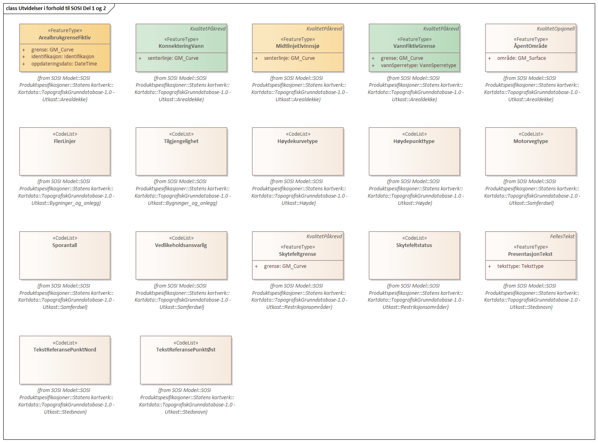
<<<
'''
==== Pakke: Generelle typer
*Definisjon:* Generelle modellelementer som er felles for alle fagområdestandarder og som kan kopieres inn og benyttes i produktspesifikasjoner.
 
'''
 
.Pakkerealisering Generelle typer 
image::diagrammer/Pakkerealisering Generelle typer.png[link=diagrammer/Pakkerealisering Generelle typer.png, Alt="Diagram med navn Pakkerealisering Generelle typer som viser UML-klasser beskrevet i teksten nedenfor."]
 
'''
 
.Hoveddiagram Generelle typer 
image::diagrammer/Hoveddiagram Generelle typer.png[link=diagrammer/Hoveddiagram Generelle typer.png, Alt="Diagram med navn Hoveddiagram Generelle typer som viser UML-klasser beskrevet i teksten nedenfor."]
 
'''
 
.Kodelister Generelle typer 
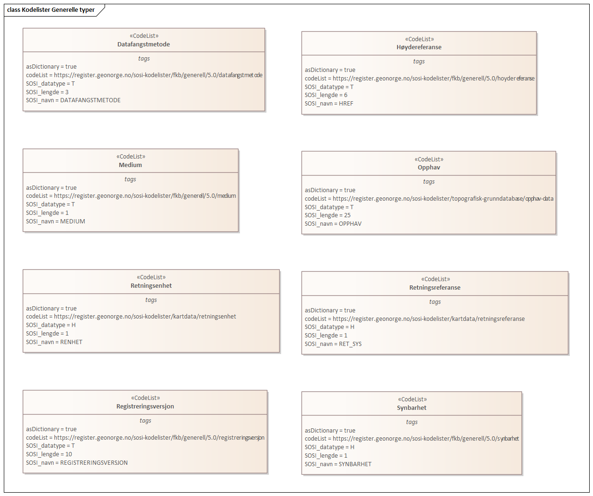
 
'''
 
.SOSI objektrealisering 
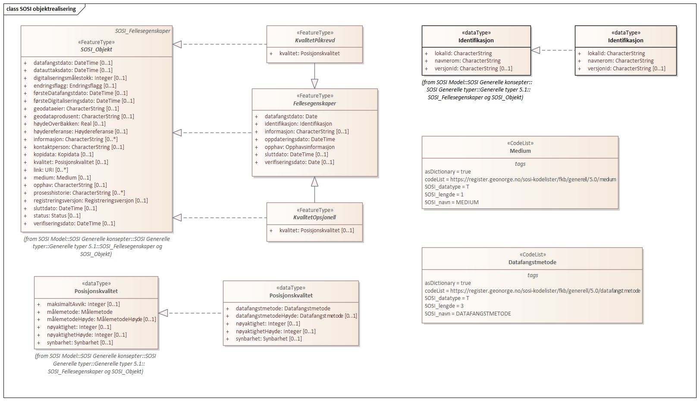
 
'''
 
[[fellesegenskaper]]
===== «FeatureType» Fellesegenskaper (abstrakt)
*Definisjon:* abstrakt objekttype som bærer sentrale egenskaper som er anbefalt for bruk i produktspesifikasjoner.
 
[discrete]
====== Egenskaper
[cols="20,80"]
|===
|*Navn:* 
|*identifikasjon*
 
|Definisjon: 
|unik identifikasjon av et objekt 

Merknad FKB:
Unik identifikasjon av et objekt, ivaretas av den ansvarlige produsent/forvalter, og som kan benyttes av eksterne applikasjoner som referanse til objektet.
Den unike identifikatoren er unik for kartobjektet og skal ikke endres i kartobjektets levetid. Dette må ikke forveksles med en tematisk identifikator (for eksempel bygningsnummer) som unikt identifiserer et objekt i virkeligheten. En bygning med samme bygningsnummer vil kunne representeres i mange kartprodukter der det finnes en unik identifikasjon i hver av dem.
For FKB benyttes UUID (Universally unique identifier) som lokalId. Dette innebærer at lokalId alene alltid vil være unik. Likevel skal alltid navnerom også angis. Navnerom angir FKB-datasettet.
 
|Multiplisitet: 
|[1..1]
 
|Type: 
|http://skjema.geonorge.no/SOSI/basistype/Identifikasjon[Identifikasjon]
|Profilparametre i tagged values: 
|
SOSI_navn: IDENT + 
|===
[cols="20,80"]
|===
|*Navn:* 
|*oppdateringsdato*
 
|Definisjon: 
|tidspunkt for siste endring på objektet 

Merknad FKB: 

Denne datoen viser datasystemets siste endring på dataobjektet. Egenskapen settes av forvaltningssystemet etter følgende regler:

i. Oppdateringsdato er tidspunkt for oppdatering av databasen og settes av forvaltningsbasen (ikke av klienten).

ii. Oppdateringsdato skal endres også hvis det er kopidata som blir endret eller importert i en ”kopibase”.

iii. Når avgrensingslinjene til en flate endres, skal flateobjektet få ny oppdateringsdato.

iv. Oppdateringsdato skal endres hvis en egenskap endres.
 
|Multiplisitet: 
|[1..1]
 
|Type: 
|http://skjema.geonorge.no/SOSI/basistype/DateTime[DateTime]
|Profilparametre i tagged values: 
|
SOSI_datatype: DATOTID + 
SOSI_navn: OPPDATERINGSDATO + 
|===
[cols="20,80"]
|===
|*Navn:* 
|*datafangstdato*
 
|Definisjon: 
|dato når objektet siste gang ble registrert/observert/målt i terrenget
 
|Multiplisitet: 
|[1..1]
 
|Type: 
|http://skjema.geonorge.no/SOSI/basistype/Date[Date]
|Profilparametre i tagged values: 
|
SOSI_datatype: DATO + 
SOSI_navn: DATAFANGSTDATO + 
|===
[cols="20,80"]
|===
|*Navn:* 
|*sluttdato*
 
|Definisjon: 
|Tid for når denne versjonen av objektet var erstattet eller opphørt å eksistere.

Merknad FKB:
Egenskapen settes av forvaltningssystemet. Sluttdato skal kun sendes med ut fra forvaltningssystemet i sammenhenger der objektenes historikk er interessant.
 
|Multiplisitet: 
|[0..1]
 
|Type: 
|http://skjema.geonorge.no/SOSI/basistype/DateTime[DateTime]
|Profilparametre i tagged values: 
|
SOSI_datatype: DATOTID + 
SOSI_navn: SLUTTDATO + 
|===
[cols="20,80"]
|===
|*Navn:* 
|*verifiseringsdato*
 
|Definisjon: 
|dato når dataene er fastslått å være i samsvar med virkeligheten.

Merknad FKB:
Brukes for eksempel i de sammenhenger hvor det er foretatt fotogrammetrisk ajourhold, og hvor det ikke er registrert endringer på objektet (det virkelige objektet er i samsvar med dataobjektet)
 
|Multiplisitet: 
|[0..1]
 
|Type: 
|http://skjema.geonorge.no/SOSI/basistype/Date[Date]
|Profilparametre i tagged values: 
|
SOSI_datatype: DATO + 
SOSI_navn: VERIFISERINGSDATO + 
|===
[cols="20,80"]
|===
|*Navn:* 
|*registreringsversjon*
 
|Definisjon: 
|angivelse av hvilken produktspesifikasjon som er utgangspunkt  for dataene
 
|Multiplisitet: 
|[0..1]
 
|Type: 
|http://skjema.geonorge.no/SOSI/basistype/Registreringsversjon[Registreringsversjon]
|Profilparametre i tagged values: 
|
defaultCodeSpace: https://register.geonorge.no/sosi-kodelister/fkb/generell/5.0/registreringsversjon + 
SOSI_datatype: T + 
SOSI_lengde: 10 + 
SOSI_navn: REGISTRERINGSVERSJON + 
|===
[cols="20,80"]
|===
|*Navn:* 
|*informasjon*
 
|Definisjon: 
|generell opplysning.

Merknad FKB:
Mulighet til å legge inn utfyllende informasjon om objektet. Egenskapen bør bare brukes til å legge inn ekstra informasjon om enkeltobjekter. Egenskapen bør ikke brukes til å systematisk angi ekstrainformasjon om mange/alle objekter i et datasett.
 
|Multiplisitet: 
|[0..1]
 
|Type: 
|http://skjema.geonorge.no/SOSI/basistype/CharacterString[CharacterString]
|Profilparametre i tagged values: 
|
SOSI_datatype: T + 
SOSI_lengde: 255 + 
SOSI_navn: INFORMASJON + 
|===
[cols="20,80"]
|===
|*Navn:* 
|*opphav*
 
|Definisjon: 
|referanse til opphavsmaterialet, kildematerialet, organisasjons/publiseringskilde

Merknad: 
Kan også beskrive navn på person og årsak til oppdatering
 
|Multiplisitet: 
|[1..1]
 
|Type: 
|<<opphavsinformasjon,«dataType» Opphavsinformasjon>>
|Profilparametre i tagged values: 
|
SOSI_datatype: T + 
SOSI_lengde: 255 + 
SOSI_navn: OPPHAV + 
|===
 
[discrete]
====== Arv og realiseringer
[cols="20,80"]
|===
|Subtyper:
|<<kvalitetpåkrevd,«FeatureType» KvalitetPåkrevd>> +
<<kvalitetopsjonell,«FeatureType» KvalitetOpsjonell>> +
|Realisering av: 
|«ApplicationSchema» Generelle typer 5.1/SOSI_Fellesegenskaper og SOSI_Objekt::«FeatureType» SOSI_Objekt +
|===
 
'''
 
[[kvalitetpåkrevd]]
===== «FeatureType» KvalitetPåkrevd (abstrakt)
*Definisjon:* abstrakt objekttype med påkrevet kvalitetsangivelse
 
[discrete]
====== Egenskaper
[cols="20,80"]
|===
|*Navn:* 
|*kvalitet*
 
|Definisjon: 
|beskrivelse av kvaliteten på stedfestingen

Merknad: Denne er identisk med ..KVALITET i tidligere versjoner av SOSI.
 
|Multiplisitet: 
|[1..1]
 
|Type: 
|http://skjema.geonorge.no/SOSI/basistype/Posisjonskvalitet[Posisjonskvalitet]
|Profilparametre i tagged values: 
|
SOSI_navn: KVALITET + 
|===
 
[discrete]
====== Arv og realiseringer
[cols="20,80"]
|===
|Supertype: 
|<<fellesegenskaper,«FeatureType» Fellesegenskaper>>
 
|Subtyper:
|<<spesielldetalj,«FeatureType» SpesiellDetalj>> +
<<grense,«FeatureType» Grense>> +
<<arealbrukgrense,«FeatureType» Arealbrukgrense>> +
<<høydekurve,«FeatureType» Høydekurve>> +
<<teiggrensepunkt,«FeatureType» Teiggrensepunkt>> +
<<terrengpunkt,«FeatureType» Terrengpunkt>> +
<<rørgate,«FeatureType» Rørgate>> +
<<elvbekk,«FeatureType» ElvBekk>> +
<<tårn,«FeatureType» Tårn>> +
<<skuterløype,«FeatureType» Skuterløype>> +
<<vindturbin,«FeatureType» Vindturbin>> +
<<navigasjonsinstallasjon,«FeatureType» Navigasjonsinstallasjon>> +
<<turisthytte,«FeatureType» Turisthytte>> +
<<ferskvanntørrfallkant,«FeatureType» FerskvannTørrfallkant>> +
<<kanalgrøft,«FeatureType» KanalGrøft>> +
<<kystkontur,«FeatureType» Kystkontur>> +
<<skjerm,«featureType» Skjerm>> +
<<pipe,«FeatureType» Pipe>> +
<<naturverngrense,«FeatureType» Naturverngrense>> +
<<foss,«FeatureType» Foss>> +
<<skytebane,«FeatureType» Skytebane>> +
<<lysløype,«FeatureType» Lysløype>> +
<<tregruppe,«FeatureType» Tregruppe>> +
<<allmenninggrense,«FeatureType» Allmenninggrense>> +
<<innsjøkant,«FeatureType» Innsjøkant>> +
<<ledning,«FeatureType» Ledning>> +
<<ruin,«FeatureType» Ruin>> +
<<flyplassavgrensning,«FeatureType» Flyplassavgrensning>> +
<<midtlinjeelvinnsjø,«FeatureType» MidtlinjeElvInnsjø>> +
<<tank,«FeatureType» Tank>> +
<<veglenke,«FeatureType» Veglenke>> +
<<voll,«FeatureType» Voll>> +
<<grunnmur,«FeatureType» Grunnmur>> +
<<molo,«FeatureType» Molo>> +
<<vegsperring,«FeatureType» Vegsperring>> +
<<kaibrygge,«FeatureType» KaiBrygge>> +
<<vannfiktivgrense,«FeatureType» VannFiktivGrense>> +
<<flomløpkant,«FeatureType» Flomløpkant>> +
<<bygning,«FeatureType» Bygning>> +
<<konnekteringvann,«FeatureType» KonnekteringVann>> +
<<lekeplass,«FeatureType» Lekeplass>> +
<<gjerde,«FeatureType» Gjerde>> +
<<flytebrygge,«FeatureType» Flytebrygge>> +
<<gruve,«FeatureType» Gruve>> +
<<kanalkant,«FeatureType» Kanalkant>> +
<<parkeringsområde,«FeatureType» Parkeringsområde>> +
<<skjær,«FeatureType» Skjær>> +
<<taubane,«FeatureType» Taubane>> +
<<stein,«featureType» Stein>> +
<<hoppbakke,«FeatureType» Hoppbakke>> +
<<elvekant,«FeatureType» ElveKant>> +
<<stasjon,«FeatureType» Stasjon>> +
<<skytefeltgrense,«FeatureType» Skytefeltgrense>> +
<<grunnlinjepunkt,«FeatureType» Grunnlinjepunkt>> +
<<mur,«FeatureType» Mur>> +
<<mast,«FeatureType» Mast>> +
<<bane,«FeatureType» Bane>> +
<<pir,«FeatureType» Pir>> +
<<campingplass,«FeatureType» Campingplass>> +
|Realisering av: 
|«ApplicationSchema» Generelle typer 5.1/SOSI_Fellesegenskaper og SOSI_Objekt::«FeatureType» SOSI_Objekt +
|===
 
'''
 
[[kvalitetopsjonell]]
===== «FeatureType» KvalitetOpsjonell (abstrakt)
*Definisjon:* abstrakt objekttype med valgfri kvalitetsangivelse
 
[discrete]
====== Egenskaper
[cols="20,80"]
|===
|*Navn:* 
|*kvalitet*
 
|Definisjon: 
|beskrivelse av kvaliteten på stedfestingen

Merknad: Denne er identisk med ..KVALITET i tidligere versjoner av SOSI.
 
|Multiplisitet: 
|[0..1]
 
|Type: 
|http://skjema.geonorge.no/SOSI/basistype/Posisjonskvalitet[Posisjonskvalitet]
|Profilparametre i tagged values: 
|
SOSI_navn: KVALITET + 
|===
 
[discrete]
====== Arv og realiseringer
[cols="20,80"]
|===
|Supertype: 
|<<fellesegenskaper,«FeatureType» Fellesegenskaper>>
 
|Subtyper:
|<<dyrketmark,«FeatureType» DyrketMark>> +
<<tettbebyggelse,«FeatureType» Tettbebyggelse>> +
<<lufthavn,«FeatureType» Lufthavn>> +
<<skog,«FeatureType» Skog>> +
<<ferskvanntørrfall,«FeatureType» FerskvannTørrfall>> +
<<rullebane,«FeatureType» Rullebane>> +
<<allmenning,«FeatureType» Allmenning>> +
<<kommune,«FeatureType» Kommune>> +
<<steinur,«featureType» Steinur>> +
<<transformatorstasjon,«featureType» Transformatorstasjon>> +
<<elv,«FeatureType» Elv>> +
<<industriområde,«FeatureType» Industriområde>> +
<<sportidrettplass,«FeatureType» SportIdrettPlass>> +
<<åpentområde,«FeatureType» ÅpentOmråde>> +
<<skytefelt,«FeatureType» Skytefelt>> +
<<myr,«FeatureType» Myr>> +
<<kanal,«FeatureType» Kanal>> +
<<alpinbakke,«FeatureType» Alpinbakke>> +
<<bymessigbebyggelse,«FeatureType» BymessigBebyggelse>> +
<<fylke,«FeatureType» Fylke>> +
<<gravplass,«FeatureType» Gravplass>> +
<<masseuttak,«FeatureType» Masseuttak>> +
<<havflate,«FeatureType» Havflate>> +
<<golfbane,«FeatureType» Golfbane>> +
<<park,«FeatureType» Park>> +
<<snøisbre,«FeatureType» SnøIsbre>> +
<<naturvernområde,«FeatureType» Naturvernområde>> +
<<massedeponi,«FeatureType» Massedeponi>> +
<<innsjø,«FeatureType» Innsjø>> +
|Realisering av: 
|«ApplicationSchema» Generelle typer 5.1/SOSI_Fellesegenskaper og SOSI_Objekt::«FeatureType» SOSI_Objekt +
|===
 
'''
 
[[opphavsinformasjon]]
===== «dataType» Opphavsinformasjon
*Definisjon:* 
 
[discrete]
====== Egenskaper
[cols="20,80"]
|===
|*Navn:* 
|*opphavData*
 
|Definisjon: 
|
 
|Multiplisitet: 
|[1..1]
 
|Type: 
|http://skjema.geonorge.no/SOSI/basistype/CharacterString[CharacterString]
|Profilparametre i tagged values: 
|
isMetadata: false + 
sequenceNumber:  + 
SOSI_lengde:  + 
SOSI_navn: OPPHAV + 
|===
[cols="20,80"]
|===
|*Navn:* 
|*id*
 
|Definisjon: 
|
 
|Multiplisitet: 
|[0..1]
 
|Type: 
|http://skjema.geonorge.no/SOSI/basistype/CharacterString[CharacterString]
|Profilparametre i tagged values: 
|
isMetadata: false + 
sequenceNumber:  + 
SOSI_lengde:  + 
SOSI_navn: ID + 
|===
 
'''
 
[[identifikasjon]]
===== «dataType» Identifikasjon
*Definisjon:* Unik identifikasjon av et objekt i et datasett, forvaltet av den ansvarlige produsent/forvalter, og kan benyttes av eksterne applikasjoner som stabil referanse til objektet. 

Merknad 1: Denne objektidentifikasjonen må ikke forveksles med en tematisk objektidentifikasjon, slik som f.eks bygningsnummer. 

Merknad 2: Denne unike identifikatoren vil ikke endres i løpet av objektets levetid, og ikke gjenbrukes i andre objekt.
 
[discrete]
====== Profilparametre i tagged values
[cols="20,80"]
|===
|SOSI_navn
|IDENT
 
|===
[discrete]
====== Egenskaper
[cols="20,80"]
|===
|*Navn:* 
|*lokalId*
 
|Definisjon: 
|lokal identifikator av et objekt

Merknad: Det er dataleverendørens ansvar å sørge for at den lokale identifikatoren er unik innenfor navnerommet. For FKB-data benyttes UUID som lokalId.
 
|Multiplisitet: 
|[1..1]
 
|Type: 
|http://skjema.geonorge.no/SOSI/basistype/CharacterString[CharacterString]
|Profilparametre i tagged values: 
|
SOSI_datatype: T + 
SOSI_lengde: 100 + 
SOSI_navn: LOKALID + 
|===
[cols="20,80"]
|===
|*Navn:* 
|*navnerom*
 
|Definisjon: 
|navnerom som unikt identifiserer datakilden til et objekt, anbefales å være en http-URI

Eksempel: http://data.geonorge.no/SentraltStedsnavnsregister/1.0

Merknad : Verdien for nanverom vil eies av den dataprodusent som har ansvar for de unike identifikatorene og må være registrert i data.geonorge.no eller data.norge.no
 
|Multiplisitet: 
|[1..1]
 
|Type: 
|http://skjema.geonorge.no/SOSI/basistype/CharacterString[CharacterString]
|Profilparametre i tagged values: 
|
SOSI_datatype: T + 
SOSI_lengde: 100 + 
SOSI_navn: NAVNEROM + 
|===
[cols="20,80"]
|===
|*Navn:* 
|*versjonId*
 
|Definisjon: 
|identifikasjon av en spesiell versjon av et geografisk objekt (instans)
 
|Multiplisitet: 
|[0..1]
 
|Type: 
|http://skjema.geonorge.no/SOSI/basistype/CharacterString[CharacterString]
|Profilparametre i tagged values: 
|
SOSI_datatype: T + 
SOSI_lengde: 100 + 
SOSI_navn: VERSJONID + 
|===
[discrete]
====== Arv og realiseringer
[cols="20,80"]
|===
|Realisering av: 
|«ApplicationSchema» Generelle typer 5.1/SOSI_Fellesegenskaper og SOSI_Objekt::«dataType» Identifikasjon +
|===
 
'''
 
[[posisjonskvalitet]]
===== «dataType» Posisjonskvalitet
*Definisjon:* beskrivelse av kvaliteten på stedfestingen.

Merknad:
Posisjonskvalitet er ikke konform med  kvalitetsmodellen i ISO slik den er defineret i ISO19157:2013, men er en videreføring av tildligere brukte kvalitetsegenskaper i SOSI. FKB 5.0 innfører en egen variant av datatypen Posisjonskvalitet der kodeliste målemetode er byttet ut med den mer generelle kodelista Datafangstmetode.
 
[discrete]
====== Profilparametre i tagged values
[cols="20,80"]
|===
|SOSI_navn
|KVALITET
 
|===
[discrete]
====== Egenskaper
[cols="20,80"]
|===
|*Navn:* 
|*datafangstmetode*
 
|Definisjon: 
|metode for datafangst. 
Egenskapen beskriver datafangstmetode for grunnrisskoordinater (x,y), eller for både grunnriss og høyde (x,y,z) dersom det ikke er oppgitt noen verdi for datafangstmetodeHøyde.
 
|Multiplisitet: 
|[1..1]
 
|Type: 
|<<datafangstmetode,«CodeList» Datafangstmetode>>
|Profilparametre i tagged values: 
|
defaultCodeSpace: https://register.geonorge.no/sosi-kodelister/fkb/generell/5.0/datafangstmetode + 
SOSI_datatype: T + 
SOSI_lengde: 3 + 
SOSI_navn: DATAFANGSTMETODE + 
|===
[cols="20,80"]
|===
|*Navn:* 
|*nøyaktighet*
 
|Definisjon: 
|standardavviket til posisjoneringa av objektet oppgitt i cm

I de aller fleste sammenhenger benyttes en anslått eller forventet verdi for standardavvik, men dersom man har en beregnet verdi skal denne benyttes. 

For objekter med punktgeometri benyttes verdi for punktstandardavvik. For objekter med kurvegeometri benyttes standardavviket for tverravviket fra kurva. For objekter med overflate- eller volumgeometri er forståelsen at standardavviket beregnes ut fra (3D) avvikene mellom sann posisjon og nærmeste punkt på overflata. 

Merknad:
Verdien er ment å beskrive nøyaktigheten til objektet sammenlignet med sann verdi. Standardavvik er i utgangspunktet et mål på det tilfeldige avviket og det innebærer at vi forutsetter at det systematiske avviket i liten grad påvirker nøyaktigheten til posisjoneringa. For fotogrammetriske data settes som hovedregel verdien lik kravet til standardavvik ved datafangst. Se standarden Geodatakvalitet for nærmere definisjon av standardavvik og hvordan dette defineres, beregnes og kontrolleres.

 
|Multiplisitet: 
|[0..1]
 
|Type: 
|http://skjema.geonorge.no/SOSI/basistype/Integer[Integer]
|Profilparametre i tagged values: 
|
SOSI_datatype: H + 
SOSI_lengde: 6 + 
SOSI_navn: NØYAKTIGHET + 
|===
[cols="20,80"]
|===
|*Navn:* 
|*synbarhet*
 
|Definisjon: 
|beskrivelse av hvor godt objektene framgår i datagrunnlaget for posisjonering (f.eks. flybildene).
 
|Multiplisitet: 
|[0..1]
 
|Type: 
|<<synbarhet,«CodeList» Synbarhet>>
|Profilparametre i tagged values: 
|
defaultCodeSpace: https://register.geonorge.no/sosi-kodelister/fkb/generell/5.0/synbarhet + 
SOSI_datatype: T + 
SOSI_lengde: 1 + 
SOSI_navn: SYNBARHET + 
|===
[cols="20,80"]
|===
|*Navn:* 
|*datafangstmetodeHøyde*
 
|Definisjon: 
|metoden brukt for høyderegistrering av posisjon.

Det er bare nødvending å angi en verdi for egenskapen dersom datafangstmetode for høyde avviker fra datafangstmetode for grunnriss.

 
|Multiplisitet: 
|[0..1]
 
|Type: 
|<<datafangstmetode,«CodeList» Datafangstmetode>>
|Profilparametre i tagged values: 
|
defaultCodeSpace: https://register.geonorge.no/sosi-kodelister/fkb/generell/5.0/datafangstmetode + 
SOSI_datatype: T + 
SOSI_lengde: 3 + 
SOSI_navn: DATAFANGSTMETODEHØYDE + 
|===
[cols="20,80"]
|===
|*Navn:* 
|*nøyaktighetHøyde*
 
|Definisjon: 
|standardavviket til posisjoneringa av objektet oppgitt i cm

I de aller fleste sammenhenger benyttes en anslått eller forventet verdi for standardavviket, men dersom man faktisk har standardavviket til posisjoneringa av objektet oppgitt i cm

I de aller fleste sammenhenger benyttes en anslått eller forventet verdi for standardavvik, men dersom man har en beregnet verdi skal denne benyttes. 

Merknad:
Verdien er ment å beskrive nøyaktigheten til objektet sammenlignet med sann verdi. Standardavvik er i utgangspunktet et mål på det tilfeldige avviket og det innebærer at vi forutsetter at det systematiske avviket i liten grad påvirker nøyaktigheten til posisjoneringa. For fotogrammetriske data settes som hovedregel verdien lik kravet til standardavvik ved datafangst. Se standarden Geodatakvalitet for nærmere definisjon av standardavvik og hvordan dette defineres, beregnes og kontrolleres.
 
|Multiplisitet: 
|[0..1]
 
|Type: 
|http://skjema.geonorge.no/SOSI/basistype/Integer[Integer]
|Profilparametre i tagged values: 
|
SOSI_datatype: H + 
SOSI_lengde: 6 + 
SOSI_navn: H-NØYAKTIGHET + 
|===
 
[discrete]
====== Restriksjoner
[cols="20,80"]
|===
|*Navn:* 
|*ugyldige datafangstmetoder for høyde*
 
|Beskrivelse: 
|inv: self.datafangstmetodeHøyde &lt;&gt; 'dig'

--Datafangstmetode Digitalisert skal ikke brukes på egenskapen datafangstmetodeHøyde
 
|===
[discrete]
====== Arv og realiseringer
[cols="20,80"]
|===
|Realisering av: 
|«ApplicationSchema» Generelle typer 5.1/SOSI_Fellesegenskaper og SOSI_Objekt::«dataType» Posisjonskvalitet +
|===
 
'''
 
[[retning]]
===== «dataType» Retning
*Definisjon:* linjestykke i planet med retning
 
[discrete]
====== Profilparametre i tagged values
[cols="20,80"]
|===
|SOSI_navn
|RETNING
 
|===
[discrete]
====== Egenskaper
[cols="20,80"]
|===
|*Navn:* 
|*retningsverdi*
 
|Definisjon: 
|generelt element med angivelse av retning
 
|Multiplisitet: 
|[1..1]
 
|Type: 
|<<real,«dataType» Real>>
|Profilparametre i tagged values: 
|
SOSI_datatype: H + 
SOSI_lengde: 3 + 
SOSI_navn: RETN + 
|===
[cols="20,80"]
|===
|*Navn:* 
|*retningsenhet*
 
|Definisjon: 
|enhet for retning
 
|Multiplisitet: 
|[1..1]
 
|Initialverdi: 
|1
 
|Type: 
|<<retningsenhet,«CodeList» Retningsenhet>>
|===
[cols="20,80"]
|===
|*Navn:* 
|*retningsreferanse*
 
|Definisjon: 
|referansesystem for retning
 
|Multiplisitet: 
|[1..1]
 
|Initialverdi: 
|1
 
|Type: 
|<<retningsreferanse,«CodeList» Retningsreferanse>>
|===
[discrete]
====== Arv og realiseringer
[cols="20,80"]
|===
|Realisering av: 
|«ApplicationSchema» Generelle typer 5.1/Objekttyper med tydelige fellestrekk/Retning::«dataType» Retning +
|===
 
'''
 
[[opphav]]
===== «CodeList» Opphav
*Definisjon:* 
 
[discrete]
====== Profilparametre i tagged values
[cols="20,80"]
|===
|asDictionary
|true
 
|codeList
|https://register.geonorge.no/sosi-kodelister/topografisk-grunndatabase/opphav
 
|SOSI_datatype
|T
 
|SOSI_lengde
|25
 
|SOSI_navn
|OPPHAV
 
|===
 
'''
 
[[datafangstmetode]]
===== «CodeList» Datafangstmetode
*Definisjon:* metode for datafangst. 

Datafangstmetoden beskriver hvordan selve vektordataene er posisjonert fra et datagrunnlag (observasjoner med landmålingsutstyr, fotogrammetrisk stereomodell, digital terrengmodell etc.) og ikke prosessen med å innhente det bakenforliggende datagrunnlaget.
 
[discrete]
====== Profilparametre i tagged values
[cols="20,80"]
|===
|asDictionary
|true
 
|codeList
|https://register.geonorge.no/sosi-kodelister/fkb/generell/5.0/datafangstmetode
 
|SOSI_datatype
|T
 
|SOSI_lengde
|3
 
|SOSI_navn
|DATAFANGSTMETODE
 
|===
 
'''
 
[[høydereferanse]]
===== «CodeList» Høydereferanse
*Definisjon:* koordinatregistering utført på topp eller bunn av et objekt
 
[discrete]
====== Profilparametre i tagged values
[cols="20,80"]
|===
|asDictionary
|true
 
|codeList
|https://register.geonorge.no/sosi-kodelister/fkb/generell/5.0/hoydereferanse
 
|SOSI_datatype
|T
 
|SOSI_lengde
|6
 
|SOSI_navn
|HREF
 
|===
 
'''
 
[[medium]]
===== «CodeList» Medium
*Definisjon:* objektets beliggenhet i forhold til jordoverflaten

Eksempel:
Veg på bro, i tunnel, inne i et bygningsmessig anlegg, etc.
 
[discrete]
====== Profilparametre i tagged values
[cols="20,80"]
|===
|asDictionary
|true
 
|codeList
|https://register.geonorge.no/sosi-kodelister/fkb/generell/5.0/medium
 
|SOSI_datatype
|T
 
|SOSI_lengde
|1
 
|SOSI_navn
|MEDIUM
 
|===
 
'''
 
[[nøyaktighet]]
===== «CodeList» Nøyaktighet
*Definisjon:* punktstandardavviket i grunnriss for punkter samt tverravvik for linjer

Merknad:
Oppgitt i cm
 
[discrete]
====== Profilparametre i tagged values
[cols="20,80"]
|===
|asDictionary
|true
 
|codeList
|https://register.geonorge.no/sosi-kodelister/kartdata/n%c3%b8yaktighet
 
|SOSI_datatype
|H
 
|SOSI_lengde
|4
 
|SOSI_navn
|NØYAKTIGHET
 
|===
 
'''
 
[[registreringsversjon]]
===== «CodeList» Registreringsversjon
*Definisjon:* FKB-verjson som ligger til grunn for registrering. Mest relevant for data som er fotogrammetrisk registrert.
 
[discrete]
====== Profilparametre i tagged values
[cols="20,80"]
|===
|asDictionary
|true
 
|codeList
|https://register.geonorge.no/sosi-kodelister/fkb/generell/5.0/registreringsversjon
 
|SOSI_datatype
|T
 
|SOSI_lengde
|10
 
|SOSI_navn
|REGISTRERINGSVERSJON
 
|===
 
'''
 
[[retningsenhet]]
===== «CodeList» Retningsenhet
*Definisjon:* enhet for retning
 
[discrete]
====== Profilparametre i tagged values
[cols="20,80"]
|===
|asDictionary
|true
 
|codeList
|https://register.geonorge.no/sosi-kodelister/topografisk-grunndatabase/retningsenhet
 
|SOSI_datatype
|H
 
|SOSI_lengde
|1
 
|SOSI_navn
|RENHET
 
|===
 
'''
 
[[retningsreferanse]]
===== «CodeList» Retningsreferanse
*Definisjon:* referansesystem for retning
 
[discrete]
====== Profilparametre i tagged values
[cols="20,80"]
|===
|asDictionary
|true
 
|codeList
|https://register.geonorge.no/sosi-kodelister/topografisk-grunndatabase/retningsreferanse
 
|SOSI_datatype
|H
 
|SOSI_lengde
|1
 
|SOSI_navn
|RET_SYS
 
|===
 
'''
 
[[synbarhet]]
===== «CodeList» Synbarhet
*Definisjon:* synbarhet beskriver hvor godt objektene framgår i datagrunnlaget for posisjonering (f.eks. flybildene).
 
[discrete]
====== Profilparametre i tagged values
[cols="20,80"]
|===
|asDictionary
|true
 
|codeList
|https://register.geonorge.no/sosi-kodelister/fkb/generell/5.0/synbarhet
 
|SOSI_datatype
|H
 
|SOSI_lengde
|1
 
|SOSI_navn
|SYNBARHET
 
|===
<<<
'''
=====  Underpakke:IKKE I BRUK
*Definisjon:* 
 
'''
 
[[sosi_objekt_kombinasjon_ulike_geometrityper]]
===== IKKE I BRUK::«FeatureType» SOSI_Objekt_Kombinasjon_Ulike_Geometrityper (abstrakt)
*Definisjon:* abstrakt objekt som bærer en rekke egenskaper som er til felles for alle objekttyper med en kombinasjon av punkt- og flategeometri eller linje- og flategeometri i dette applikasjonsskjemaet
 
[discrete]
======= Egenskaper
[cols="20,80"]
|===
|*Navn:* 
|*datafangstdato*
 
|Definisjon: 
|dato når objektet siste gang ble registrert/observert/målt i terrenget
 
|Multiplisitet: 
|[0..1]
 
|Type: 
|http://skjema.geonorge.no/SOSI/basistype/Date[Date]
|Profilparametre i tagged values: 
|
SOSI_datatype: DATO + 
SOSI_navn: DATAFANGSTDATO + 
|===
[cols="20,80"]
|===
|*Navn:* 
|*oppdateringsdato*
 
|Definisjon: 
|dato for siste endring på objektetdataene 

-Definition-
Date and time at which this version of the spatial object was inserted or changed in the spatial data set.
 
|Multiplisitet: 
|[1..1]
 
|Type: 
|http://skjema.geonorge.no/SOSI/basistype/Date[Date]
|Profilparametre i tagged values: 
|
SOSI_datatype: DATO + 
SOSI_navn: OPPDATERINGSDATO + 
|===
[cols="20,80"]
|===
|*Navn:* 
|*kvalitet*
 
|Definisjon: 
|beskrivelse av kvaliteten på stedfestingen
 
|Multiplisitet: 
|[0..1]
 
|Type: 
|<<posisjonskvalitet,«dataType» Posisjonskvalitet>>
|===
 
[discrete]
======= Arv og realiseringer
[cols="20,80"]
|===
|Subtyper:
|<<tribune,«FeatureType» Tribune>> +
<<svømmebasseng,«FeatureType» Svømmebasseng>> +
<<demning,«FeatureType» Demning>> +
<<lufthavn,«FeatureType» Lufthavn>> +
<<takoverbygg,«FeatureType» Takoverbygg>> +
<<slipp,«FeatureType» Slipp>> +
<<oppdrettslokalitet,«featureType» Oppdrettslokalitet>> +
|Realisering av: 
|«ApplicationSchema» Generelle typer 5.1/SOSI_Fellesegenskaper og SOSI_Objekt::«FeatureType» SOSI_Objekt +
|===
 
'''
 
[[sosi_objekt_linjer_samferdsel]]
===== IKKE I BRUK::«FeatureType» SOSI_Objekt_Linjer_Samferdsel (abstrakt)
*Definisjon:* abstrakt objekt som bærer en rekke egenskaper som er til felles for flere objekttyper i underpakke Samferdsel i dette applikasjonsskjemaet
 
[discrete]
======= Egenskaper
[cols="20,80"]
|===
|*Navn:* 
|*medium*
 
|Definisjon: 
|objektets beliggenhet i forhold til jordoverflaten

Eksempel:
På bro, i tunnel, inne i et bygningsmessig anlegg, etc.
 
|Multiplisitet: 
|[0..1]
 
|Type: 
|http://skjema.geonorge.no/SOSI/basistype/Medium[Medium]
|Profilparametre i tagged values: 
|
SOSI_navn: MEDIUM + 
|===
[cols="20,80"]
|===
|*Navn:* 
|*datafangstdato*
 
|Definisjon: 
|dato når objektet siste gang ble registrert/observert/målt i terrenget
 
|Multiplisitet: 
|[1..1]
 
|Type: 
|http://skjema.geonorge.no/SOSI/basistype/Date[Date]
|Profilparametre i tagged values: 
|
SOSI_datatype: DATO + 
SOSI_navn: DATAFANGSTDATO + 
|===
[cols="20,80"]
|===
|*Navn:* 
|*oppdateringsdato*
 
|Definisjon: 
|dato for siste endring på objektetdataene 

-Definition-
Date and time at which this version of the spatial object was inserted or changed in the spatial data set.
 
|Multiplisitet: 
|[1..1]
 
|Type: 
|http://skjema.geonorge.no/SOSI/basistype/Date[Date]
|Profilparametre i tagged values: 
|
SOSI_datatype: DATO + 
SOSI_navn: OPPDATERINGSDATO + 
|===
[cols="20,80"]
|===
|*Navn:* 
|*kvalitet*
 
|Definisjon: 
|beskrivelse av kvaliteten på stedfestingen
 
|Multiplisitet: 
|[1..1]
 
|Type: 
|<<posisjonskvalitet,«dataType» Posisjonskvalitet>>
|Profilparametre i tagged values: 
|
SOSI_navn: KVALITET + 
|===
[discrete]
======= Arv og realiseringer
[cols="20,80"]
|===
|Realisering av: 
|«ApplicationSchema» Generelle typer 5.1/SOSI_Fellesegenskaper og SOSI_Objekt::«FeatureType» SOSI_Objekt +
|===
 
'''
 
[[sosi_objekt_punkteroglinjer_høyde]]
===== IKKE I BRUK::«FeatureType» SOSI_Objekt_PunkterOgLinjer_Høyde (abstrakt)
*Definisjon:* abstrakt objekt som bærer en rekke egenskaper som er til felles for flere objekttyper i underpakke Høyde i dette applikasjonsskjemaet
 
[discrete]
======= Egenskaper
[cols="20,80"]
|===
|*Navn:* 
|*medium*
 
|Definisjon: 
|objektets beliggenhet i forhold til jordoverflaten

Eksempel:
På bro, i tunnel, inne i et bygningsmessig anlegg, etc.
 
|Multiplisitet: 
|[1..1]
 
|Type: 
|<<mediumhøyde,«CodeList» MediumHøyde>>
|Profilparametre i tagged values: 
|
SOSI_navn: MEDIUM + 
|===
[cols="20,80"]
|===
|*Navn:* 
|*datafangstdato*
 
|Definisjon: 
|dato når objektet siste gang ble registrert/observert/målt i terrenget
 
|Multiplisitet: 
|[1..1]
 
|Type: 
|http://skjema.geonorge.no/SOSI/basistype/Date[Date]
|Profilparametre i tagged values: 
|
SOSI_datatype: DATO + 
SOSI_navn: DATAFANGSTDATO + 
|===
[cols="20,80"]
|===
|*Navn:* 
|*oppdateringsdato*
 
|Definisjon: 
|dato for siste endring på objektetdataene 

-Definition-
Date and time at which this version of the spatial object was inserted or changed in the spatial data set.
 
|Multiplisitet: 
|[1..1]
 
|Type: 
|http://skjema.geonorge.no/SOSI/basistype/Date[Date]
|Profilparametre i tagged values: 
|
SOSI_datatype: DATO + 
SOSI_navn: OPPDATERINGSDATO + 
|===
[cols="20,80"]
|===
|*Navn:* 
|*kvalitet*
 
|Definisjon: 
|beskrivelse av kvaliteten på stedfestingen
 
|Multiplisitet: 
|[1..1]
 
|Type: 
|<<posisjonskvalitet,«dataType» Posisjonskvalitet>>
|Profilparametre i tagged values: 
|
SOSI_navn: KVALITET + 
|===
 
[discrete]
======= Arv og realiseringer
[cols="20,80"]
|===
|Subtyper:
|<<trigonometriskpunkt,«FeatureType» TrigonometriskPunkt>> +
<<forsenkningskurve,«FeatureType» Forsenkningskurve>> +
<<hjelpekurve,«FeatureType» Hjelpekurve>> +
|Realisering av: 
|«ApplicationSchema» Generelle typer 5.1/SOSI_Fellesegenskaper og SOSI_Objekt::«FeatureType» SOSI_Objekt +
|===
 
'''
 
[[sosi_objekt_flater]]
===== IKKE I BRUK::«FeatureType» SOSI_Objekt_Flater (abstrakt)
*Definisjon:* abstrakt supertype som samler fellesegenskaper og assosiasjoner som gjelder objekttyper som bare har flategeometri
 
[discrete]
======= Egenskaper
[cols="20,80"]
|===
|*Navn:* 
|*oppdateringsdato*
 
|Definisjon: 
|dato for siste endring på objektetdataene 

-Definition-
Date and time at which this version of the spatial object was inserted or changed in the spatial data set.
 
|Multiplisitet: 
|[1..1]
 
|Type: 
|http://skjema.geonorge.no/SOSI/basistype/Date[Date]
|Profilparametre i tagged values: 
|
SOSI_datatype: DATO + 
SOSI_navn: OPPDATERINGSDATO + 
|===
 
[discrete]
======= Arv og realiseringer
[cols="20,80"]
|===
|Subtyper:
|<<innsjøregulert,«FeatureType» InnsjøRegulert>> +
|Realisering av: 
|«ApplicationSchema» Generelle typer 5.1/SOSI_Fellesegenskaper og SOSI_Objekt::«FeatureType» SOSI_Objekt +
|===
 
'''
 
[[sosi_objekt_hjelpelinjer]]
===== IKKE I BRUK::«FeatureType» SOSI_Objekt_Hjelpelinjer (abstrakt)
*Definisjon:* abstrakt objekt som bærer en rekke egenskaper som er til felles for KantUtsnitt, Dataavgrensning og FiktivDelelinje i dette applikasjonsskjemaet
 
[discrete]
======= Egenskaper
[cols="20,80"]
|===
|*Navn:* 
|*oppdateringsdato*
 
|Definisjon: 
|dato for siste endring på objektetdataene 

-Definition-
Date and time at which this version of the spatial object was inserted or changed in the spatial data set.
 
|Multiplisitet: 
|[0..1]
 
|Type: 
|http://skjema.geonorge.no/SOSI/basistype/Date[Date]
|Profilparametre i tagged values: 
|
SOSI_datatype: DATO + 
SOSI_navn: OPPDATERINGSDATO + 
|===
[discrete]
======= Arv og realiseringer
[cols="20,80"]
|===
|Realisering av: 
|«ApplicationSchema» Generelle typer 5.1/SOSI_Fellesegenskaper og SOSI_Objekt::«FeatureType» SOSI_Objekt +
|===
 
'''
 
[[sosi_objekt_punkteroglinjer]]
===== IKKE I BRUK::«FeatureType» SOSI_Objekt_PunkterOgLinjer (abstrakt)
*Definisjon:* abstrakt objekt som bærer en rekke egenskaper som er til felles for flere objekttyper med punkt- eller linjegeometri i underpakkene Administrative områder, Arealdekke, Bygninger og anlegg, Restriksjonsområder og Samferdsel i dette applikasjonsskjemaet
 
[discrete]
======= Egenskaper
[cols="20,80"]
|===
|*Navn:* 
|*datafangstdato*
 
|Definisjon: 
|dato når objektet siste gang ble registrert/observert/målt i terrenget
 
|Multiplisitet: 
|[1..1]
 
|Type: 
|http://skjema.geonorge.no/SOSI/basistype/Date[Date]
|Profilparametre i tagged values: 
|
SOSI_datatype: DATO + 
SOSI_navn: DATAFANGSTDATO + 
|===
[cols="20,80"]
|===
|*Navn:* 
|*oppdateringsdato*
 
|Definisjon: 
|dato for siste endring på objektetdataene 

-Definition-
Date and time at which this version of the spatial object was inserted or changed in the spatial data set.
 
|Multiplisitet: 
|[1..1]
 
|Type: 
|http://skjema.geonorge.no/SOSI/basistype/Date[Date]
|Profilparametre i tagged values: 
|
SOSI_datatype: DATO + 
SOSI_navn: OPPDATERINGSDATO + 
|===
[cols="20,80"]
|===
|*Navn:* 
|*kvalitet*
 
|Definisjon: 
|beskrivelse av kvaliteten på stedfestingen
 
|Multiplisitet: 
|[1..1]
 
|Type: 
|<<posisjonskvalitet,«dataType» Posisjonskvalitet>>
|===
 
[discrete]
======= Arv og realiseringer
[cols="20,80"]
|===
|Subtyper:
|<<elvelinjefiktiv,«FeatureType» ElvelinjeFiktiv>> +
<<territorialgrense,«FeatureType» Territorialgrense>> +
<<dam,«FeatureType» Dam>> +
<<elvmidtlinje,«FeatureType» ElvMidtlinje>> +
<<naturvernpunkt,«FeatureType» Naturvernpunkt>> +
<<vindkraftverk,«FeatureType» Vindkraftverk>> +
<<grunnlinje,«FeatureType» Grunnlinje>> +
<<reingjerde,«FeatureType» Reingjerde>> +
<<taubane,«FeatureType» Taubane>> +
<<avtaltavgrensningslinje,«FeatureType» AvtaltAvgrensningslinje>> +
<<takkant,«FeatureType» Takkant>> +
<<fylkesgrense,«FeatureType» Fylkesgrense>> +
<<kommunegrense,«FeatureType» Kommunegrense>> +
<<tankkant,«FeatureType» Tankkant>> +
<<riksgrense,«FeatureType» Riksgrense>> +
<<innsjøkantregulert,«FeatureType» InnsjøkantRegulert>> +
<<ledning,«FeatureType» Ledning>> +
<<parkeringsområde,«FeatureType» Parkeringsområde>> +
|Realisering av: 
|«ApplicationSchema» Generelle typer 5.1/SOSI_Fellesegenskaper og SOSI_Objekt::«FeatureType» SOSI_Objekt +
|===
 
'''
 
[[sosi_objekt_sperrelinjer]]
===== IKKE I BRUK::«FeatureType» SOSI_Objekt_Sperrelinjer (abstrakt)
*Definisjon:* abstrakt objekt som bærer en rekke egenskaper som er felles for alle sperrelinjer i dette applikasjonsskjemaet
 
[discrete]
======= Egenskaper
[cols="20,80"]
|===
|*Navn:* 
|*oppdateringsdato*
 
|Definisjon: 
|dato for siste endring på objektdataene
 
|Multiplisitet: 
|[1..1]
 
|Type: 
|http://skjema.geonorge.no/SOSI/basistype/Date[Date]
|Profilparametre i tagged values: 
|
SOSI_datatype: DATO + 
SOSI_navn: OPPDATERINGSDATO + 
|===
 
[discrete]
======= Arv og realiseringer
[cols="20,80"]
|===
|Subtyper:
|<<innsjøinnsjøsperre,«FeatureType» InnsjøInnsjøSperre>> +
<<innsjøelvsperre,«FeatureType» InnsjøElvSperre>> +
<<havelvsperre,«FeatureType» HavElvSperre>> +
|Realisering av: 
|«ApplicationSchema» Generelle typer 5.1/SOSI_Fellesegenskaper og SOSI_Objekt::«FeatureType» SOSI_Objekt +
|===
 
'''
 
[[posisjonskvalitet]]
===== IKKE I BRUK::«dataType» Posisjonskvalitet
*Definisjon:* beskrivelse av kvaliteten på stedfestingen
 
[discrete]
======= Profilparametre i tagged values
[cols="20,80"]
|===
|SOSI_navn
|KVALITET
 
|===
[discrete]
======= Egenskaper
[cols="20,80"]
|===
|*Navn:* 
|*målemetode*
 
|Definisjon: 
|metode for måling i grunnriss (x,y), og høyde (z) når metoden er den samme som ved måling i grunnriss
 
|Multiplisitet: 
|[1..1]
 
|Type: 
|<<målemetode,«CodeList» Målemetode>>
|===
[cols="20,80"]
|===
|*Navn:* 
|*nøyaktighet*
 
|Definisjon: 
|punktstandardavviket i grunnriss for punkter samt tverravvik for linjer

Merknad:
Oppgitt i cm
 
|Multiplisitet: 
|[1..1]
 
|Type: 
|<<nøyaktighet,«CodeList» Nøyaktighet>>
|Profilparametre i tagged values: 
|
SOSI_datatype: H + 
SOSI_lengde: 4 + 
SOSI_navn: NØYAKTIGHET + 
|===
[discrete]
======= Arv og realiseringer
[cols="20,80"]
|===
|Realisering av: 
|«ApplicationSchema» Generelle typer 5.1/SOSI_Fellesegenskaper og SOSI_Objekt::«dataType» Posisjonskvalitet +
|===
 
'''
 
[[målemetode]]
===== IKKE I BRUK::«CodeList» Målemetode
*Definisjon:* metode som ligger til grunn for registrering av posisjon

-- Definition - - 
method on which registration of position is based
 
[discrete]
======= Profilparametre i tagged values
[cols="20,80"]
|===
|asDictionary
|true
 
|codeList
|https://register.geonorge.no/sosi-kodelister/kartdata/m%C3%A5lemetode
 
|SOSI_datatype
|T
 
|SOSI_lengde
|3
 
|SOSI_navn
|MÅLEMETODE
 
|===
<<<
'''
==== Pakke: Administrative_områder
*Definisjon:* Administrative områder inneholder grenser for fastlands Norge, og inndelingen av Norge i kommuner og fylker.
 
'''
 
.Pakkerealisering Administrative områder 
image::diagrammer/Pakkerealisering Administrative områder.png[link=diagrammer/Pakkerealisering Administrative områder.png, Alt="Diagram med navn Pakkerealisering Administrative områder som viser UML-klasser beskrevet i teksten nedenfor."]
 
'''
 
.Hoveddiagram Administrative områder 
image::diagrammer/Hoveddiagram Administrative områder.png[link=diagrammer/Hoveddiagram Administrative områder.png, Alt="Diagram med navn Hoveddiagram Administrative områder som viser UML-klasser beskrevet i teksten nedenfor."]
 
'''
 
.Realisering av objekttyper fra generell objektkatalog 

 
'''
 
.Realisering av kodelister fra generell objektkatalog 

 
'''
 
[[fylke]]
===== «FeatureType» Fylke
*Definisjon:* administrativ inndeling av nasjonen på regionalt nivå

Merknad: Tilsvarer NUTS 3 på internasjonalt statistisk nivå
 
[discrete]
====== Egenskaper
[cols="20,80"]
|===
|*Navn:* 
|*område*
 
|Definisjon: 
|den geografiske avgrensingen av stemmekretsen.
 
|Multiplisitet: 
|[1..1]
 
|Type: 
|<<gm_multisurface,GM_MultiSurface>>
|Profilparametre i tagged values: 
|
SOSI_navn: FLATE + 
|===
[cols="20,80"]
|===
|*Navn:* 
|*fylkesnummer*
 
|Definisjon: 
|nummerering av fylker i henhold til Statistisk sentralbyrå sin offisielle liste

Merknad:
Det presiseres at fylkesnummer alltid skal ha 2 sifre, dvs. eventuelt med ledende null. Fylkesnummer benyttes for kopling mot en rekke andre registre som også benytter 2 sifre.
 
|Multiplisitet: 
|[1..1]
 
|Type: 
|<<fylkesnummer,Fylkesnummer>>
|Profilparametre i tagged values: 
|
defaultCodeSpace: https://register.geonorge.no/sosi-kodelister/inndelinger/inndelingsbase/fylkesnummer? + 
SOSI_navn: FYLKESNUMMER + 
|===
[cols="20,80"]
|===
|*Navn:* 
|*fylkesnavn*
 
|Definisjon: 
|Offisielt navn på et fylke. Merk: Hvis fylket har flere vedtatte parallellnavn, framstår disse i en sammenhengende tekststreng.
 
|Multiplisitet: 
|[1..1]
 
|Type: 
|http://skjema.geonorge.no/SOSI/basistype/CharacterString[CharacterString]
|Profilparametre i tagged values: 
|
isMetadata: false + 
sequenceNumber:  + 
SOSI_lengde: 50 + 
SOSI_navn: FYLKESNAVN + 
|===
 
[discrete]
====== Roller
[cols="20,80"]
|===
|*Rollenavn:* 
|*avgrensesAvGrense*
 
|Definisjon:
|avgrenser Fylke
 
|Multiplisitet: 
|[0..*]
 
|Til klasse
|<<grense,«FeatureType» Grense>>
|===
 
[discrete]
====== Arv og realiseringer
[cols="20,80"]
|===
|Supertype: 
|<<kvalitetopsjonell,«FeatureType» KvalitetOpsjonell>>
 
|===
 
'''
 
[[grense]]
===== «FeatureType» Grense
*Definisjon:* Generell avgrensingslinje
 
[discrete]
====== Egenskaper
[cols="20,80"]
|===
|*Navn:* 
|*grense*
 
|Definisjon: 
|Geometri for avgrensingslinjer
 
|Multiplisitet: 
|[1..1]
 
|Type: 
|<<gm_curve,GM_Curve>>
|Profilparametre i tagged values: 
|
SOSI_navn: GRENSE + 
|===
[cols="20,80"]
|===
|*Navn:* 
|*avgrensningstype*
 
|Definisjon: 
|angir type avgreisningslinje. Ulike objekter avgrenses av ulike typer grenser.
 
|Multiplisitet: 
|[1..1]
 
|Type: 
|<<typeavgrensning,«CodeList» TypeAvgrensning>>
|Profilparametre i tagged values: 
|
SOSI_navn: AVGRENSNINGSTYPE + 
|===
 
[discrete]
====== Arv og realiseringer
[cols="20,80"]
|===
|Supertype: 
|<<kvalitetpåkrevd,«FeatureType» KvalitetPåkrevd>>
 
|===
 
'''
 
[[grunnlinjepunkt]]
===== «FeatureType» Grunnlinjepunkt
*Definisjon:* knekkpunkt på grunnlinjen
 
[discrete]
====== Profilparametre i tagged values
[cols="20,80"]
|===
|SOSI_geometri
|PUNKT;
 
|===
[discrete]
====== Egenskaper
[cols="20,80"]
|===
|*Navn:* 
|*posisjon*
 
|Definisjon: 
|sted som objektet eksisterer på
 
|Multiplisitet: 
|[1..1]
 
|Type: 
|http://skjema.geonorge.no/SOSI/basistype/GM_Point[GM_Point]
|Profilparametre i tagged values: 
|
SOSI_datatype: * + 
SOSI_lengde:  + 
SOSI_navn: Punkt + 
SOSI_navn: NØ + 
|===
[cols="20,80"]
|===
|*Navn:* 
|*grunnlinjepunktnavn*
 
|Definisjon: 
|angivelse av navn på grunnlinjen
 
|Multiplisitet: 
|[0..1]
 
|Type: 
|<<characterstring,«dataType» CharacterString>>
|Profilparametre i tagged values: 
|
SOSI_datatype: T + 
SOSI_lengde: 50 + 
SOSI_navn: GRUNNLINJENAVN + 
|===
[cols="20,80"]
|===
|*Navn:* 
|*grunnlinjepunktnummer*
 
|Definisjon: 
|angivelse av nummeret på grunnlinjen
 
|Multiplisitet: 
|[1..1]
 
|Type: 
|<<characterstring,«dataType» CharacterString>>
|Profilparametre i tagged values: 
|
SOSI_datatype: T + 
SOSI_lengde: 30 + 
SOSI_navn: GRUNNLINJENUMMER + 
|===
 
[discrete]
====== Arv og realiseringer
[cols="20,80"]
|===
|Supertype: 
|<<kvalitetpåkrevd,«FeatureType» KvalitetPåkrevd>>
 
|Realisering av: 
|«ApplicationSchema» AdministrativeOgStatistiskeInndelinger-4.0/Nasjonal hovedinndeling::«featureType» Grunnlinjepunkt +
|===
 
'''
 
[[kommune]]
===== «FeatureType» Kommune
*Definisjon:* inndeling i administrative og politiske enheter innenfor fylket

Merknad: Tilsvarer NUTS 5 og LAU 2 på internasjonalt statistisk nivå
 
[discrete]
====== Profilparametre i tagged values
[cols="20,80"]
|===
|SOSI_geometri
|PUNKT;FLATE;
 
|SOSI_navn
|KOMMUNE
 
|SOSI-melding
|Finnes i SOSI_db,men ingen ting skal overføres
 
|===
[discrete]
====== Egenskaper
[cols="20,80"]
|===
|*Navn:* 
|*område*
 
|Definisjon: 
|den geografiske avgrensingen av stemmekretsen.
 
|Multiplisitet: 
|[1..1]
 
|Type: 
|<<gm_multisurface,GM_MultiSurface>>
|Profilparametre i tagged values: 
|
SOSI_navn: FLATE + 
|===
[cols="20,80"]
|===
|*Navn:* 
|*kommunenavn*
 
|Definisjon: 
|offisielt navn på kommunen
 
|Multiplisitet: 
|[1..1]
 
|Type: 
|http://skjema.geonorge.no/SOSI/basistype/CharacterString[CharacterString]
|Profilparametre i tagged values: 
|
SOSI_datatype: T + 
SOSI_lengde: 60 + 
SOSI_melding: Fant ikke denne i SOSI_db + 
SOSI_melding: Fant ikke denne i SOSI_db/Objektegenskaper + 
SOSI_navn: NAVN + 
|===
[cols="20,80"]
|===
|*Navn:* 
|*kommunenummer*
 
|Definisjon: 
|nummerering av kommuner i henhold til Statistisk sentralbyrå sin offisielle liste

Merknad: Det presiseres at kommune alltid skal ha 4 siffer, dvs. eventuelt med ledende null. Kommune benyttes for kopling mot en rekke andre registre som også benytter 4 siffer.

-- Definition - - 
numbering of municipalities in accordance with Statistics Norway’s official list 
Note: It must be following that municipality number always consists of 4 digits, i.e. sometimes with leading zero. Municipality is used for establishing relations to a number of other registers which also use 4 digits.
 
|Multiplisitet: 
|[1..1]
 
|Type: 
|<<kommunenummer,«CodeList» Kommunenummer>>
|===
 
[discrete]
====== Roller
[cols="20,80"]
|===
|*Rollenavn:* 
|*avgrensesAvKommunegrense*
 
|Definisjon:
|avgrenser Kommuner
 
|Multiplisitet: 
|[0..*]
 
|Til klasse
|<<kommunegrense,«FeatureType» Kommunegrense>>
|===
[cols="20,80"]
|===
|*Rollenavn:* 
|*avgrensesAvFylkesgrense*
 
|Definisjon:
|avgrenser Kommune
 
|Multiplisitet: 
|[0..*]
 
|Til klasse
|<<fylkesgrense,«FeatureType» Fylkesgrense>>
|===
[cols="20,80"]
|===
|*Rollenavn:* 
|*avgrensesAvRiksgrense*
 
|Definisjon:
|avgrenser Kommune
 
|Multiplisitet: 
|[0..*]
 
|Til klasse
|<<riksgrense,«FeatureType» Riksgrense>>
|===
[cols="20,80"]
|===
|*Rollenavn:* 
|*avgrensesAvGrense*
 
|Definisjon:
|avgrenser Kommune
 
|Multiplisitet: 
|[0..*]
 
|Til klasse
|<<grense,«FeatureType» Grense>>
|===
[cols="20,80"]
|===
|*Rollenavn:* 
|*avgrensesAvAvtaltAvgrensningslinje*
 
|Definisjon:
|avgrenser Kommune
 
|Multiplisitet: 
|[0..*]
 
|Til klasse
|<<avtaltavgrensningslinje,«FeatureType» AvtaltAvgrensningslinje>>
|===
 
[discrete]
====== Arv og realiseringer
[cols="20,80"]
|===
|Supertype: 
|<<kvalitetopsjonell,«FeatureType» KvalitetOpsjonell>>
 
|Realisering av: 
|«ApplicationSchema» AdministrativeOgStatistiskeInndelinger-4.7.1/Nasjonal hovedinndeling::«FeatureType» Kommune +
|===
 
'''
 
[[teiggrensepunkt]]
===== «FeatureType» Teiggrensepunkt
*Definisjon:* koordinatbestemt punkt som er påvist, beskrevet og/eller markert spesielt i den geografiske avgrensinga av teigen

-- Definition -- 
point established by coordinates, which is proven, described and/or marked specifically in the geographical demarcation of the parcel Note: Can also be am auxiliary point for technical registration purposes Note: A boundary point is placed either at the beginning or end of a parcel boundary.
 
[discrete]
====== Profilparametre i tagged values
[cols="20,80"]
|===
|SOSI_geometri
|PUNKT;
 
|SOSI_navn
|TEIGGRENSEPUNKT
 
|===
[discrete]
====== Egenskaper
[cols="20,80"]
|===
|*Navn:* 
|*posisjon*
 
|Definisjon: 
|sted som objektet eksisterer på
 
|Multiplisitet: 
|[1..1]
 
|Type: 
|http://skjema.geonorge.no/SOSI/basistype/GM_Point[GM_Point]
|Profilparametre i tagged values: 
|
SOSI_datatype: * + 
SOSI_lengde:  + 
SOSI_navn: Punkt + 
SOSI_navn: NØ + 
|===
[cols="20,80"]
|===
|*Navn:* 
|*grensepunkttype*
 
|Definisjon: 
|angivelse av hva slags grensemerke som er brukt i terrenget. Sier også om grensepunktet er merket i terrenget, eller om det bare er et registreringsteknisk punkt.

-- Definition -- 
statement of what kind of grensemerke which is used in the terrain. Indicates also whether the boundary point is marked in the terrain, or whether it is merely a point for technical registration purposes.
 
|Multiplisitet: 
|[1..1]
 
|Type: 
|<<grensepunkttype,«CodeList» Grensepunkttype>>
|Profilparametre i tagged values: 
|
SOSI_datatype: H + 
SOSI_lengde: 4 + 
SOSI_navn: GRENSEPUNKTTYPE + 
|===
[cols="20,80"]
|===
|*Navn:* 
|*grensepunktnummer*
 
|Definisjon: 
|Kommunens nummerering av grensepunkt
 
|Multiplisitet: 
|[0..1]
 
|Type: 
|<<characterstring,«dataType» CharacterString>>
|Profilparametre i tagged values: 
|
SOSI_datatype: T + 
SOSI_lengde: 20 + 
SOSI_navn: GRENSEPUNKTNUMMER + 
|===
 
[discrete]
====== Arv og realiseringer
[cols="20,80"]
|===
|Supertype: 
|<<kvalitetpåkrevd,«FeatureType» KvalitetPåkrevd>>
 
|Realisering av: 
|«ApplicationSchema» Eiendomsinformasjon-4.0::«featureType» Teiggrensepunkt +
|===
 
'''
 
[[grensepunkttype]]
===== «CodeList» Grensepunkttype
*Definisjon:* Angivelse av hva slags grensemerke som er brukt i terrenget.
 
[discrete]
====== Profilparametre i tagged values
[cols="20,80"]
|===
|asDictionary
|true
 
|codeList
|https://register.geonorge.no/sosi-kodelister/kartdata/grensepunkttype
 
|SOSI_datatype
|H
 
|SOSI_lengde
|4
 
|SOSI_navn
|GRENSEPUNKTTYPE
 
|===
 
'''
 
[[kommunenummer]]
===== «CodeList» Kommunenummer
*Definisjon:* nummerering av kommuner i henhold til Statistisk sentralbyrå sin offisielle liste samt et utvalg av utgåtte numre

Merknad: Det presiseres at kommune alltid skal ha 4 sifre, dvs. eventuelt med ledende null. Kommune benyttes for kopling mot en rekke andre registre som også benytter 4 sifre.

Merknad 2: Modelleringsverktøyet Enterprise Architect håndterer ikke samiske tegn eller tankestrek. Det betyr at det vil forekomme avvik mellom definisjonene i denne lista i SOSI modellregister og definisjonene i offisielt standarddokument.
 
[discrete]
====== Profilparametre i tagged values
[cols="20,80"]
|===
|asDictionary
|true
 
|codeList
|https://register.geonorge.no/sosi-kodelister/inndelinger/inndelingsbase/kommunenummer
 
|SOSI_datatype
|T
 
|SOSI_lengde
|4
 
|SOSI_navn
|KOMMUNENUMMER
 
|===
 
'''
 
[[typeavgrensning]]
===== «CodeList» TypeAvgrensning
*Definisjon:* oversikt over ulike typer avgrensingslinjer.
 
[discrete]
====== Profilparametre i tagged values
[cols="20,80"]
|===
|asDictionary
|true
 
|codeList
|https://register.geonorge.no/sosi-kodelister/topografisk-grunndatabase/typeavgrensning
 
|SOSI_datatype
|T
 
|SOSI_lengde
|23
 
|===
<<<
'''
=====  Underpakke:IKKE I BRUK
*Definisjon:* 
 
'''
 
[[avtaltavgrensningslinje]]
===== IKKE I BRUK::«FeatureType» AvtaltAvgrensningslinje
*Definisjon:* avtalt avgrensningslinje til havs basert på folkerettslig bindende avtaler

Merknad:
Avtalt avgrensningslinje vil normalt gjelde alle aktuelle former for kyststatsjurisdiksjon. Detaljene vil framgå av den aktuelle avgrensningsavtale.
 
[discrete]
======= Profilparametre i tagged values
[cols="20,80"]
|===
|SOSI_navn
|AVTALTAVGRENSNINGSLINJE
 
|===
[discrete]
======= Egenskaper
[cols="20,80"]
|===
|*Navn:* 
|*grense*
 
|Definisjon: 
|forløp som følger overgang mellom ulike fenomener
 
|Multiplisitet: 
|[1..1]
 
|Type: 
|http://skjema.geonorge.no/SOSI/basistype/GM_Curve[GM_Curve]
|===
 
[discrete]
======= Arv og realiseringer
[cols="20,80"]
|===
|Supertype: 
|<<sosi_objekt_punkteroglinjer,«FeatureType» SOSI_Objekt_PunkterOgLinjer>>
 
|Realisering av: 
|«ApplicationSchema» AdministrativeOgStatistiskeInndelinger-4.7.1/Forvaltningsområder og lovers virkeområde/Maritime grenser::«featureType» AvtaltAvgrensningslinje +
|===
 
'''
 
[[fylkesgrense]]
===== IKKE I BRUK::«FeatureType» Fylkesgrense
*Definisjon:* avgrensning av fylke
 
[discrete]
======= Profilparametre i tagged values
[cols="20,80"]
|===
|SOSI_geometri
|KURVE;
 
|SOSI_navn
|FYLKESGRENSE
 
|SOSI-melding
|Finnes i SOSI_db,men ingen ting skal overføres
 
|===
[discrete]
======= Egenskaper
[cols="20,80"]
|===
|*Navn:* 
|*grense*
 
|Definisjon: 
|forløp som følger overgang mellom ulike fenomener
 
|Multiplisitet: 
|[1..1]
 
|Type: 
|http://skjema.geonorge.no/SOSI/basistype/GM_Curve[GM_Curve]
|===
 
[discrete]
======= Arv og realiseringer
[cols="20,80"]
|===
|Supertype: 
|<<sosi_objekt_punkteroglinjer,«FeatureType» SOSI_Objekt_PunkterOgLinjer>>
 
|Realisering av: 
|«ApplicationSchema» AdministrativeOgStatistiskeInndelinger-4.7.1/Nasjonal hovedinndeling::«featureType» Fylkesgrense +
|===
 
'''
 
[[grunnlinje]]
===== IKKE I BRUK::«FeatureType» Grunnlinje
*Definisjon:* rette linjer trukket opp mellom punkter på de ytterste nes og skjær som stikker opp av havet ved lavvann (fjære sjø)

Merknad: 
Med rett linje forstås den korteste linje mellom to punkt (såkalt geodetisk linje).
 
[discrete]
======= Profilparametre i tagged values
[cols="20,80"]
|===
|SOSI_geometri
|KURVE;
 
|===
[discrete]
======= Egenskaper
[cols="20,80"]
|===
|*Navn:* 
|*grense*
 
|Definisjon: 
|forløp som følger overgang mellom ulike fenomener
 
|Multiplisitet: 
|[1..1]
 
|Type: 
|http://skjema.geonorge.no/SOSI/basistype/GM_Curve[GM_Curve]
|Profilparametre i tagged values: 
|
SOSI_melding: Fant ikke denne i SOSI_db + 
|===
 
[discrete]
======= Arv og realiseringer
[cols="20,80"]
|===
|Supertype: 
|<<sosi_objekt_punkteroglinjer,«FeatureType» SOSI_Objekt_PunkterOgLinjer>>
 
|Realisering av: 
|«ApplicationSchema» AdministrativeOgStatistiskeInndelinger-4.7.1/Forvaltningsområder og lovers virkeområde/Maritime grenser::«featureType» Grunnlinje +
|===
 
'''
 
[[kommunegrense]]
===== IKKE I BRUK::«FeatureType» Kommunegrense
*Definisjon:* avgrensing av kommune
 
[discrete]
======= Profilparametre i tagged values
[cols="20,80"]
|===
|SOSI_geometri
|KURVE;
 
|SOSI_navn
|KOMMUNEGRENSE
 
|SOSI-melding
|Finnes i SOSI_db,men ingen ting skal overføres
 
|===
[discrete]
======= Egenskaper
[cols="20,80"]
|===
|*Navn:* 
|*grense*
 
|Definisjon: 
|forløp som følger overgang mellom ulike fenomener
 
|Multiplisitet: 
|[1..1]
 
|Type: 
|http://skjema.geonorge.no/SOSI/basistype/GM_Curve[GM_Curve]
|===
 
[discrete]
======= Arv og realiseringer
[cols="20,80"]
|===
|Supertype: 
|<<sosi_objekt_punkteroglinjer,«FeatureType» SOSI_Objekt_PunkterOgLinjer>>
 
|Realisering av: 
|«ApplicationSchema» AdministrativeOgStatistiskeInndelinger-4.7.1/Nasjonal hovedinndeling::«featureType» Kommunegrense +
|===
 
'''
 
[[riksgrense]]
===== IKKE I BRUK::«FeatureType» Riksgrense
*Definisjon:* avgrensningen av nasjonen Norge mot andre nasjoner

Merknad:
Delvis avledet fra norsk svensk riksgrensemodell

--Definition--
delimitation of the country of Norway over against other countries Note:Partially derived from the Norwegian-Swedish national boundary model
 
[discrete]
======= Profilparametre i tagged values
[cols="20,80"]
|===
|SOSI_geometri
|KURVE;
 
|SOSI_navn
|RIKSGRENSE
 
|SOSI-melding
|Finnes i SOSI_db,men ingen ting skal overføres
 
|===
[discrete]
======= Egenskaper
[cols="20,80"]
|===
|*Navn:* 
|*grense*
 
|Definisjon: 
|forløp som følger overgang mellom ulike fenomener
 
|Multiplisitet: 
|[1..1]
 
|Type: 
|http://skjema.geonorge.no/SOSI/basistype/GM_Curve[GM_Curve]
|Profilparametre i tagged values: 
|
SOSI_melding: Fant ikke denne i SOSI_db + 
SOSI_navn: Kurve + 
|===
 
[discrete]
======= Arv og realiseringer
[cols="20,80"]
|===
|Supertype: 
|<<sosi_objekt_punkteroglinjer,«FeatureType» SOSI_Objekt_PunkterOgLinjer>>
 
|Realisering av: 
|«ApplicationSchema» AdministrativeOgStatistiskeInndelinger-4.7.1/Nasjonal hovedinndeling/Riksgrense::«featureType» Riksgrense +
|===
 
'''
 
[[territorialgrense]]
===== IKKE I BRUK::«FeatureType» Territorialgrense
*Definisjon:* avgrensning i havet av statens suverenitetsområde, beregnet 12 nm (22 224 m) utenfor og parallelt med grunnlinjen
 
[discrete]
======= Profilparametre i tagged values
[cols="20,80"]
|===
|SOSI_geometri
|KURVE;
 
|SOSI_navn
|TERRITORIALGRENSE
 
|SOSI-melding
|Finnes i SOSI_db,men ingen ting skal overføres
 
|===
[discrete]
======= Egenskaper
[cols="20,80"]
|===
|*Navn:* 
|*grense*
 
|Definisjon: 
|forløp som følger overgang mellom ulike fenomener
 
|Multiplisitet: 
|[1..1]
 
|Type: 
|http://skjema.geonorge.no/SOSI/basistype/GM_Curve[GM_Curve]
|Profilparametre i tagged values: 
|
SOSI_melding: Fant ikke denne i SOSI_db + 
|===
 
[discrete]
======= Arv og realiseringer
[cols="20,80"]
|===
|Supertype: 
|<<sosi_objekt_punkteroglinjer,«FeatureType» SOSI_Objekt_PunkterOgLinjer>>
 
|Realisering av: 
|«ApplicationSchema» AdministrativeOgStatistiskeInndelinger-4.7.1/Forvaltningsområder og lovers virkeområde/Maritime grenser::«featureType» Territorialgrense +
|===
<<<
'''
==== Pakke: Arealdekke
*Definisjon:* Arealdekke inneholder alle vannrelaterte objekter, samt naturlige og menneskeskapte arealtyper. I tillegg finnes punktobjekter som tregrupper, skjær og lufthavn.
 
'''
 
.Pakkerealisering Arealdekke 
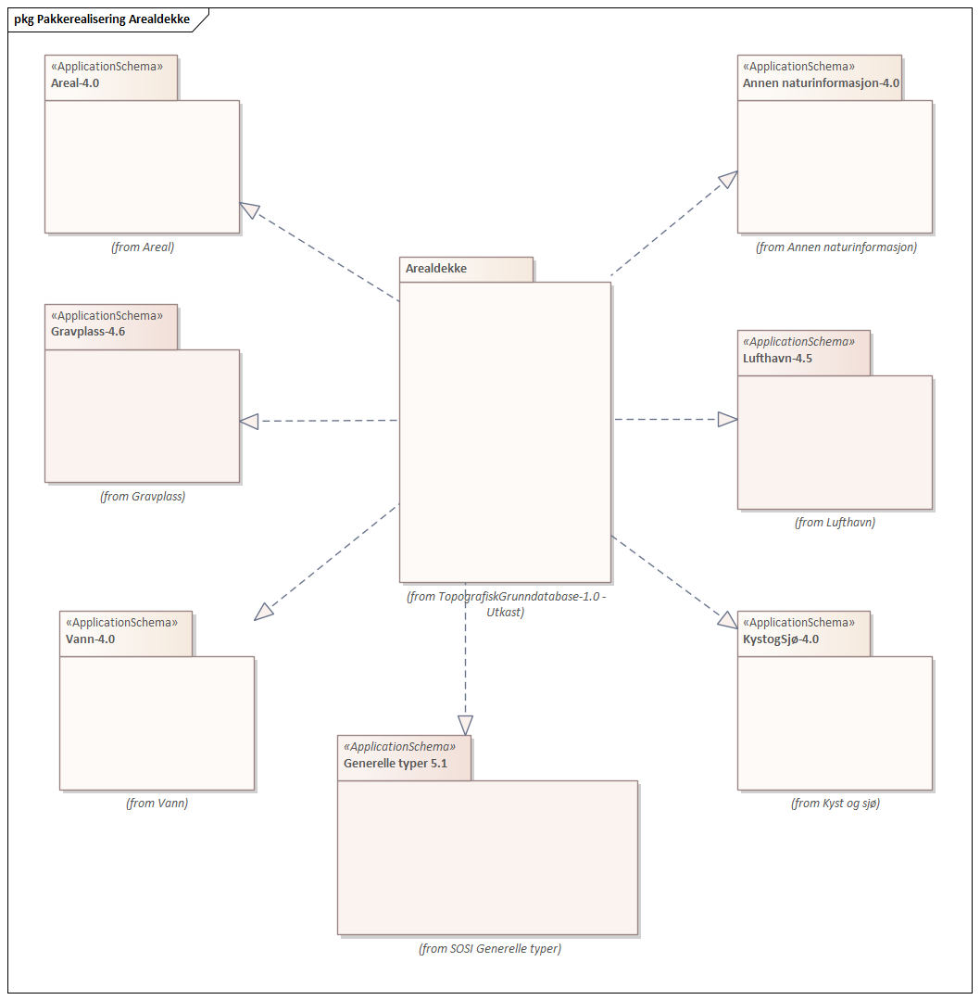
 
'''
 
.Oversiktsdiagram Arealdekke - Arealbrukgrense 
image::diagrammer/Oversiktsdiagram Arealdekke - Arealbrukgrense.png[link=diagrammer/Oversiktsdiagram Arealdekke - Arealbrukgrense.png, Alt="Diagram med navn Oversiktsdiagram Arealdekke - Arealbrukgrense som viser UML-klasser beskrevet i teksten nedenfor."]
 
'''
 
.Hoveddiagram Vann 

 
'''
 
.Hoveddiagram ElveKant 
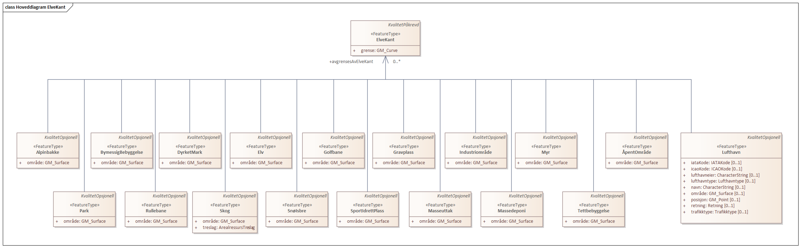
 
'''
 
.Hoveddiagram Innsjøkant 
image::diagrammer/Hoveddiagram Innsjøkant.png[link=diagrammer/Hoveddiagram Innsjøkant.png, Alt="Diagram med navn Hoveddiagram Innsjøkant som viser UML-klasser beskrevet i teksten nedenfor."]
 
'''
 
.Hoveddiagram InnsjøkantRegulert 
image::diagrammer/Hoveddiagram InnsjøkantRegulert.png[link=diagrammer/Hoveddiagram InnsjøkantRegulert.png, Alt="Diagram med navn Hoveddiagram InnsjøkantRegulert som viser UML-klasser beskrevet i teksten nedenfor."]
 
'''
 
.Hoveddiagram Kystkontur 

 
'''
 
.Realisering av featuretyper fra generell objektkatalog 

 
'''
 
.Realisering av datatyper og kodelister fra generell objektkatalog 

 
'''
 
.Kodelister og datatyper 
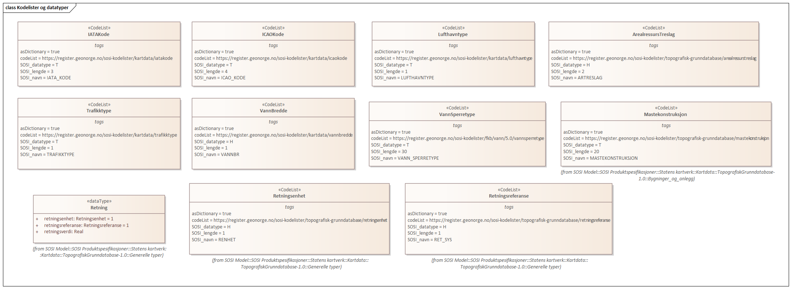
 
'''
 
[[alpinbakke]]
===== «FeatureType» Alpinbakke
*Definisjon:* nedfart for ski med permanent karakter

Alle alpinbakker skal med i Topografisk grunndatabase. Alpinbakke skal registreres fullstedig, avgrensingen skal være i samsvar med utstrekningen av Skitrekk / Stolheis og preparerte løyper.

 
[discrete]
====== Profilparametre i tagged values
[cols="20,80"]
|===
|SOSI_geometri
|FLATE;
 
|===
[discrete]
====== Egenskaper
[cols="20,80"]
|===
|*Navn:* 
|*område*
 
|Definisjon: 
|objektets utstrekning
 
|Multiplisitet: 
|[1..1]
 
|Type: 
|http://skjema.geonorge.no/SOSI/basistype/GM_Surface[GM_Surface]
|Profilparametre i tagged values: 
|
SOSI_melding: Fant ikke denne i SOSI_db + 
|===
 
[discrete]
====== Roller
[cols="20,80"]
|===
|*Rollenavn:* 
|*avgrensesAvInnsjøkantRegulert*
 
|Definisjon:
|avgrenser Alpinbakke
 
|Multiplisitet: 
|[0..*]
 
|Til klasse
|<<innsjøkantregulert,«FeatureType» InnsjøkantRegulert>>
|===
[cols="20,80"]
|===
|*Rollenavn:* 
|*avgrensesAvArealbrukgrense*
 
|Definisjon:
|avgrenser Alpinbakke
 
|Multiplisitet: 
|[0..*]
 
|Til klasse
|<<arealbrukgrense,«FeatureType» Arealbrukgrense>>
|===
[cols="20,80"]
|===
|*Rollenavn:* 
|*avgrensesAvKystkontur*
 
|Definisjon:
|avgrenser Alpinbakke
 
|Multiplisitet: 
|[0..*]
 
|Til klasse
|<<kystkontur,«FeatureType» Kystkontur>>
|===
[cols="20,80"]
|===
|*Rollenavn:* 
|*avgrensesAvInnsjøkant*
 
|Definisjon:
|avgrenser Alpinbakke
 
|Multiplisitet: 
|[0..*]
 
|Til klasse
|<<innsjøkant,«FeatureType» Innsjøkant>>
|===
[cols="20,80"]
|===
|*Rollenavn:* 
|*avgrensesAvElveKant*
 
|Definisjon:
|avgrenser Alpinbakke
 
|Multiplisitet: 
|[0..*]
 
|Til klasse
|<<elvekant,«FeatureType» ElveKant>>
|===
 
[discrete]
====== Arv og realiseringer
[cols="20,80"]
|===
|Supertype: 
|<<kvalitetopsjonell,«FeatureType» KvalitetOpsjonell>>
 
|Realisering av: 
|«ApplicationSchema» Areal-4.0/Fritidsområder::«featureType» Alpinbakke +
|===
 
'''
 
[[arealbrukgrense]]
===== «FeatureType» Arealbrukgrense
*Definisjon:* avgrensning av de ulike arealbruksflatene  

Merknad:
Kode for bruken av arealet legges på flaten, dvs på representasjonspunktet der dette representerer flata.
 
[discrete]
====== Profilparametre i tagged values
[cols="20,80"]
|===
|SOSI_geometri
|KURVE;
 
|===
[discrete]
====== Egenskaper
[cols="20,80"]
|===
|*Navn:* 
|*grense*
 
|Definisjon: 
|forløp som følger overgang mellom ulike fenomener
 
|Multiplisitet: 
|[1..1]
 
|Type: 
|http://skjema.geonorge.no/SOSI/basistype/GM_Curve[GM_Curve]
|Profilparametre i tagged values: 
|
SOSI_melding: Fant ikke denne i SOSI_db + 
|===
 
[discrete]
====== Arv og realiseringer
[cols="20,80"]
|===
|Supertype: 
|<<kvalitetpåkrevd,«FeatureType» KvalitetPåkrevd>>
 
|Realisering av: 
|«ApplicationSchema» Areal-4.0/Arealbruksgrense::«featureType» Arealbrukgrense +
|===
 
'''
 
[[bymessigbebyggelse]]
===== «FeatureType» BymessigBebyggelse
*Definisjon:* kvartalsbebyggelse (bykjerne) med stort innslag av forretnings- og servicebygg

Merknad:
Husene har overveiende to eller flere etasjer.

Bymessig bebyggelse som er større enn 1000 m 2  og bredere enn 20 meter skal med i Topografisk grunndatabase.
 
[discrete]
====== Profilparametre i tagged values
[cols="20,80"]
|===
|SOSI_geometri
|PUNKT;FLATE;
 
|===
[discrete]
====== Egenskaper
[cols="20,80"]
|===
|*Navn:* 
|*område*
 
|Definisjon: 
|objektets utstrekning
 
|Multiplisitet: 
|[1..1]
 
|Type: 
|http://skjema.geonorge.no/SOSI/basistype/GM_Surface[GM_Surface]
|Profilparametre i tagged values: 
|
SOSI_melding: Fant ikke denne i SOSI_db + 
|===
 
[discrete]
====== Roller
[cols="20,80"]
|===
|*Rollenavn:* 
|*avgrensesAvInnsjøkantRegulert*
 
|Definisjon:
|avgrenser BymessigBebyggelse
 
|Multiplisitet: 
|[0..*]
 
|Til klasse
|<<innsjøkantregulert,«FeatureType» InnsjøkantRegulert>>
|===
[cols="20,80"]
|===
|*Rollenavn:* 
|*avgrensesAvArealbrukgrense*
 
|Definisjon:
|avgrenser BymessigBebyggelse
 
|Multiplisitet: 
|[0..*]
 
|Til klasse
|<<arealbrukgrense,«FeatureType» Arealbrukgrense>>
|===
[cols="20,80"]
|===
|*Rollenavn:* 
|*avgrensesAvKystkontur*
 
|Definisjon:
|avgrenser BymessigBebyggelse
 
|Multiplisitet: 
|[0..*]
 
|Til klasse
|<<kystkontur,«FeatureType» Kystkontur>>
|===
[cols="20,80"]
|===
|*Rollenavn:* 
|*avgrensesAvInnsjøkant*
 
|Definisjon:
|avgrenser BymessigBebyggelse
 
|Multiplisitet: 
|[0..*]
 
|Til klasse
|<<innsjøkant,«FeatureType» Innsjøkant>>
|===
[cols="20,80"]
|===
|*Rollenavn:* 
|*avgrensesAvElveKant*
 
|Definisjon:
|avgrenser Bymessigbebyggelse
 
|Multiplisitet: 
|[0..*]
 
|Til klasse
|<<elvekant,«FeatureType» ElveKant>>
|===
 
[discrete]
====== Arv og realiseringer
[cols="20,80"]
|===
|Supertype: 
|<<kvalitetopsjonell,«FeatureType» KvalitetOpsjonell>>
 
|Realisering av: 
|«ApplicationSchema» Areal-4.0/Kulturområder::«featureType» BymessigBebyggelse +
|===
 
'''
 
[[dyrketmark]]
===== «FeatureType» DyrketMark
*Definisjon:* fulldyrket (plogmark), beitemark som er overflatebehandlet og bærhager. Jordbruksareal som ligger brakk i kortere perioder eller brukes til kulturbeite, regnes også som dyrket mark

Dyrket mark skal skilles i arealtypene Overflatedyrket, Innmarksbeite og Fulldyrka jord

Dyrket mark som er større enn 500 m 2  og bredere enn 15 meter skal med i Topografisk grunndatabase. Dyrket mark som dekker hele øyer som er mindre enn minstemålet for dyrket mark, skal med i Topografisk grunndatabase

 
[discrete]
====== Profilparametre i tagged values
[cols="20,80"]
|===
|SOSI_geometri
|PUNKT;FLATE;
 
|===
[discrete]
====== Egenskaper
[cols="20,80"]
|===
|*Navn:* 
|*område*
 
|Definisjon: 
|objektets utstrekning
 
|Multiplisitet: 
|[1..1]
 
|Type: 
|http://skjema.geonorge.no/SOSI/basistype/GM_Surface[GM_Surface]
|Profilparametre i tagged values: 
|
SOSI_melding: Fant ikke denne i SOSI_db + 
|===
 
[discrete]
====== Roller
[cols="20,80"]
|===
|*Rollenavn:* 
|*avgrensesAvKystkontur*
 
|Definisjon:
|avgrenser DyrketMark
 
|Multiplisitet: 
|[0..*]
 
|Til klasse
|<<kystkontur,«FeatureType» Kystkontur>>
|===
[cols="20,80"]
|===
|*Rollenavn:* 
|*avgrensesAvElveKant*
 
|Definisjon:
|avgrenser DyrketMark
 
|Multiplisitet: 
|[0..*]
 
|Til klasse
|<<elvekant,«FeatureType» ElveKant>>
|===
[cols="20,80"]
|===
|*Rollenavn:* 
|*avgrensesAvInnsjøkantRegulert*
 
|Definisjon:
|avgrenser DyrketMark
 
|Multiplisitet: 
|[0..*]
 
|Til klasse
|<<innsjøkantregulert,«FeatureType» InnsjøkantRegulert>>
|===
[cols="20,80"]
|===
|*Rollenavn:* 
|*avgrensesAvInnsjøkant*
 
|Definisjon:
|avgrenser DyrketMark
 
|Multiplisitet: 
|[0..*]
 
|Til klasse
|<<innsjøkant,«FeatureType» Innsjøkant>>
|===
[cols="20,80"]
|===
|*Rollenavn:* 
|*avgrensesAvArealbrukgrense*
 
|Definisjon:
|avgrenser DyrketMark
 
|Multiplisitet: 
|[0..*]
 
|Til klasse
|<<arealbrukgrense,«FeatureType» Arealbrukgrense>>
|===
 
[discrete]
====== Arv og realiseringer
[cols="20,80"]
|===
|Supertype: 
|<<kvalitetopsjonell,«FeatureType» KvalitetOpsjonell>>
 
|Realisering av: 
|«ApplicationSchema» Areal-4.0/Kulturområder::«featureType» DyrketMark +
|===
 
'''
 
[[elv]]
===== «FeatureType» Elv
*Definisjon:* større vannvei for rennende vann representert ved flate

Elver bredere enn 3 meter og lengre enn 10 meter danner elveflater (flater med vannBredde 3 - 5). Øy i elv som er større enn 100 m 2  og bredere enn 5 meter skal med i Topografisk grunndatabase
MEDIUM U benyttes på elv som ligger under terreng, for eksempel under veg. Skal ikke benyttes ved bruer.
 
[discrete]
====== Egenskaper
[cols="20,80"]
|===
|*Navn:* 
|*område*
 
|Definisjon: 
|objektets utstrekning

 
|Multiplisitet: 
|[1..1]
 
|Type: 
|http://skjema.geonorge.no/SOSI/basistype/GM_Surface[GM_Surface]
|===
 
[discrete]
====== Roller
[cols="20,80"]
|===
|*Rollenavn:* 
|*avgrensesAvVannFiktivGrense*
 
|Definisjon:
|avgrenser Elv
 
|Multiplisitet: 
|[0..*]
 
|Til klasse
|<<vannfiktivgrense,«FeatureType» VannFiktivGrense>>
|===
[cols="20,80"]
|===
|*Rollenavn:* 
|*avgrensesAvInnsjøElvSperre*
 
|Definisjon:
|avgrenser Elv
 
|Multiplisitet: 
|[0..*]
 
|Til klasse
|<<innsjøelvsperre,«FeatureType» InnsjøElvSperre>>
|===
[cols="20,80"]
|===
|*Rollenavn:* 
|*avgrensesAvElveKant*
 
|Definisjon:
|avgenser Elv
 
|Multiplisitet: 
|[0..*]
 
|Til klasse
|<<elvekant,«FeatureType» ElveKant>>
|===
[cols="20,80"]
|===
|*Rollenavn:* 
|*avgrensesAvFerskvanntørrfallkant*
 
|Definisjon:
|avgrenser Elv
 
|Multiplisitet: 
|[0..*]
 
|Til klasse
|<<ferskvanntørrfallkant,«FeatureType» FerskvannTørrfallkant>>
|===
 
[discrete]
====== Arv og realiseringer
[cols="20,80"]
|===
|Supertype: 
|<<kvalitetopsjonell,«FeatureType» KvalitetOpsjonell>>
 
|Realisering av: 
|«ApplicationSchema» Vann-4.0/Elver og bekker::«featureType» ElvBekk +
|===
 
'''
 
[[elvbekk]]
===== «FeatureType» ElvBekk
*Definisjon:* mindre vannvei for rennende vann representert ved senterlinje

Naturlig rennende vann med bredde opptil 3 meter registreres som midtlinje (vannBredde 1-2). Er vannbredden over 3 meter brukes Elvekant og Elv.

Merknad: Det skal etableres nodepunkt mellom ElvBekk (midtlinje) og andre tilstøtende vannobjekter. Der det er naturlig skal det lages nodepunkt i 3D.

MEDIUM U benyttes på ElvBekk som ligger under terreng, for eksempel under veg. Skal ikke benyttes ved bruer.

 
[discrete]
====== Profilparametre i tagged values
[cols="20,80"]
|===
|SOSI_geometri
|KURVE
 
|SOSI_geometri
|PUNKT;KURVE;FLATE;
 
|===
[discrete]
====== Egenskaper
[cols="20,80"]
|===
|*Navn:* 
|*senterlinje*
 
|Definisjon: 
|forløp som følger objektets sentrale del
 
|Multiplisitet: 
|[1..1]
 
|Type: 
|http://skjema.geonorge.no/SOSI/basistype/GM_Curve[GM_Curve]
|Profilparametre i tagged values: 
|
SOSI_melding: Fant ikke denne i SOSI_db + 
SOSI_navn: Kurve + 
|===
[cols="20,80"]
|===
|*Navn:* 
|*vannbredde*
 
|Definisjon: 
|grov klassifikasjon av vassdrag etter gjennomsnittelig bredde over lengre strekninger

-- Definition - - 
Rough classification of river system according to average width over longer sections.
 
|Multiplisitet: 
|[1..1]
 
|Type: 
|<<vannbredde,«CodeList» VannBredde>>
|===
 
[discrete]
====== Arv og realiseringer
[cols="20,80"]
|===
|Supertype: 
|<<kvalitetpåkrevd,«FeatureType» KvalitetPåkrevd>>
 
|Realisering av: 
|«ApplicationSchema» Vann-4.0/Elver og bekker::«featureType» ElvBekk +
|===
 
'''
 
[[elvekant]]
===== «FeatureType» ElveKant
*Definisjon:* konturlinje mellom land og elveflate
  
  MEDIUM U benyttes på Elvekant som ligger under terreng, for eksempel under veg. Skal ikke benyttes ved bruer.
 
[discrete]
====== Profilparametre i tagged values
[cols="20,80"]
|===
|SOSI_geometri
|KURVE;
 
|===
[discrete]
====== Egenskaper
[cols="20,80"]
|===
|*Navn:* 
|*grense*
 
|Definisjon: 
|forløp som følger overgang mellom ulike fenomener
 
|Multiplisitet: 
|[1..1]
 
|Type: 
|http://skjema.geonorge.no/SOSI/basistype/GM_Curve[GM_Curve]
|Profilparametre i tagged values: 
|
SOSI_melding: Fant ikke denne i SOSI_db + 
|===
 
[discrete]
====== Arv og realiseringer
[cols="20,80"]
|===
|Supertype: 
|<<kvalitetpåkrevd,«FeatureType» KvalitetPåkrevd>>
 
|Realisering av: 
|«ApplicationSchema» Vann-4.0/Elver og bekker::«featureType» ElvBekkKant +
|===
 
'''
 
[[ferskvanntørrfall]]
===== «FeatureType» FerskvannTørrfall
*Definisjon:* sandbanker og avleiringer i elv/bekk som oversvømmes ved normal høyvannsføring

Merknad:
Flatene avgrenses av FerskvannTørrfallKant og elve- eller kanalkant som grenser inn til tørrfallet.

Tørrfallflater større enn 1 000 m&#178; skal med i Topografisk grunndatabase

 
[discrete]
====== Profilparametre i tagged values
[cols="20,80"]
|===
|SOSI_geometri
|PUNKT;FLATE;
 
|===
[discrete]
====== Egenskaper
[cols="20,80"]
|===
|*Navn:* 
|*område*
 
|Definisjon: 
|objektets utstrekning
 
|Multiplisitet: 
|[1..1]
 
|Type: 
|http://skjema.geonorge.no/SOSI/basistype/GM_Surface[GM_Surface]
|Profilparametre i tagged values: 
|
SOSI_melding: Fant ikke denne i SOSI_db + 
|===
 
[discrete]
====== Roller
[cols="20,80"]
|===
|*Rollenavn:* 
|*avgrensesAvElveKant*
 
|Definisjon:
|avgrenser FerskvannTørrfall
 
|Multiplisitet: 
|[0..*]
 
|Til klasse
|<<elvekant,«FeatureType» ElveKant>>
|===
[cols="20,80"]
|===
|*Rollenavn:* 
|*avgrensesAvFerskvanntørrfallkant*
 
|Definisjon:
|avgrenser FerskvannTørrfall
 
|Multiplisitet: 
|[0..*]
 
|Til klasse
|<<ferskvanntørrfallkant,«FeatureType» FerskvannTørrfallkant>>
|===
 
[discrete]
====== Arv og realiseringer
[cols="20,80"]
|===
|Supertype: 
|<<kvalitetopsjonell,«FeatureType» KvalitetOpsjonell>>
 
|Realisering av: 
|«ApplicationSchema» Vann-4.0/Elver og bekker::«featureType» FerskvannTørrfall +
|===
 
'''
 
[[ferskvanntørrfallkant]]
===== «FeatureType» FerskvannTørrfallkant
*Definisjon:* avgrensningslinje for FerskvannTørrfall

 
[discrete]
====== Profilparametre i tagged values
[cols="20,80"]
|===
|SOSI_geometri
|KURVE;
 
|===
[discrete]
====== Egenskaper
[cols="20,80"]
|===
|*Navn:* 
|*grense*
 
|Definisjon: 
|forløp som følger overgang mellom ulike fenomener
 
|Multiplisitet: 
|[1..1]
 
|Type: 
|http://skjema.geonorge.no/SOSI/basistype/GM_Curve[GM_Curve]
|Profilparametre i tagged values: 
|
SOSI_melding: Fant ikke denne i SOSI_db + 
|===
 
[discrete]
====== Arv og realiseringer
[cols="20,80"]
|===
|Supertype: 
|<<kvalitetpåkrevd,«FeatureType» KvalitetPåkrevd>>
 
|Realisering av: 
|«ApplicationSchema» Vann-4.0/Elver og bekker::«featureType» FerskvannTørrfallkant +
|===
 
'''
 
[[flomløpkant]]
===== «FeatureType» Flomløpkant
*Definisjon:* begrensningslinje for store markerte elveløp hvor det pga regulering eller andre årsaker bare det en sjelden gang er vannføring

Benyttes kun på elveløp bredere enn 5 meter. Smalere flomløp enn 
5 meter framstilles som elvbekk.

Merknad:
Flomløp finnes fortrinnsvis i regulerte vassdrag.
 
[discrete]
====== Profilparametre i tagged values
[cols="20,80"]
|===
|SOSI_geometri
|KURVE;
 
|===
[discrete]
====== Egenskaper
[cols="20,80"]
|===
|*Navn:* 
|*grense*
 
|Definisjon: 
|forløp som følger overgang mellom ulike fenomener
 
|Multiplisitet: 
|[1..1]
 
|Type: 
|http://skjema.geonorge.no/SOSI/basistype/GM_Curve[GM_Curve]
|Profilparametre i tagged values: 
|
SOSI_melding: Fant ikke denne i SOSI_db + 
|===
 
[discrete]
====== Arv og realiseringer
[cols="20,80"]
|===
|Supertype: 
|<<kvalitetpåkrevd,«FeatureType» KvalitetPåkrevd>>
 
|Realisering av: 
|«ApplicationSchema» Vann-4.0/Flom::«featureType» Flomløpkant +
|===
 
'''
 
[[foss]]
===== «FeatureType» Foss
*Definisjon:* vann i tilnærmet fritt fall

Større fosser av nasjonal- eller turistinteresse skal med i Topografisk grunndatabase. Det skal etterstrebes at alle fosser er navnsatt.
Merknad:
Foss representeres med et punkt på toppen av fossen. Der elva er et kurveobjekt knyttes punktsymbolet til kurven, og roteres slik at det står vinkelrett på elva.
Er elva avlagt som flate legges punktet midt i elva og punktsymbolet roteres slik at dette står vinkelrett på elva.
 
[discrete]
====== Profilparametre i tagged values
[cols="20,80"]
|===
|SOSI_geometri
|PUNKT;KURVE;
 
|===
[discrete]
====== Egenskaper
[cols="20,80"]
|===
|*Navn:* 
|*posisjon*
 
|Definisjon: 
|sted som objektet eksisterer på
 
|Multiplisitet: 
|[1..1]
 
|Type: 
|http://skjema.geonorge.no/SOSI/basistype/GM_Point[GM_Point]
|Profilparametre i tagged values: 
|
SOSI_datatype: * + 
SOSI_lengde:  + 
SOSI_navn: NØ + 
SOSI_navn: Punkt + 
|===
[cols="20,80"]
|===
|*Navn:* 
|*retning*
 
|Definisjon: 
|linjestykke i planet med retning
 
|Multiplisitet: 
|[1..1]
 
|Type: 
|<<retning,«dataType» Retning>>
|===
 
[discrete]
====== Arv og realiseringer
[cols="20,80"]
|===
|Supertype: 
|<<kvalitetpåkrevd,«FeatureType» KvalitetPåkrevd>>
 
|Realisering av: 
|«ApplicationSchema» Vann-4.0/Elver og bekker::«featureType» Foss +
|===
 
'''
 
[[golfbane]]
===== «FeatureType» Golfbane
*Definisjon:* område for golfspilling

Alle baneanlegg med minst 6 hull skal med i Topografisk grunndatabase. Mindre skogflater innenfor flaten kan avsettes som tregrupper.
Golfbanen skal registreres fullstendig. Interne veger og tilhørende areal skal inngå i arealbruksflaten, ikke bare spilleflaten på de forskjellige hullene
 
[discrete]
====== Profilparametre i tagged values
[cols="20,80"]
|===
|SOSI_geometri
|PUNKT;FLATE;
 
|===
[discrete]
====== Egenskaper
[cols="20,80"]
|===
|*Navn:* 
|*område*
 
|Definisjon: 
|objektets utstrekning
 
|Multiplisitet: 
|[1..1]
 
|Type: 
|http://skjema.geonorge.no/SOSI/basistype/GM_Surface[GM_Surface]
|Profilparametre i tagged values: 
|
SOSI_melding: Fant ikke denne i SOSI_db + 
|===
 
[discrete]
====== Roller
[cols="20,80"]
|===
|*Rollenavn:* 
|*avgrensesAvInnsjøkantRegulert*
 
|Definisjon:
|avgrenser Golfbane
 
|Multiplisitet: 
|[0..*]
 
|Til klasse
|<<innsjøkantregulert,«FeatureType» InnsjøkantRegulert>>
|===
[cols="20,80"]
|===
|*Rollenavn:* 
|*avgrensesAvArealbrukgrense*
 
|Definisjon:
|avgrenser Golfbane
 
|Multiplisitet: 
|[0..*]
 
|Til klasse
|<<arealbrukgrense,«FeatureType» Arealbrukgrense>>
|===
[cols="20,80"]
|===
|*Rollenavn:* 
|*avgrensesAvKystkontur*
 
|Definisjon:
|avgrenser Golfbane
 
|Multiplisitet: 
|[0..*]
 
|Til klasse
|<<kystkontur,«FeatureType» Kystkontur>>
|===
[cols="20,80"]
|===
|*Rollenavn:* 
|*avgrensesAvInnsjøkant*
 
|Definisjon:
|avgrenser Golfbane
 
|Multiplisitet: 
|[0..*]
 
|Til klasse
|<<innsjøkant,«FeatureType» Innsjøkant>>
|===
[cols="20,80"]
|===
|*Rollenavn:* 
|*avgrensesAvElveKant*
 
|Definisjon:
|avgrenser Golfbane
 
|Multiplisitet: 
|[0..*]
 
|Til klasse
|<<elvekant,«FeatureType» ElveKant>>
|===
 
[discrete]
====== Arv og realiseringer
[cols="20,80"]
|===
|Supertype: 
|<<kvalitetopsjonell,«FeatureType» KvalitetOpsjonell>>
 
|Realisering av: 
|«ApplicationSchema» Areal-4.0/Fritidsområder::«featureType» Golfbane +
|===
 
'''
 
[[gravplass]]
===== «FeatureType» Gravplass
*Definisjon:* areal hvor gravlegging kan finne sted i en grav  innenfor gravfelt

Gravplass/kirkegård større enn 400 m 2  og bredere enn 5 meter tas med. 
Gravplassen skal registreres fullstendig. Interne veger, gangveger og tilhørende areal skal inngå i arealbruksflaten
 
[discrete]
====== Profilparametre i tagged values
[cols="20,80"]
|===
|SOSI_geometri
|PUNKT;FLATE;
 
|SOSI_navn
|Gravplass
 
|===
[discrete]
====== Egenskaper
[cols="20,80"]
|===
|*Navn:* 
|*område*
 
|Definisjon: 
|objektets utstrekning
 
|Multiplisitet: 
|[1..1]
 
|Type: 
|http://skjema.geonorge.no/SOSI/basistype/GM_Surface[GM_Surface]
|Profilparametre i tagged values: 
|
SOSI_navn: Flate + 
|===
 
[discrete]
====== Roller
[cols="20,80"]
|===
|*Rollenavn:* 
|*avgrensesAvArealbrukgrense*
 
|Definisjon:
|avgrenser Gravplass
 
|Multiplisitet: 
|[0..*]
 
|Til klasse
|<<arealbrukgrense,«FeatureType» Arealbrukgrense>>
|===
[cols="20,80"]
|===
|*Rollenavn:* 
|*avgrensesAvInnsjøkantregulert*
 
|Definisjon:
|avgrenser Gravplass
 
|Multiplisitet: 
|[0..*]
 
|Til klasse
|<<innsjøkantregulert,«FeatureType» InnsjøkantRegulert>>
|===
[cols="20,80"]
|===
|*Rollenavn:* 
|*avgrensesAvKystkontur*
 
|Definisjon:
|avgrenser Gravplass
 
|Multiplisitet: 
|[0..*]
 
|Til klasse
|<<kystkontur,«FeatureType» Kystkontur>>
|===
[cols="20,80"]
|===
|*Rollenavn:* 
|*avgrensesAvInnsjøkant*
 
|Definisjon:
|avgrenser Gravplass
 
|Multiplisitet: 
|[0..*]
 
|Til klasse
|<<innsjøkant,«FeatureType» Innsjøkant>>
|===
[cols="20,80"]
|===
|*Rollenavn:* 
|*avgrensesAvElveKant*
 
|Definisjon:
|avgrenser Gravplass
 
|Multiplisitet: 
|[0..*]
 
|Til klasse
|<<elvekant,«FeatureType» ElveKant>>
|===
 
[discrete]
====== Arv og realiseringer
[cols="20,80"]
|===
|Supertype: 
|<<kvalitetopsjonell,«FeatureType» KvalitetOpsjonell>>
 
|Realisering av: 
|«ApplicationSchema» Gravplass-4.6::«featureType» Gravplass +
|===
 
'''
 
[[havflate]]
===== «FeatureType» Havflate
*Definisjon:* havområde som avgrenses av Kystkontur, Kystsperre, HavElvSperre og KystkonturTekniskAnlegg

Alle øyer som er større enn 100 m&#178; og bredere enn 5 meter skal med i Topografisk grunndatabase.
Øyer under minstemålet kodes som skjær.
 
[discrete]
====== Profilparametre i tagged values
[cols="20,80"]
|===
|SOSI_geometri
|PUNKT;FLATE;
 
|===
[discrete]
====== Egenskaper
[cols="20,80"]
|===
|*Navn:* 
|*område*
 
|Definisjon: 
|objektets utstrekning
 
|Multiplisitet: 
|[1..1]
 
|Type: 
|http://skjema.geonorge.no/SOSI/basistype/GM_Surface[GM_Surface]
|Profilparametre i tagged values: 
|
SOSI_melding: Fant ikke denne i SOSI_db + 
|===
 
[discrete]
====== Roller
[cols="20,80"]
|===
|*Rollenavn:* 
|*avgrensesAvKystkontur*
 
|Definisjon:
|avgrenser Havflate
 
|Multiplisitet: 
|[0..*]
 
|Til klasse
|<<kystkontur,«FeatureType» Kystkontur>>
|===
[cols="20,80"]
|===
|*Rollenavn:* 
|*avgrensesAvHavElvSperre*
 
|Definisjon:
|avgrenser Havflate
 
|Multiplisitet: 
|[0..*]
 
|Til klasse
|<<havelvsperre,«FeatureType» HavElvSperre>>
|===
[cols="20,80"]
|===
|*Rollenavn:* 
|*avgrensesAvHavInnsjøSperre*
 
|Definisjon:
|avgrenser Havflate
 
|Multiplisitet: 
|[0..*]
 
|Til klasse
|<<vannfiktivgrense,«FeatureType» VannFiktivGrense>>
|===
 
[discrete]
====== Arv og realiseringer
[cols="20,80"]
|===
|Supertype: 
|<<kvalitetopsjonell,«FeatureType» KvalitetOpsjonell>>
 
|Realisering av: 
|«ApplicationSchema» KystogSjø-4.0/Topografi::«featureType» Havflate +
|===
 
'''
 
[[industriområde]]
===== «FeatureType» Industriområde
*Definisjon:* område, bebygd eller ubebygd, benyttet til industriformål

Merknad:
Omfatter også anlegg for vannforsyning, avfallshåndtering og rensing, samt kraftstasjon, transformatorstasjon o.l.
I Topografisk grunndatabase inkluderes næringsområder/næringsparker der det drives ulike typer næringsvirksomhet, f.eks kontorlokaler, produksjonsbedrifter eller lager. Handel-/forretningsvirksomhet kan også forekomme i industriområder.

Industriområder som er større enn 3000 m 2  og bredere enn 20 meter skal med i Topografisk grunndatabase.
Industriområder under minstemålet innlemmes i tettbebyggelsen der disse grenser til hverandre. 
 
[discrete]
====== Profilparametre i tagged values
[cols="20,80"]
|===
|SOSI_geometri
|PUNKT;FLATE;
 
|===
[discrete]
====== Egenskaper
[cols="20,80"]
|===
|*Navn:* 
|*område*
 
|Definisjon: 
|objektets utstrekning
 
|Multiplisitet: 
|[1..1]
 
|Type: 
|http://skjema.geonorge.no/SOSI/basistype/GM_Surface[GM_Surface]
|Profilparametre i tagged values: 
|
SOSI_melding: Fant ikke denne i SOSI_db + 
|===
 
[discrete]
====== Roller
[cols="20,80"]
|===
|*Rollenavn:* 
|*avgrensesAvInnsjøkantRegulert*
 
|Definisjon:
|avgrenser IndustriOmråde
 
|Multiplisitet: 
|[0..*]
 
|Til klasse
|<<innsjøkantregulert,«FeatureType» InnsjøkantRegulert>>
|===
[cols="20,80"]
|===
|*Rollenavn:* 
|*avgrensesAvArealbrukgrense*
 
|Definisjon:
|avgrenser IndustriOmråde
 
|Multiplisitet: 
|[0..*]
 
|Til klasse
|<<arealbrukgrense,«FeatureType» Arealbrukgrense>>
|===
[cols="20,80"]
|===
|*Rollenavn:* 
|*avgrensesAvKystkontur*
 
|Definisjon:
|avgrenser IndustriOmråde
 
|Multiplisitet: 
|[0..*]
 
|Til klasse
|<<kystkontur,«FeatureType» Kystkontur>>
|===
[cols="20,80"]
|===
|*Rollenavn:* 
|*avgrensesAvInnsjøkant*
 
|Definisjon:
|avgrenser Industriområde
 
|Multiplisitet: 
|[0..*]
 
|Til klasse
|<<innsjøkant,«FeatureType» Innsjøkant>>
|===
[cols="20,80"]
|===
|*Rollenavn:* 
|*avgrensesAvElveKant*
 
|Definisjon:
|avgrenser IndustriOmråde
 
|Multiplisitet: 
|[0..*]
 
|Til klasse
|<<elvekant,«FeatureType» ElveKant>>
|===
 
[discrete]
====== Arv og realiseringer
[cols="20,80"]
|===
|Supertype: 
|<<kvalitetopsjonell,«FeatureType» KvalitetOpsjonell>>
 
|Realisering av: 
|«ApplicationSchema» Areal-4.0/Driftsområder::«featureType» Industriområde +
|===
 
'''
 
[[innsjø]]
===== «FeatureType» Innsjø
*Definisjon:* en ferskvannsflate som ikke er renndende vann

Innsjøer og øyer over 100m 2  og bredere enn 3 meter skal med i Topografisk grunndatabase.
Øyer i innsjø som er større enn 100 m&#178; og bredere enn 3 meter skal med i Topografisk grunndatabase.

Innsjøer over 2 500 m 2  skal være påført løpenummer for innsjø (vatnLøpenummer).
For alle oppdemte og regulerte innsjøer der reguleringen er i drift kodes innsjøen med egenskapen Regulert.
Det skal tilstrebes at alle innsjøer skal ha egenskapen høyde. Høyden skal angis i hele meter. 

MEDIUM U benyttes på del av Innsjø som ligger under terreng, for eksempel under veg. Skal ikke benyttes ved bruer.
 
[discrete]
====== Profilparametre i tagged values
[cols="20,80"]
|===
|SOSI_geometri
|PUNKT;KURVE;FLATE;
 
|===
[discrete]
====== Egenskaper
[cols="20,80"]
|===
|*Navn:* 
|*område*
 
|Definisjon: 
|objektets utstrekning
 
|Multiplisitet: 
|[1..1]
 
|Type: 
|http://skjema.geonorge.no/SOSI/basistype/GM_Surface[GM_Surface]
|Profilparametre i tagged values: 
|
SOSI_melding: Fant ikke denne i SOSI_db + 
SOSI_navn: Flate + 
|===
[cols="20,80"]
|===
|*Navn:* 
|*vatnLøpenummer*
 
|Definisjon: 
|unik identifikasjon på innsjøer som fortløpende løpenummer i henhold til NVEs Innsjøregister

-- Definition -- 
unique identification of lakes as consecutive serial number in accordance with the lake register of the NVE (The Norwegian Water Resources and Energy Administration)
 
|Multiplisitet: 
|[0..1]
 
|Type: 
|<<integer,«dataType» Integer>>
|Profilparametre i tagged values: 
|
SOSI_datatype: H + 
SOSI_lengde: 6 + 
SOSI_navn: VATNLNR + 
|===
[cols="20,80"]
|===
|*Navn:* 
|*høyde*
 
|Definisjon: 
|registrert høyde for vannspeilet. 
 
|Multiplisitet: 
|[0..1]
 
|Type: 
|http://skjema.geonorge.no/SOSI/basistype/Integer[Integer]
|Profilparametre i tagged values: 
|
SOSI_datatype: H + 
SOSI_lengde: 4 + 
SOSI_navn: HØYDE + 
|===
[cols="20,80"]
|===
|*Navn:* 
|*regulert*
 
|Definisjon: 
|angir om innsjø er oppdemt/regulert
 
|Multiplisitet: 
|[1..1]
 
|Type: 
|http://skjema.geonorge.no/SOSI/basistype/Boolean[Boolean]
|Profilparametre i tagged values: 
|
SOSI_datatype: BOOLSK + 
SOSI_navn: REGULERT + 
|===
[cols="20,80"]
|===
|*Navn:* 
|*lavesteRegulerteVannstand*
 
|Definisjon: 
|laveste regulerte vannstand - LRV

-- Definition -- 
lowest regulated water level
 
|Multiplisitet: 
|[0..1]
 
|Type: 
|http://skjema.geonorge.no/SOSI/basistype/Integer[Integer]
|Profilparametre i tagged values: 
|
SOSI_datatype: H + 
SOSI_lengde: 4 + 
SOSI_navn: LRV + 
|===
 
[discrete]
====== Roller
[cols="20,80"]
|===
|*Rollenavn:* 
|*avgrensesAvInnsjøElvSperre*
 
|Definisjon:
|avgrenser Innsjø
 
|Multiplisitet: 
|[0..*]
 
|Til klasse
|<<innsjøelvsperre,«FeatureType» InnsjøElvSperre>>
|===
[cols="20,80"]
|===
|*Rollenavn:* 
|*avgrensesAvInnsjøinnsjøsperre*
 
|Definisjon:
|avgrenser Innsjø
 
|Multiplisitet: 
|[0..*]
 
|Til klasse
|<<innsjøinnsjøsperre,«FeatureType» InnsjøInnsjøSperre>>
|===
[cols="20,80"]
|===
|*Rollenavn:* 
|*avgrensesAvHavInnsjøSperre*
 
|Definisjon:
|avgrenser Innsjø
 
|Multiplisitet: 
|[0..*]
 
|Til klasse
|<<vannfiktivgrense,«FeatureType» VannFiktivGrense>>
|===
[cols="20,80"]
|===
|*Rollenavn:* 
|*avgrensesAvInnsjøkant*
 
|Definisjon:
|avgrenser Innsjø
 
|Multiplisitet: 
|[0..*]
 
|Til klasse
|<<innsjøkant,«FeatureType» Innsjøkant>>
|===
 
[discrete]
====== Arv og realiseringer
[cols="20,80"]
|===
|Supertype: 
|<<kvalitetopsjonell,«FeatureType» KvalitetOpsjonell>>
 
|Realisering av: 
|«ApplicationSchema» Vann-4.0/Innsjø::«featureType» Innsjø +
|===
 
'''
 
[[innsjøkant]]
===== «FeatureType» Innsjøkant
*Definisjon:* konturlinje mellom land og innsjø

 
[discrete]
====== Profilparametre i tagged values
[cols="20,80"]
|===
|SOSI_geometri
|KURVE;
 
|===
[discrete]
====== Egenskaper
[cols="20,80"]
|===
|*Navn:* 
|*grense*
 
|Definisjon: 
|forløp som følger overgang mellom ulike fenomener
 
|Multiplisitet: 
|[1..1]
 
|Type: 
|http://skjema.geonorge.no/SOSI/basistype/GM_Curve[GM_Curve]
|Profilparametre i tagged values: 
|
SOSI_melding: Fant ikke denne i SOSI_db + 
|===
 
[discrete]
====== Arv og realiseringer
[cols="20,80"]
|===
|Supertype: 
|<<kvalitetpåkrevd,«FeatureType» KvalitetPåkrevd>>
 
|Realisering av: 
|«ApplicationSchema» Vann-4.0/Innsjø::«featureType» Innsjøkant +
|===
 
'''
 
[[kanal]]
===== «FeatureType» Kanal
*Definisjon:* større menneskeskapt vannvei for rennende vann representert ved flate

Alle kanal bredere enn 3 meter (vannBredde 3-5) skal med i Topografisk grunndatabase
 
 
'''
.Illustrasjon av objekttype Kanal
image::http://skjema.geonorge.no/SOSI/produktspesifikasjon/FKB-Vann/5.0/figurer/objtype_kanal.png[link=http://skjema.geonorge.no/SOSI/produktspesifikasjon/FKB-Vann/5.0/figurer/objtype_kanal.png, Alt="Bilde av et eksempel på objekttypen Kanal, eventuelt med påtegning av streker som viser hvor geometrien til objektet skal måles fra."]
[discrete]
====== Egenskaper
[cols="20,80"]
|===
|*Navn:* 
|*område*
 
|Definisjon: 
|objektets utstrekning
 
|Multiplisitet: 
|[1..1]
 
|Type: 
|http://skjema.geonorge.no/SOSI/basistype/GM_Surface[GM_Surface]
|===
[cols="20,80"]
|===
|*Navn:* 
|*vannBredde*
 
|Definisjon: 
|grov klassifisering av vassdrag etter gjennomsnittlig bredde over lengre strekninger

 
|Multiplisitet: 
|[1..1]
 
|Type: 
|http://skjema.geonorge.no/SOSI/basistype/VannBredde[VannBredde]
|Profilparametre i tagged values: 
|
defaultCodeSpace: https://register.geonorge.no/sosi-kodelister/fkb/vann/5.0/vannbredde + 
SOSI_datatype: H + 
SOSI_lengde: 1 + 
SOSI_navn: VANNBR + 
|===
 
[discrete]
====== Roller
[cols="20,80"]
|===
|*Rollenavn:* 
|*avgrensesAvKanalkant*
 
|Definisjon: 
|avgrensningslinje av kanal, dvs. der stor vannføring normalt går
 
|Multiplisitet: 
|[0..*]
 
|Til klasse
|<<kanalkant,«FeatureType» Kanalkant>>
|===
 
[discrete]
====== Restriksjoner
[cols="20,80"]
|===
|*Navn:* 
|*avgrensningsobjekter i samsvar med områdegeometri*
 
|Beskrivelse: 
|
--ingen OCL  restriksjonen implementeres manuelt

--Område
 
|===
[cols="20,80"]
|===
|*Navn:* 
|*posisjon innenfor område*
 
|Beskrivelse: 
|
--ingen OCL  restriksjonen implementeres manuelt

--Dersom det finnes område
 
|===
 
[discrete]
====== Arv og realiseringer
[cols="20,80"]
|===
|Supertype: 
|<<kvalitetopsjonell,«FeatureType» KvalitetOpsjonell>>
 
|===
 
'''
 
[[kanalkant]]
===== «FeatureType» Kanalkant
*Definisjon:* konturlinje mellom land og kanalflate
 
 
'''
.Illustrasjon av objekttype Kanalkant
image::http://skjema.geonorge.no/SOSI/produktspesifikasjon/FKB-Vann/5.0/figurer/objtype_kanalkant.png[link=http://skjema.geonorge.no/SOSI/produktspesifikasjon/FKB-Vann/5.0/figurer/objtype_kanalkant.png, Alt="Bilde av et eksempel på objekttypen Kanalkant, eventuelt med påtegning av streker som viser hvor geometrien til objektet skal måles fra."]
[discrete]
====== Egenskaper
[cols="20,80"]
|===
|*Navn:* 
|*grense*
 
|Definisjon: 
|forløp som følger overgang mellom ulike fenomener
 
|Multiplisitet: 
|[1..1]
 
|Type: 
|http://skjema.geonorge.no/SOSI/basistype/GM_Curve[GM_Curve]
|===
 
[discrete]
====== Arv og realiseringer
[cols="20,80"]
|===
|Supertype: 
|<<kvalitetpåkrevd,«FeatureType» KvalitetPåkrevd>>
 
|===
 
'''
 
[[kystkontur]]
===== «FeatureType» Kystkontur
*Definisjon:* grense mellom land og sjø, definert som midlere høyvannslinje

Merknad:
Tilsvarer COALNE i S-57

Kystkonturen skal være registrert fullstendig og sammenhengende. 

 
[discrete]
====== Profilparametre i tagged values
[cols="20,80"]
|===
|SOSI_geometri
|KURVE;
 
|===
[discrete]
====== Egenskaper
[cols="20,80"]
|===
|*Navn:* 
|*grense*
 
|Definisjon: 
|forløp som følger overgang mellom ulike fenomener
 
|Multiplisitet: 
|[1..1]
 
|Type: 
|http://skjema.geonorge.no/SOSI/basistype/GM_Curve[GM_Curve]
|Profilparametre i tagged values: 
|
SOSI_melding: Fant ikke denne i SOSI_db + 
SOSI_navn: Kurve + 
|===
 
[discrete]
====== Arv og realiseringer
[cols="20,80"]
|===
|Supertype: 
|<<kvalitetpåkrevd,«FeatureType» KvalitetPåkrevd>>
 
|Realisering av: 
|«ApplicationSchema» KystogSjø-4.0/Topografi::«featureType» Kystkontur +
|===
 
'''
 
[[kanalgrøft]]
===== «FeatureType» KanalGrøft
*Definisjon:* mindre menneskeskapt vannvei for rennende vann representert ved senterlinje

 Alle kanalgrøft som er en del av elvenettverket skal med i Topografisk grunndatabase. 
 
 
'''
.Illustrasjon av objekttype KanalGrøft
image::http://skjema.geonorge.no/SOSI/produktspesifikasjon/FKB-Vann/5.0/figurer/objtype_kanalgroft.png[link=http://skjema.geonorge.no/SOSI/produktspesifikasjon/FKB-Vann/5.0/figurer/objtype_kanalgroft.png, Alt="Bilde av et eksempel på objekttypen KanalGrøft, eventuelt med påtegning av streker som viser hvor geometrien til objektet skal måles fra."]
[discrete]
====== Egenskaper
[cols="20,80"]
|===
|*Navn:* 
|*senterlinje*
 
|Definisjon: 
|forløp som følger objektets sentrale del
 
|Multiplisitet: 
|[1..1]
 
|Type: 
|http://skjema.geonorge.no/SOSI/basistype/GM_Curve[GM_Curve]
|===
[cols="20,80"]
|===
|*Navn:* 
|*vannBredde*
 
|Definisjon: 
|grov klassifikasjon av vassdrag etter gjennomsnittlig bredde over lengre strekninger 
 
|Multiplisitet: 
|[1..1]
 
|Type: 
|http://skjema.geonorge.no/SOSI/basistype/VannBredde[VannBredde]
|Profilparametre i tagged values: 
|
defaultCodeSpace: https://register.geonorge.no/sosi-kodelister/fkb/vann/5.0/vannbredde + 
SOSI_datatype: H + 
SOSI_lengde: 1 + 
SOSI_navn: VANNBR + 
|===
 
[discrete]
====== Arv og realiseringer
[cols="20,80"]
|===
|Supertype: 
|<<kvalitetpåkrevd,«FeatureType» KvalitetPåkrevd>>
 
|===
 
'''
 
[[konnekteringvann]]
===== «FeatureType» KonnekteringVann
*Definisjon:* kunstig objekt hvor senterlinjen representerer en fiktiv linje som skjøter sammen lenker der det er hull i beskrivelsen av vannforløp

Benyttes for å lage sammenhengende vannregistrering i områder der geometrien ikke er sammenhengende. Kan brukes for å knytte sammen bekkeforløp over dyrket mark, myrområder og liknende.
Merknad:
KonnekteringVann er kun til analyseformål og bør ikke brukes i kartsammenheng.
 
 
'''
.Illustrasjon av objekttype KonnekteringVann
image::http://skjema.geonorge.no/SOSI/produktspesifikasjon/FKB-Vann/5.0/figurer/objtype_konnekteringvann.png[link=http://skjema.geonorge.no/SOSI/produktspesifikasjon/FKB-Vann/5.0/figurer/objtype_konnekteringvann.png, Alt="Bilde av et eksempel på objekttypen KonnekteringVann, eventuelt med påtegning av streker som viser hvor geometrien til objektet skal måles fra."]
[discrete]
====== Egenskaper
[cols="20,80"]
|===
|*Navn:* 
|*senterlinje*
 
|Definisjon: 
|fiktiv linje som skjøter sammen lenker der det er hull i beskrivelsen av vannforløp
 
|Multiplisitet: 
|[1..1]
 
|Type: 
|http://skjema.geonorge.no/SOSI/basistype/GM_Curve[GM_Curve]
|===
 
[discrete]
====== Arv og realiseringer
[cols="20,80"]
|===
|Supertype: 
|<<kvalitetpåkrevd,«FeatureType» KvalitetPåkrevd>>
 
|===
 
'''
 
[[lekeplass]]
===== «FeatureType» Lekeplass
*Definisjon:* område for lekeplass

 Alle lekeplasser over 100 kvm skal med i Topografisk grunndatabase 
Lekeområder i skolegårder/barnehager skal registreres som en sammenhengende lekeplass med mindre lekeområder ligger fysisk adskilt. I så fall registreres lekeplass for hvert enkelt område.
Lekeplasser i åpne fellesareal (blokkbebyggelse) og innenfor andre arealbruksflater (for eksempel park) skal registreres.
Områder med lekeapparater i private hager (villa/enebolig) registreres ikke.
 
 
'''
.Illustrasjon av objekttype Lekeplass
image::http://skjema.geonorge.no/SOSI/produktspesifikasjon/FKB-Arealbruk/5.0/figurer/objtype_lekeplass.png[link=http://skjema.geonorge.no/SOSI/produktspesifikasjon/FKB-Arealbruk/5.0/figurer/objtype_lekeplass.png, Alt="Bilde av et eksempel på objekttypen Lekeplass, eventuelt med påtegning av streker som viser hvor geometrien til objektet skal måles fra."]
[discrete]
====== Egenskaper
[cols="20,80"]
|===
|*Navn:* 
|*posisjon*
 
|Definisjon: 
|sted som objektet eksisterer på
 
|Multiplisitet: 
|[1..1]
 
|Type: 
|http://skjema.geonorge.no/SOSI/basistype/GM_Point[GM_Point]
|Profilparametre i tagged values: 
|
SOSI_datatype: * + 
SOSI_lengde:  + 
SOSI_navn: Punkt + 
SOSI_navn: NØ + 
|===
 
[discrete]
====== Arv og realiseringer
[cols="20,80"]
|===
|Supertype: 
|<<kvalitetpåkrevd,«FeatureType» KvalitetPåkrevd>>
 
|===
 
'''
 
[[lufthavn]]
===== «FeatureType» Lufthavn
*Definisjon:* land- eller sjøområde (med bygninger, installasjoner og utstyr) som helt eller delvis brukes for luftfartøyers avgang, landing og annen manøvrering på bakken

Alle lufthavner som er større enn 20 000 m 2  og bredere enn 10 meter skal med i Topografisk grunndatabase og avlegges som flate. I tillegg tas objekttypen Rullebane med som flate, og Lufthavn som punkt. Det er lufthavnpunktet som skal ha den utdypende informasjonen om lufthavnen. Lufthavnpunktet på lufthavnene avsettes tilnærmet på midten av rullebanen og roteres i rullebanens retning.
Alle helikopterplasser skal med i Topografisk grunndatabase, selv om de ligger på eller like ved bygninger.
 
[discrete]
====== Profilparametre i tagged values
[cols="20,80"]
|===
|SOSI_geometri
|PUNKT;FLATE;
 
|===
[discrete]
====== Egenskaper
[cols="20,80"]
|===
|*Navn:* 
|*område*
 
|Definisjon: 
|objektets utstrekning
 
|Multiplisitet: 
|[0..1]
 
|Type: 
|http://skjema.geonorge.no/SOSI/basistype/GM_Surface[GM_Surface]
|Profilparametre i tagged values: 
|
SOSI_melding: Fant ikke denne i SOSI_db + 
SOSI_navn: Flate + 
|===
[cols="20,80"]
|===
|*Navn:* 
|*posisjon*
 
|Definisjon: 
|sted som objektet eksisterer på
 
|Multiplisitet: 
|[0..1]
 
|Type: 
|http://skjema.geonorge.no/SOSI/basistype/GM_Point[GM_Point]
|Profilparametre i tagged values: 
|
SOSI_datatype: * + 
SOSI_lengde:  + 
SOSI_navn: Punkt + 
SOSI_navn: NØ + 
|===
[cols="20,80"]
|===
|*Navn:* 
|*lufthavntype*
 
|Definisjon: 
|angivelse av type lufthavn
 
|Multiplisitet: 
|[0..1]
 
|Type: 
|<<lufthavntype,«CodeList» Lufthavntype>>
|Profilparametre i tagged values: 
|
SOSI_datatype: T + 
SOSI_lengde: 1 + 
SOSI_navn: LUFTHAVNTYPE + 
|===
[cols="20,80"]
|===
|*Navn:* 
|*trafikktype*
 
|Definisjon: 
|beskrivelse av rutetrafikk
 
|Multiplisitet: 
|[0..1]
 
|Type: 
|<<trafikktype,«CodeList» Trafikktype>>
|Profilparametre i tagged values: 
|
SOSI_datatype: T + 
SOSI_lengde: 1 + 
SOSI_navn: TRAFIKKTYPE + 
|===
[cols="20,80"]
|===
|*Navn:* 
|*iataKode*
 
|Definisjon: 
|unik kode for lufthavner. 

Merknad1: Ikke alle lufthavner har IATA kode.
Merknad 2: Bare norske lufthavner er tatt med her.
 
|Multiplisitet: 
|[0..1]
 
|Type: 
|<<iatakode,«CodeList» IATAKode>>
|Profilparametre i tagged values: 
|
SOSI_datatype: T + 
SOSI_lengde: 3 + 
SOSI_navn: IATA_KODE + 
|===
[cols="20,80"]
|===
|*Navn:* 
|*icaoKode*
 
|Definisjon: 
|angivelse av lufthavn ved    kode    på fire    alfanumeriske       tegn   . 

Merknad: Den første bokstaven tilordnes etter kontinent og angir et land eller en gruppe land på det samme kontinentet. Den andre bokstaven angir landet og de to siste angir lufthavn.
 
|Multiplisitet: 
|[0..1]
 
|Type: 
|<<icaokode,«CodeList» ICAOKode>>
|Profilparametre i tagged values: 
|
SOSI_datatype: T + 
SOSI_lengde: 4 + 
SOSI_navn: ICAO_KODE + 
|===
[cols="20,80"]
|===
|*Navn:* 
|*lufthavneier*
 
|Definisjon: 
|eier av lufthavn
 
|Multiplisitet: 
|[0..1]
 
|Type: 
|http://skjema.geonorge.no/SOSI/basistype/CharacterString[CharacterString]
|Profilparametre i tagged values: 
|
SOSI_datatype: T + 
SOSI_lengde: 100 + 
SOSI_navn: LUFTHAVNEIER + 
|===
[cols="20,80"]
|===
|*Navn:* 
|*navn*
 
|Definisjon: 
|navn på flyplass

Merknad: Benyttes spesielt for de flyplasser som ikke har IATA eller ICAO kode
 
|Multiplisitet: 
|[0..1]
 
|Type: 
|http://skjema.geonorge.no/SOSI/basistype/CharacterString[CharacterString]
|Profilparametre i tagged values: 
|
SOSI_datatype: T + 
SOSI_lengde: 60 + 
SOSI_navn: NAVN + 
|===
[cols="20,80"]
|===
|*Navn:* 
|*retning*
 
|Definisjon: 
|linjestykke i planet med retning
 
|Multiplisitet: 
|[0..1]
 
|Type: 
|<<retning,«dataType» Retning>>
|===
 
[discrete]
====== Roller
[cols="20,80"]
|===
|*Rollenavn:* 
|*avgrensesAvArealbrukgrense*
 
|Definisjon:
|avgrenser Lufthavn
 
|Multiplisitet: 
|[0..*]
 
|Til klasse
|<<arealbrukgrense,«FeatureType» Arealbrukgrense>>
|===
[cols="20,80"]
|===
|*Rollenavn:* 
|*avgrensesAvInnsjøkantRegulert*
 
|Definisjon:
|avgrenser Lufthavn
 
|Multiplisitet: 
|[0..*]
 
|Til klasse
|<<innsjøkantregulert,«FeatureType» InnsjøkantRegulert>>
|===
[cols="20,80"]
|===
|*Rollenavn:* 
|*avgrensesAvKystkontur*
 
|Definisjon:
|avgrenser Lufthavn
 
|Multiplisitet: 
|[0..*]
 
|Til klasse
|<<kystkontur,«FeatureType» Kystkontur>>
|===
[cols="20,80"]
|===
|*Rollenavn:* 
|*avgrensesAvInnsjøkant*
 
|Definisjon:
|avgrenser Lufthavn
 
|Multiplisitet: 
|[0..*]
 
|Til klasse
|<<innsjøkant,«FeatureType» Innsjøkant>>
|===
[cols="20,80"]
|===
|*Rollenavn:* 
|*avgrensesAvElveKant*
 
|Definisjon:
|avgrenser LuftHavn
 
|Multiplisitet: 
|[0..*]
 
|Til klasse
|<<elvekant,«FeatureType» ElveKant>>
|===
 
[discrete]
====== Arv og realiseringer
[cols="20,80"]
|===
|Supertype: 
|<<sosi_objekt_kombinasjon_ulike_geometrityper,«FeatureType» SOSI_Objekt_Kombinasjon_Ulike_Geometrityper>>
 
|Supertype: 
|<<kvalitetopsjonell,«FeatureType» KvalitetOpsjonell>>
 
|Realisering av: 
|«ApplicationSchema» Lufthavn-4.5/Lufthavn::«featureType» Lufthavn +
|===
 
'''
 
[[massedeponi]]
===== «FeatureType» Massedeponi
*Definisjon:* permanent massedeponering som ikke er skogbevokst og er dominerende i
landskapet (f.eks. laget i forbindelse med gruvedrift, masseuttak eller vassdragsutbygging)

Massedeponi større enn 800 m 2  og bredere enn 10 meter skal med i Topografisk grunndatabase
 
[discrete]
====== Egenskaper
[cols="20,80"]
|===
|*Navn:* 
|*område*
 
|Definisjon: 
|objektets utstrekning
 
|Multiplisitet: 
|[1..1]
 
|Type: 
|http://skjema.geonorge.no/SOSI/basistype/GM_Surface[GM_Surface]
|===
 
[discrete]
====== Roller
[cols="20,80"]
|===
|*Rollenavn:* 
|*avgrensesAvInnsjøkantRegulert*
 
|Definisjon:
|avgrenser Steintipp
 
|Multiplisitet: 
|[0..*]
 
|Til klasse
|<<innsjøkantregulert,«FeatureType» InnsjøkantRegulert>>
|===
[cols="20,80"]
|===
|*Rollenavn:* 
|*avgrensesAvKystkontur*
 
|Definisjon:
|avgrenser Steintipp
 
|Multiplisitet: 
|[0..*]
 
|Til klasse
|<<kystkontur,«FeatureType» Kystkontur>>
|===
[cols="20,80"]
|===
|*Rollenavn:* 
|*avgrensesAvArealbrukgrense*
 
|Definisjon:
|avgrenser Steintipp
 
|Multiplisitet: 
|[0..*]
 
|Til klasse
|<<arealbrukgrense,«FeatureType» Arealbrukgrense>>
|===
[cols="20,80"]
|===
|*Rollenavn:* 
|*avgrensesAvInnsjøkant*
 
|Definisjon:
|avgrenser Steintipp
 
|Multiplisitet: 
|[0..*]
 
|Til klasse
|<<innsjøkant,«FeatureType» Innsjøkant>>
|===
[cols="20,80"]
|===
|*Rollenavn:* 
|*avgrensesAvElveKant*
 
|Definisjon:
|avgrenser Steintipp
 
|Multiplisitet: 
|[0..*]
 
|Til klasse
|<<elvekant,«FeatureType» ElveKant>>
|===
 
[discrete]
====== Arv og realiseringer
[cols="20,80"]
|===
|Supertype: 
|<<kvalitetopsjonell,«FeatureType» KvalitetOpsjonell>>
 
|Realisering av: 
|«ApplicationSchema» Areal-4.0/Driftsområder::«FeatureType» Steintipp +
|===
 
'''
 
[[masseuttak]]
===== «FeatureType» Masseuttak
*Definisjon:* Dagbrudd for uttak av malm, skifer, sand, grus og pukk.

Masseuttak større enn 800     m 2  og bredere enn 10 meter skal med i Topografisk grunndatabase
 
[discrete]
====== Profilparametre i tagged values
[cols="20,80"]
|===
|SOSI_geometri
|PUNKT;FLATE;
 
|===
[discrete]
====== Egenskaper
[cols="20,80"]
|===
|*Navn:* 
|*område*
 
|Definisjon: 
|objektets utstrekning
 
|Multiplisitet: 
|[1..1]
 
|Type: 
|http://skjema.geonorge.no/SOSI/basistype/GM_Surface[GM_Surface]
|Profilparametre i tagged values: 
|
SOSI_melding: Fant ikke denne i SOSI_db + 
|===
 
[discrete]
====== Roller
[cols="20,80"]
|===
|*Rollenavn:* 
|*avgrensesAvInnsjøkantRegulert*
 
|Definisjon:
|avgrenser Steinbrudd
 
|Multiplisitet: 
|[0..*]
 
|Til klasse
|<<innsjøkantregulert,«FeatureType» InnsjøkantRegulert>>
|===
[cols="20,80"]
|===
|*Rollenavn:* 
|*avgrensesAvArealbrukgrense*
 
|Definisjon:
|avgrenser Steinbrudd
 
|Multiplisitet: 
|[0..*]
 
|Til klasse
|<<arealbrukgrense,«FeatureType» Arealbrukgrense>>
|===
[cols="20,80"]
|===
|*Rollenavn:* 
|*avgrensesAvKystkontur*
 
|Definisjon:
|avgrenser Steinbrudd
 
|Multiplisitet: 
|[0..*]
 
|Til klasse
|<<kystkontur,«FeatureType» Kystkontur>>
|===
[cols="20,80"]
|===
|*Rollenavn:* 
|*avgrensesAvInnsjøkant*
 
|Definisjon:
|avgrenser Steinbrudd
 
|Multiplisitet: 
|[0..*]
 
|Til klasse
|<<innsjøkant,«FeatureType» Innsjøkant>>
|===
[cols="20,80"]
|===
|*Rollenavn:* 
|*avgrensesAvElveKant*
 
|Definisjon:
|avgrenser Steinbrudd
 
|Multiplisitet: 
|[0..*]
 
|Til klasse
|<<elvekant,«FeatureType» ElveKant>>
|===
 
[discrete]
====== Arv og realiseringer
[cols="20,80"]
|===
|Supertype: 
|<<kvalitetopsjonell,«FeatureType» KvalitetOpsjonell>>
 
|Realisering av: 
|«ApplicationSchema» Areal-4.0/Driftsområder::«featureType» Steinbrudd +
|===
 
'''
 
[[midtlinjeelvinnsjø]]
===== «FeatureType» MidtlinjeElvInnsjø
*Definisjon:* kunstig objekt hvor senterlinjen er en fiktiv linje som skjøter sammen en-strekselver gjennom en innsjø, - eller elveflate

Det skal etableres midtlinjer for alle elver og innsjøflatene som er en del av elvenettverket i Topografisk grunndatabase
 
[discrete]
====== Egenskaper
[cols="20,80"]
|===
|*Navn:* 
|*senterlinje*
 
|Definisjon: 
|Fiktiv senterlinje i innsjø
 
|Multiplisitet: 
|[1..1]
 
|Type: 
|http://skjema.geonorge.no/SOSI/basistype/GM_Curve[GM_Curve]
|===
 
[discrete]
====== Arv og realiseringer
[cols="20,80"]
|===
|Supertype: 
|<<kvalitetpåkrevd,«FeatureType» KvalitetPåkrevd>>
 
|===
 
'''
 
[[myr]]
===== «FeatureType» Myr
*Definisjon:* åpent ikke skogvokst område med myrvegetasjon

Merknad:  
Myra kan være bevokst, men da av få eller små trær. Grøftet myr som er blitt skogmark tas IKKE med. Åpent område med vannmettet mark.
Myr som er større enn 800 m 2  og bredere enn 10 meter skal med i Topografisk grunndatabase
 
[discrete]
====== Profilparametre i tagged values
[cols="20,80"]
|===
|SOSI_geometri
|FLATE;
 
|===
[discrete]
====== Egenskaper
[cols="20,80"]
|===
|*Navn:* 
|*område*
 
|Definisjon: 
|objektets utstrekning
 
|Multiplisitet: 
|[1..1]
 
|Type: 
|http://skjema.geonorge.no/SOSI/basistype/GM_Surface[GM_Surface]
|Profilparametre i tagged values: 
|
SOSI_melding: Fant ikke denne i SOSI_db + 
|===
 
[discrete]
====== Roller
[cols="20,80"]
|===
|*Rollenavn:* 
|*avgrensesAvArealbrukgrense*
 
|Definisjon:
|avgrenser Myr
 
|Multiplisitet: 
|[0..*]
 
|Til klasse
|<<arealbrukgrense,«FeatureType» Arealbrukgrense>>
|===
[cols="20,80"]
|===
|*Rollenavn:* 
|*avgrensesAvInnsjøkantRegulert*
 
|Definisjon:
|avgrenser Myr
 
|Multiplisitet: 
|[0..*]
 
|Til klasse
|<<innsjøkantregulert,«FeatureType» InnsjøkantRegulert>>
|===
[cols="20,80"]
|===
|*Rollenavn:* 
|*avgrensesAvKystkontur*
 
|Definisjon:
|avgrenser Myr
 
|Multiplisitet: 
|[0..*]
 
|Til klasse
|<<kystkontur,«FeatureType» Kystkontur>>
|===
[cols="20,80"]
|===
|*Rollenavn:* 
|*avgrensesAvInnsjøkant*
 
|Definisjon:
|avgrenser Myr
 
|Multiplisitet: 
|[0..*]
 
|Til klasse
|<<innsjøkant,«FeatureType» Innsjøkant>>
|===
[cols="20,80"]
|===
|*Rollenavn:* 
|*avgrensesAvElveKant*
 
|Definisjon:
|avgrenser Myr
 
|Multiplisitet: 
|[0..*]
 
|Til klasse
|<<elvekant,«FeatureType» ElveKant>>
|===
 
[discrete]
====== Arv og realiseringer
[cols="20,80"]
|===
|Supertype: 
|<<kvalitetopsjonell,«FeatureType» KvalitetOpsjonell>>
 
|Realisering av: 
|«ApplicationSchema» Annen naturinformasjon-4.0::«featureType» Myr +
|===
 
'''
 
[[park]]
===== «FeatureType» Park
*Definisjon:* grøntområde i by- eller tettbygd område, opparbeidet og vedlikeholdt med plenareal, beplantninger, vannpartier og lignende

Områder større enn 400 m 2  og bredere enn 5 meter skal med i Topografisk grunndatabase. Fornøyelsesparker inngår ikke i denne kategorien.
 
[discrete]
====== Profilparametre i tagged values
[cols="20,80"]
|===
|SOSI_geometri
|PUNKT;FLATE;
 
|===
[discrete]
====== Egenskaper
[cols="20,80"]
|===
|*Navn:* 
|*område*
 
|Definisjon: 
|objektets utstrekning
 
|Multiplisitet: 
|[1..1]
 
|Type: 
|http://skjema.geonorge.no/SOSI/basistype/GM_Surface[GM_Surface]
|Profilparametre i tagged values: 
|
SOSI_melding: Fant ikke denne i SOSI_db + 
|===
 
[discrete]
====== Roller
[cols="20,80"]
|===
|*Rollenavn:* 
|*avgrensesAvInnsjøkantRegulert*
 
|Definisjon:
|avgrenser Park
 
|Multiplisitet: 
|[0..*]
 
|Til klasse
|<<innsjøkantregulert,«FeatureType» InnsjøkantRegulert>>
|===
[cols="20,80"]
|===
|*Rollenavn:* 
|*avgrensesAvArealbrukgrense*
 
|Definisjon:
|avgrense Park
 
|Multiplisitet: 
|[0..*]
 
|Til klasse
|<<arealbrukgrense,«FeatureType» Arealbrukgrense>>
|===
[cols="20,80"]
|===
|*Rollenavn:* 
|*avgrensesAvKystkontur*
 
|Definisjon:
|avgrenser Park
 
|Multiplisitet: 
|[0..*]
 
|Til klasse
|<<kystkontur,«FeatureType» Kystkontur>>
|===
[cols="20,80"]
|===
|*Rollenavn:* 
|*avgrensesAvInnsjøkant*
 
|Definisjon:
|avgrenser Park
 
|Multiplisitet: 
|[0..*]
 
|Til klasse
|<<innsjøkant,«FeatureType» Innsjøkant>>
|===
[cols="20,80"]
|===
|*Rollenavn:* 
|*avgrensesAvElveKant*
 
|Definisjon:
|avgrenser Park
 
|Multiplisitet: 
|[0..*]
 
|Til klasse
|<<elvekant,«FeatureType» ElveKant>>
|===
 
[discrete]
====== Arv og realiseringer
[cols="20,80"]
|===
|Supertype: 
|<<kvalitetopsjonell,«FeatureType» KvalitetOpsjonell>>
 
|Realisering av: 
|«ApplicationSchema» Areal-4.0/Kulturområder::«featureType» Park +
|===
 
'''
 
[[rullebane]]
===== «FeatureType» Rullebane
*Definisjon:* avgrenset, rektangulært område på en flyplass på land innrettet for landing og avgang med luftfartøyer

Alle rullebaner skal med i Topografisk grunndatabase
 
[discrete]
====== Profilparametre i tagged values
[cols="20,80"]
|===
|SOSI_geometri
|PUNKT;KURVE;FLATE;
 
|===
[discrete]
====== Egenskaper
[cols="20,80"]
|===
|*Navn:* 
|*område*
 
|Definisjon: 
|objektets utstrekning
 
|Multiplisitet: 
|[1..1]
 
|Type: 
|http://skjema.geonorge.no/SOSI/basistype/GM_Surface[GM_Surface]
|Profilparametre i tagged values: 
|
SOSI_melding: Fant ikke denne i SOSI_db + 
|===
 
[discrete]
====== Roller
[cols="20,80"]
|===
|*Rollenavn:* 
|*avgrensesAvInnsjøkant*
 
|Definisjon:
|avgrenser Rullebane
 
|Multiplisitet: 
|[0..*]
 
|Til klasse
|<<innsjøkant,«FeatureType» Innsjøkant>>
|===
[cols="20,80"]
|===
|*Rollenavn:* 
|*avgrensesAvInnsjøkantRegulert*
 
|Definisjon:
|avgrenser Rullebane
 
|Multiplisitet: 
|[0..*]
 
|Til klasse
|<<innsjøkantregulert,«FeatureType» InnsjøkantRegulert>>
|===
[cols="20,80"]
|===
|*Rollenavn:* 
|*avgrensesAvArealbrukgrense*
 
|Definisjon:
|avgrenser Rullebane
 
|Multiplisitet: 
|[0..*]
 
|Til klasse
|<<arealbrukgrense,«FeatureType» Arealbrukgrense>>
|===
[cols="20,80"]
|===
|*Rollenavn:* 
|*avgrensesAvKystkontur*
 
|Definisjon:
|avgrenser Rullebane
 
|Multiplisitet: 
|[0..*]
 
|Til klasse
|<<kystkontur,«FeatureType» Kystkontur>>
|===
[cols="20,80"]
|===
|*Rollenavn:* 
|*avgrensesAvElveKant*
 
|Definisjon:
|avgrenser Rullebane
 
|Multiplisitet: 
|[0..*]
 
|Til klasse
|<<elvekant,«FeatureType» ElveKant>>
|===
 
[discrete]
====== Arv og realiseringer
[cols="20,80"]
|===
|Supertype: 
|<<kvalitetopsjonell,«FeatureType» KvalitetOpsjonell>>
 
|Realisering av: 
|«ApplicationSchema» Lufthavn-4.5/Rullebane::«featureType» Rullebane +
|===
 
'''
 
[[skjær]]
===== «FeatureType» Skjær
*Definisjon:* generalisert punktobjekt for små øyer eller landareal

Alle øyer under 100m 2  og smalere enn 3 meter skal med som skjær. Kun skjær som har høyde lik eller høyere enn den lokale MHV-verdien skal registreres.
 
[discrete]
====== Profilparametre i tagged values
[cols="20,80"]
|===
|SOSI_geometri
|PUNKT;FLATE;
 
|===
[discrete]
====== Egenskaper
[cols="20,80"]
|===
|*Navn:* 
|*posisjon*
 
|Definisjon: 
|sted som objektet eksisterer på
 
|Multiplisitet: 
|[1..1]
 
|Type: 
|http://skjema.geonorge.no/SOSI/basistype/GM_Point[GM_Point]
|Profilparametre i tagged values: 
|
SOSI_datatype: * + 
SOSI_lengde:  + 
SOSI_navn: Punkt + 
SOSI_navn: NØ + 
|===
 
[discrete]
====== Arv og realiseringer
[cols="20,80"]
|===
|Supertype: 
|<<kvalitetpåkrevd,«FeatureType» KvalitetPåkrevd>>
 
|Realisering av: 
|«ApplicationSchema» KystogSjø-4.0/Topografi::«featureType» Skjær +
|===
 
'''
 
[[skog]]
===== «FeatureType» Skog
*Definisjon:* alle typer skogsmark som barskog, lauvskog og blandingsskog

Merknad: Også hogstflater - selv om nyplanting ikke er synlig.  Omfatter alle slags skogboniteter, også storvokste vierkrattbelter i Nord-Norge

Skog skal skilles i treslagene Barskog, Blandingsskog og Lauvskog, der det er mulig.

Skogområder som er større enn 800 m 2  og bredere enn 5 meter skal med i Topografisk grunndatabase. 
  
  Skog som dekker hele øyer som er mindre enn minstemålet for skog, tas også med.
 
[discrete]
====== Profilparametre i tagged values
[cols="20,80"]
|===
|SOSI_geometri
|PUNKT;FLATE;
 
|===
[discrete]
====== Egenskaper
[cols="20,80"]
|===
|*Navn:* 
|*område*
 
|Definisjon: 
|objektets utstrekning
 
|Multiplisitet: 
|[1..1]
 
|Type: 
|http://skjema.geonorge.no/SOSI/basistype/GM_Surface[GM_Surface]
|Profilparametre i tagged values: 
|
SOSI_melding: Fant ikke denne i SOSI_db + 
|===
[cols="20,80"]
|===
|*Navn:* 
|*treslag*
 
|Definisjon: 
|inndeling etter fordeling av kronedekket mellom bartrær og lauvtrær
 
|Multiplisitet: 
|[1..1]
 
|Type: 
|<<arealressurstreslag,«CodeList» ArealressursTreslag>>
|Profilparametre i tagged values: 
|
defaultCodeSpace: https://register.geonorge.no/sosi-kodelister/fkb/ar5/5.0/arealressurstreslag + 
SOSI_datatype: H + 
SOSI_lengde: 2 + 
SOSI_navn: ARTRESLAG + 
|===
 
[discrete]
====== Roller
[cols="20,80"]
|===
|*Rollenavn:* 
|*avgrensesAvInnsjøkantRegulert*
 
|Definisjon:
|avgrenser Skog
 
|Multiplisitet: 
|[0..*]
 
|Til klasse
|<<innsjøkantregulert,«FeatureType» InnsjøkantRegulert>>
|===
[cols="20,80"]
|===
|*Rollenavn:* 
|*avgrensesAvArealbrukgrense*
 
|Definisjon:
|avgrenser Skog
 
|Multiplisitet: 
|[0..*]
 
|Til klasse
|<<arealbrukgrense,«FeatureType» Arealbrukgrense>>
|===
[cols="20,80"]
|===
|*Rollenavn:* 
|*avgrensesAvKystkontur*
 
|Definisjon:
|avgrenser Skog
 
|Multiplisitet: 
|[0..*]
 
|Til klasse
|<<kystkontur,«FeatureType» Kystkontur>>
|===
[cols="20,80"]
|===
|*Rollenavn:* 
|*avgrensesAvInnsjøkant*
 
|Definisjon:
|avgrenser Skog
 
|Multiplisitet: 
|[0..*]
 
|Til klasse
|<<innsjøkant,«FeatureType» Innsjøkant>>
|===
[cols="20,80"]
|===
|*Rollenavn:* 
|*avgrensesAvElveKant*
 
|Definisjon:
|avgrenser Skog
 
|Multiplisitet: 
|[0..*]
 
|Til klasse
|<<elvekant,«FeatureType» ElveKant>>
|===
 
[discrete]
====== Arv og realiseringer
[cols="20,80"]
|===
|Supertype: 
|<<kvalitetopsjonell,«FeatureType» KvalitetOpsjonell>>
 
|Realisering av: 
|«ApplicationSchema» Annen naturinformasjon-4.0::«featureType» Skog +
|===
 
'''
 
[[snøisbre]]
===== «FeatureType» SnøIsbre
*Definisjon:* grense mellom snø eller isbre og barmark der det er usikkert om det er isbre eller snø

Merknad:
Masse av is og tettpakket snø som vesentlig ligger på land, der isen er i bevegelse, i motsetning til snømassen som ligger i ro. Isbre og snøfonn er slått sammen i definisjonen fordi det ofte kan være vanskelig å skille mellom dem. 
Breer som er større enn 6 000 m 2  og bredere enn 20 meter skal med i Topografisk grunndatabase.
  
  Mindre isfrie områder beholdes dersom de er større enn 2 000 m 2  og bredere en 20 meter. Ett unntak fra regelen: Dersom terrengpunkt ligger på isfritt terreng, skal dette vises.
 
[discrete]
====== Profilparametre i tagged values
[cols="20,80"]
|===
|SOSI_geometri
|PUNKT;FLATE;
 
|===
[discrete]
====== Egenskaper
[cols="20,80"]
|===
|*Navn:* 
|*område*
 
|Definisjon: 
|objektets utstrekning
 
|Multiplisitet: 
|[1..1]
 
|Type: 
|http://skjema.geonorge.no/SOSI/basistype/GM_Surface[GM_Surface]
|Profilparametre i tagged values: 
|
SOSI_melding: Fant ikke denne i SOSI_db + 
SOSI_navn: Flate + 
|===
 
[discrete]
====== Roller
[cols="20,80"]
|===
|*Rollenavn:* 
|*avgrensesAvArealbrukgrense*
 
|Definisjon:
|avgrenser SnøIsbre
 
|Multiplisitet: 
|[0..*]
 
|Til klasse
|<<arealbrukgrense,«FeatureType» Arealbrukgrense>>
|===
[cols="20,80"]
|===
|*Rollenavn:* 
|*avgrensesAvInnsjøkantRegulert*
 
|Definisjon:
|avgrenser SnøIsbre
 
|Multiplisitet: 
|[0..*]
 
|Til klasse
|<<innsjøkantregulert,«FeatureType» InnsjøkantRegulert>>
|===
[cols="20,80"]
|===
|*Rollenavn:* 
|*avgrensesAvKystkontur*
 
|Definisjon:
|avgrenser SnøIsbre
 
|Multiplisitet: 
|[0..*]
 
|Til klasse
|<<kystkontur,«FeatureType» Kystkontur>>
|===
[cols="20,80"]
|===
|*Rollenavn:* 
|*avgrensesAvInnsjøkant*
 
|Definisjon:
|avgrenser SnøIsbre
 
|Multiplisitet: 
|[0..*]
 
|Til klasse
|<<innsjøkant,«FeatureType» Innsjøkant>>
|===
[cols="20,80"]
|===
|*Rollenavn:* 
|*avgrensesAvElveKant*
 
|Definisjon:
|avgrenser SnøIsbre
 
|Multiplisitet: 
|[0..*]
 
|Til klasse
|<<elvekant,«FeatureType» ElveKant>>
|===
 
[discrete]
====== Arv og realiseringer
[cols="20,80"]
|===
|Supertype: 
|<<kvalitetopsjonell,«FeatureType» KvalitetOpsjonell>>
 
|Realisering av: 
|«ApplicationSchema» Vann-4.0/Breer og fonner::«featureType» SnøIsbre +
|===
 
'''
 
[[sportidrettplass]]
===== «FeatureType» SportIdrettPlass
*Definisjon:* område hvor det utøves sport og idrett

Idrettsplass større enn 400 m 2  og bredere enn 5 meter skal med i Topografisk grunndatabase.

For motorsportanlegg se SpesiellDetalj.
 
[discrete]
====== Profilparametre i tagged values
[cols="20,80"]
|===
|SOSI_geometri
|PUNKT;FLATE;
 
|===
[discrete]
====== Egenskaper
[cols="20,80"]
|===
|*Navn:* 
|*område*
 
|Definisjon: 
|objektets utstrekning
 
|Multiplisitet: 
|[1..1]
 
|Type: 
|http://skjema.geonorge.no/SOSI/basistype/GM_Surface[GM_Surface]
|Profilparametre i tagged values: 
|
SOSI_melding: Fant ikke denne i SOSI_db + 
|===
 
[discrete]
====== Roller
[cols="20,80"]
|===
|*Rollenavn:* 
|*avgrensesAvInnsjøkantRegulert*
 
|Definisjon:
|avggrenser SportIdrettPlass
 
|Multiplisitet: 
|[0..*]
 
|Til klasse
|<<innsjøkantregulert,«FeatureType» InnsjøkantRegulert>>
|===
[cols="20,80"]
|===
|*Rollenavn:* 
|*avgrensesAvArealbrukgrense*
 
|Definisjon:
|avgrenser SportIdrettPlass
 
|Multiplisitet: 
|[0..*]
 
|Til klasse
|<<arealbrukgrense,«FeatureType» Arealbrukgrense>>
|===
[cols="20,80"]
|===
|*Rollenavn:* 
|*avgrensesAvKystkontur*
 
|Definisjon:
|avgrenser SportIdrettPlass
 
|Multiplisitet: 
|[0..*]
 
|Til klasse
|<<kystkontur,«FeatureType» Kystkontur>>
|===
[cols="20,80"]
|===
|*Rollenavn:* 
|*avgrensesAvInnsjøkant*
 
|Definisjon:
|avgrenser SportIdrettPlass
 
|Multiplisitet: 
|[0..*]
 
|Til klasse
|<<innsjøkant,«FeatureType» Innsjøkant>>
|===
[cols="20,80"]
|===
|*Rollenavn:* 
|*avgrensesAvElveKant*
 
|Definisjon:
|avgrenser SportIdrettPlass
 
|Multiplisitet: 
|[0..*]
 
|Til klasse
|<<elvekant,«FeatureType» ElveKant>>
|===
 
[discrete]
====== Arv og realiseringer
[cols="20,80"]
|===
|Supertype: 
|<<kvalitetopsjonell,«FeatureType» KvalitetOpsjonell>>
 
|Realisering av: 
|«ApplicationSchema» Areal-4.0/Fritidsområder::«featureType» SportIdrettPlass +
|===
 
'''
 
[[stein]]
===== «featureType» Stein
*Definisjon:* markert stein

Enkeltstående stein høyere enn 2 meter og større enn 10 m 3 .
Er det et område med mange steiner som er større enn 400 m 2 , skal arealet steinur registreres. Se steinur.
 
[discrete]
====== Profilparametre i tagged values
[cols="20,80"]
|===
|SOSI_geometri
|PUNKT;FLATE;
 
|===
[discrete]
====== Egenskaper
[cols="20,80"]
|===
|*Navn:* 
|*posisjon*
 
|Definisjon: 
|sted som objektet eksisterer på
 
|Multiplisitet: 
|[1..1]
 
|Type: 
|http://skjema.geonorge.no/SOSI/basistype/GM_Point[GM_Point]
|Profilparametre i tagged values: 
|
SOSI_datatype: * + 
SOSI_lengde:  + 
SOSI_navn: Punkt + 
SOSI_navn: NØ + 
|===
 
[discrete]
====== Arv og realiseringer
[cols="20,80"]
|===
|Supertype: 
|<<kvalitetpåkrevd,«FeatureType» KvalitetPåkrevd>>
 
|===
 
'''
 
[[steinur]]
===== «featureType» Steinur
*Definisjon:* steinurer, steinområder
 
  Alle områder større enn 400  m 2  skal med i Topografisk grunndatbase
 
[discrete]
====== Profilparametre i tagged values
[cols="20,80"]
|===
|SOSI_geometri
|PUNKT;FLATE;
 
|===
[discrete]
====== Egenskaper
[cols="20,80"]
|===
|*Navn:* 
|*område*
 
|Definisjon: 
|objektets utstrekning
 
|Multiplisitet: 
|[1..1]
 
|Type: 
|http://skjema.geonorge.no/SOSI/basistype/GM_Surface[GM_Surface]
|Profilparametre i tagged values: 
|
SOSI_melding: Fant ikke denne i SOSI_db + 
|===
 
[discrete]
====== Roller
[cols="20,80"]
|===
|*Rollenavn:* 
|*avgrensesAvArealbrukgrense*
 
|Definisjon:
|avgrenser Steinur
 
|Multiplisitet: 
|[0..*]
 
|Til klasse
|<<arealbrukgrense,«FeatureType» Arealbrukgrense>>
|===
 
[discrete]
====== Arv og realiseringer
[cols="20,80"]
|===
|Supertype: 
|<<kvalitetopsjonell,«FeatureType» KvalitetOpsjonell>>
 
|===
 
'''
 
[[tettbebyggelse]]
===== «FeatureType» Tettbebyggelse
*Definisjon:* sammenhengende bebygd område (overveiende boligbegyggelse) hvor husene i hovedsak ligger tettere enn 50 meter

Tettbebyggelse som er større enn 2 000 m 2  og bredere enn 10 meter skal med i Topografisk grunndatabase.
 
[discrete]
====== Profilparametre i tagged values
[cols="20,80"]
|===
|SOSI_geometri
|PUNKT;FLATE;
 
|===
[discrete]
====== Egenskaper
[cols="20,80"]
|===
|*Navn:* 
|*område*
 
|Definisjon: 
|objektets utstrekning
 
|Multiplisitet: 
|[1..1]
 
|Type: 
|http://skjema.geonorge.no/SOSI/basistype/GM_Surface[GM_Surface]
|Profilparametre i tagged values: 
|
SOSI_melding: Fant ikke denne i SOSI_db + 
|===
 
[discrete]
====== Roller
[cols="20,80"]
|===
|*Rollenavn:* 
|*avgrensesAvInnsjøkantRegulert*
 
|Definisjon:
|avgrenser tettbebyggelse
 
|Multiplisitet: 
|[0..*]
 
|Til klasse
|<<innsjøkantregulert,«FeatureType» InnsjøkantRegulert>>
|===
[cols="20,80"]
|===
|*Rollenavn:* 
|*avgrensesAvArealbrukgrense*
 
|Definisjon:
|avgrenser Tettbebyggelse
 
|Multiplisitet: 
|[0..*]
 
|Til klasse
|<<arealbrukgrense,«FeatureType» Arealbrukgrense>>
|===
[cols="20,80"]
|===
|*Rollenavn:* 
|*avgrensesAvKystkontur*
 
|Definisjon:
|avgrenser Tettbebyggelse
 
|Multiplisitet: 
|[0..*]
 
|Til klasse
|<<kystkontur,«FeatureType» Kystkontur>>
|===
[cols="20,80"]
|===
|*Rollenavn:* 
|*avgrensesAvInnsjøkant*
 
|Definisjon:
|avgrenser Tettbebyggelse
 
|Multiplisitet: 
|[0..*]
 
|Til klasse
|<<innsjøkant,«FeatureType» Innsjøkant>>
|===
[cols="20,80"]
|===
|*Rollenavn:* 
|*avgrensesAvElveKant*
 
|Definisjon:
|avgrenser Tettbebyggelse
 
|Multiplisitet: 
|[0..*]
 
|Til klasse
|<<elvekant,«FeatureType» ElveKant>>
|===
 
[discrete]
====== Arv og realiseringer
[cols="20,80"]
|===
|Supertype: 
|<<kvalitetopsjonell,«FeatureType» KvalitetOpsjonell>>
 
|Realisering av: 
|«ApplicationSchema» Areal-4.0/Kulturområder::«featureType» Tettbebyggelse +
|===
 
'''
 
[[transformatorstasjon]]
===== «featureType» Transformatorstasjon
*Definisjon:* område for omforming og fordeling av elektrisk energi.

Oftest et tydelig avgrenset/inngjerdet område med mange kabler inn o
 
 
'''
.Illustrasjon av objekttype Transformatorstasjon
image::http://skjema.geonorge.no/SOSI/produktspesifikasjon/FKB-Arealbruk/5.0/figurer/objtype_transformatorstasjon.png[link=http://skjema.geonorge.no/SOSI/produktspesifikasjon/FKB-Arealbruk/5.0/figurer/objtype_transformatorstasjon.png, Alt="Bilde av et eksempel på objekttypen Transformatorstasjon, eventuelt med påtegning av streker som viser hvor geometrien til objektet skal måles fra."]
[discrete]
====== Egenskaper
[cols="20,80"]
|===
|*Navn:* 
|*område*
 
|Definisjon: 
|objektets utstrekning
 
|Multiplisitet: 
|[1..1]
 
|Type: 
|http://skjema.geonorge.no/SOSI/basistype/GM_Surface[GM_Surface]
|Profilparametre i tagged values: 
|
SOSI_melding: Fant ikke denne i SOSI_db + 
|===
 
[discrete]
====== Roller
[cols="20,80"]
|===
|*Rollenavn:* 
|*avgrensesAvArealbrukgrense*
 
|Definisjon:
|avgrenser Transformatorstasjon
 
|Multiplisitet: 
|[0..*]
 
|Til klasse
|<<arealbrukgrense,«FeatureType» Arealbrukgrense>>
|===
 
[discrete]
====== Arv og realiseringer
[cols="20,80"]
|===
|Supertype: 
|<<kvalitetopsjonell,«FeatureType» KvalitetOpsjonell>>
 
|===
 
'''
 
[[tregruppe]]
===== «FeatureType» Tregruppe
*Definisjon:* enkeltstående tre eller trær i små grupper

Skogflater under minstemålet for skog kan omgjøres til tregrupper. 
Avstanden mellom tregrupper, og fra tregrupper til arealflater som skog og innsjø, skal være minimum 30 meter.
Der tregruppen er i konflikt med gjeldene tema utelates tregruppen. Dette inkluderer veg, traktorveg, sti, kraftlinjer, navn, høydepunkt, bygningspunkt og grunnriss.
Skog som dekker hele øyer som er mindre enn minstemålet avlegges likevel som skog. 
 
[discrete]
====== Profilparametre i tagged values
[cols="20,80"]
|===
|SOSI_geometri
|PUNKT;
 
|===
[discrete]
====== Egenskaper
[cols="20,80"]
|===
|*Navn:* 
|*posisjon*
 
|Definisjon: 
|sted som objektet eksisterer på
 
|Multiplisitet: 
|[1..1]
 
|Type: 
|http://skjema.geonorge.no/SOSI/basistype/GM_Point[GM_Point]
|Profilparametre i tagged values: 
|
SOSI_datatype: * + 
SOSI_lengde:  + 
SOSI_navn: Punkt + 
SOSI_navn: NØ + 
|===
 
[discrete]
====== Arv og realiseringer
[cols="20,80"]
|===
|Supertype: 
|<<kvalitetpåkrevd,«FeatureType» KvalitetPåkrevd>>
 
|Realisering av: 
|«ApplicationSchema» Annen naturinformasjon-4.0::«featureType» Tregruppe +
|===
 
'''
 
[[vannfiktivgrense]]
===== «FeatureType» VannFiktivGrense
*Definisjon:* Hjelpelinje som brukes for å dele opp flateobjekter. Egenskapen vannSperretype gir mere detaljert inndeling

  elveElvSperre   Hjelpelinje for avgrensning av en elveflate der den renner ut i en annen elv-/kanalflate. Elvesperre registreres over elv/kanal i munningen, der denne naturlig går over i annen elv/kanal.
Referanse i grunnriss og høyde er lik den største elvas/kanalens nodepunkt.
Kan være med på å avgrense objekttypene Elv og Kanal.
  elvelinjeFiktiv   Kan brukes i de tilfeller det er aktuelt å dele opp en elv i mindre deler. Brukes også der deler av elvekanten er ukjent for å kunne danne elveflate og for avgrensning av flate mot ikke kartlagt område eller mellom ulike standarder.Det skal lages nodepunkt mot objekttypene Elvekant/Kanalkant. Der det er naturlig lages det nodepunkt i 3D.
Kan være med på å avgrense objekttypene Elv og Kanal.
  havlinjeFiktiv   Kan brukes i de tilfeller det er aktuelt å dele opp en havflate i mindre deler Det skal dannes nodepunkt med Kystkontur. Der det er naturlig lages det 3D-nodepunkt..Kan være med på å avgrense objekttype Havflate.
  havElvSperre   Sperrelinjen etableres som en rett linje mellom endepunkt på objekttype Kystkontur i overgang mellom objekttypene Kystkontur og Elvekant. Kriterier for plassering av "havElvSperre":
 
	 Overgang fra kyst til elv er der elva har høyde lik MHV 
	 Der elvekanten er registrert med MHV oppover i elva plasseres sperrelinja i et naturlig skille mellom kyst og elv ut fra topografien (munningen) 
	 Elvekanten på innsiden av sperrelinja kan registreres med MHV som høydeverdi, men høydeverdien skal ikke være lavere enn MHV 
 
Det skal dannes nodepunkt med andre vannobjekter. Der det er naturlig lages det 3D-nodepunkt. Referanse i grunnriss og høyde skal være lik kystkonturens nodepunkt.
  innsjøElvSperre   Kodeverdien "innsjøElvSperre" registreres over elv/kanal i munningen, der denne naturlig går over i innsjø. Referanse i grunnriss og høyde er lik innsjøkantens nodepunkt.Det skal dannes nodepunkt med andre vannobjekter. Der det er naturlig lages det 3D-nodepunkt.
Kan være med på å avgrense objekttypene Innsjø, Elv og Kanal.
  innsjølinjeFiktiv   Brukes i de tilfeller det er aktuelt å dele opp en innsjø i mindre deler. Brukes også mot ikke kartlagt område eller mellom ulike standarder.Det skal lages nodepunkt mot Innsjøkant. Der det er naturlig lages det nodepunkt i 3D.
Kan være med på å avgrense objekttype Innsjø.
 
[discrete]
====== Profilparametre i tagged values
[cols="20,80"]
|===
|SOSI_geometri
|KURVE;
 
|===
[discrete]
====== Egenskaper
[cols="20,80"]
|===
|*Navn:* 
|*grense*
 
|Definisjon: 
|forløp som følger overgang mellom ulike fenomener
 
|Multiplisitet: 
|[1..1]
 
|Type: 
|http://skjema.geonorge.no/SOSI/basistype/GM_Curve[GM_Curve]
|Profilparametre i tagged values: 
|
SOSI_melding: Fant ikke denne i SOSI_db + 
|===
 
[discrete]
====== Arv og realiseringer
[cols="20,80"]
|===
|Supertype: 
|<<kvalitetpåkrevd,«FeatureType» KvalitetPåkrevd>>
 
|Realisering av: 
|«ApplicationSchema» Vann-4.0/Innsjø::«featureType» HavInnsjøSperre +
|===
 
'''
 
[[åpentområde]]
===== «FeatureType» ÅpentOmråde
*Definisjon:* område som ikke er klassifisert som annet tema i henhold til gjeldende produktspesifikasjon

Åpent område som er større enn 400 m 2  og bredere enn 5 meter skal med i TG.

Åpent område som dekker hele øyer som er mindre enn minstemålet for åpent område skal med i Topografisk grunndatabase
 
[discrete]
====== Egenskaper
[cols="20,80"]
|===
|*Navn:* 
|*område*
 
|Definisjon: 
|objektets utstrekning
 
|Multiplisitet: 
|[1..1]
 
|Type: 
|http://skjema.geonorge.no/SOSI/basistype/GM_Surface[GM_Surface]
|===
 
[discrete]
====== Roller
[cols="20,80"]
|===
|*Rollenavn:* 
|*avgrensesAvInnsjøkantRegulert*
 
|Definisjon:
|avgrenser ÅpentOmråde
 
|Multiplisitet: 
|[0..*]
 
|Til klasse
|<<innsjøkantregulert,«FeatureType» InnsjøkantRegulert>>
|===
[cols="20,80"]
|===
|*Rollenavn:* 
|*avgrensesAvArealbrukgrense*
 
|Definisjon:
|avgrenser ÅpentOmråde
 
|Multiplisitet: 
|[0..*]
 
|Til klasse
|<<arealbrukgrense,«FeatureType» Arealbrukgrense>>
|===
[cols="20,80"]
|===
|*Rollenavn:* 
|*avgrensesAvKystkontur*
 
|Definisjon:
|avgrenser ÅpentOmråde
 
|Multiplisitet: 
|[0..*]
 
|Til klasse
|<<kystkontur,«FeatureType» Kystkontur>>
|===
[cols="20,80"]
|===
|*Rollenavn:* 
|*avgrensesAvInnsjøkant*
 
|Definisjon:
|avgrenser ÅpentOmråde
 
|Multiplisitet: 
|[0..*]
 
|Til klasse
|<<innsjøkant,«FeatureType» Innsjøkant>>
|===
[cols="20,80"]
|===
|*Rollenavn:* 
|*avgrensesAvElveKant*
 
|Definisjon:
|avgrenser ÅpentOmråde
 
|Multiplisitet: 
|[0..*]
 
|Til klasse
|<<elvekant,«FeatureType» ElveKant>>
|===
 
[discrete]
====== Arv og realiseringer
[cols="20,80"]
|===
|Supertype: 
|<<kvalitetopsjonell,«FeatureType» KvalitetOpsjonell>>
 
|===
 
'''
 
[[arealressurstreslag]]
===== «CodeList» ArealressursTreslag
*Definisjon:* inndeling etter fordeling av kronedekket mellom bartrær og lauvtrær
 
[discrete]
====== Profilparametre i tagged values
[cols="20,80"]
|===
|asDictionary
|true
 
|codeList
|https://register.geonorge.no/sosi-kodelister/fkb/ar5/5.0/arealressurstreslag
 
|SOSI_datatype
|H
 
|SOSI_lengde
|2
 
|SOSI_navn
|ARTRESLAG
 
|===
 
'''
 
[[iatakode]]
===== «CodeList» IATAKode
*Definisjon:* unik kode for lufthavner. 

Merknad1: Ikke alle lufthavner har IATA kode.
Merknad 2: Bare norske lufthavner er tatt med her.

 
[discrete]
====== Profilparametre i tagged values
[cols="20,80"]
|===
|asDictionary
|true
 
|codeList
|https://register.geonorge.no/sosi-kodelister/kartdata/iatakode
 
|SOSI_datatype
|T
 
|SOSI_lengde
|3
 
|SOSI_navn
|IATA_KODE
 
|===
 
'''
 
[[icaokode]]
===== «CodeList» ICAOKode
*Definisjon:* angivelse av lufthavn ved    kode    på fire    alfanumeriske       tegn   . 

Merknad: Den første bokstaven tilordnes etter kontinent og angir et land eller en gruppe land på det samme kontinentet. Den andre bokstaven angir landet og de to siste angir lufthavn.
 
[discrete]
====== Profilparametre i tagged values
[cols="20,80"]
|===
|asDictionary
|true
 
|codeList
|https://register.geonorge.no/sosi-kodelister/kartdata/icaokode
 
|SOSI_datatype
|T
 
|SOSI_lengde
|4
 
|SOSI_navn
|ICAO_KODE
 
|===
 
'''
 
[[lufthavntype]]
===== «CodeList» Lufthavntype
*Definisjon:* angivelse av type lufthavn
 
[discrete]
====== Profilparametre i tagged values
[cols="20,80"]
|===
|asDictionary
|true
 
|codeList
|https://register.geonorge.no/sosi-kodelister/kartdata/lufthavntype
 
|SOSI_datatype
|T
 
|SOSI_lengde
|1
 
|SOSI_navn
|LUFTHAVNTYPE
 
|===
 
'''
 
[[trafikktype]]
===== «CodeList» Trafikktype
*Definisjon:* angivelse av type rutetrafikk

Merknad: Benyttes i N50 Kartdata i forhold til luftfart
 
[discrete]
====== Profilparametre i tagged values
[cols="20,80"]
|===
|asDictionary
|true
 
|codeList
|https://register.geonorge.no/sosi-kodelister/kartdata/trafikktype
 
|SOSI_datatype
|T
 
|SOSI_lengde
|1
 
|SOSI_navn
|TRAFIKKTYPE
 
|===
 
'''
 
[[vannbredde]]
===== «CodeList» VannBredde
*Definisjon:* grov klassifikasjon av vassdrag etter gjennomsnittelig bredde over lengre strekninger

-- Definition - - 
Rough classification of river system according to average width over longer sections.
 
[discrete]
====== Profilparametre i tagged values
[cols="20,80"]
|===
|asDictionary
|true
 
|codeList
|https://register.geonorge.no/sosi-kodelister/kartdata/vannbredde
 
|SOSI_datatype
|H
 
|SOSI_lengde
|1
 
|SOSI_navn
|VANNBR
 
|===
<<<
'''
=====  Underpakke:IKKE I BRUK
*Definisjon:* 
 
'''
 
[[elvmidtlinje]]
===== IKKE I BRUK::«FeatureType» ElvMidtlinje
*Definisjon:* kunstig objekt hvor senterlinjen er en fiktiv linje som skjøter sammen en-strekselver gjennom en elveflate

 
[discrete]
======= Egenskaper
[cols="20,80"]
|===
|*Navn:* 
|*senterlinje*
 
|Definisjon: 
|forløp som følger objektets sentrale del
 
|Multiplisitet: 
|[1..1]
 
|Type: 
|http://skjema.geonorge.no/SOSI/basistype/GM_Curve[GM_Curve]
|===
 
[discrete]
======= Arv og realiseringer
[cols="20,80"]
|===
|Supertype: 
|<<sosi_objekt_punkteroglinjer,«FeatureType» SOSI_Objekt_PunkterOgLinjer>>
 
|===
 
'''
 
[[elvelinjefiktiv]]
===== IKKE I BRUK::«FeatureType» ElvelinjeFiktiv
*Definisjon:* Kunstig objekt hvor senterlinjen representerer en fiktiv linje som skjøter sammen lenker der det er hull i beskrivelsen av vannforløp

-- Definition – 
Artificial objekt where the center linje represents a fictious line joining links where there are gaps in the description of water courses
 
[discrete]
======= Profilparametre i tagged values
[cols="20,80"]
|===
|SOSI_geometri
|KURVE;
 
|===
[discrete]
======= Egenskaper
[cols="20,80"]
|===
|*Navn:* 
|*senterlinje*
 
|Definisjon: 
|forløp som følger objektets sentrale del

 
|Multiplisitet: 
|[1..1]
 
|Type: 
|http://skjema.geonorge.no/SOSI/basistype/GM_Curve[GM_Curve]
|===
 
[discrete]
======= Arv og realiseringer
[cols="20,80"]
|===
|Supertype: 
|<<sosi_objekt_punkteroglinjer,«FeatureType» SOSI_Objekt_PunkterOgLinjer>>
 
|===
 
'''
 
[[havelvsperre]]
===== IKKE I BRUK::«FeatureType» HavElvSperre
*Definisjon:* en fiktiv linje som definerer grensa mellom sjø og elv, i samme nivå som kystKontur (middel høyvann) 

Merknad:
Denne er identisk med samme linje nevnt under kapitlet Innsjøer og vassdrag).

-- Definition -- 
a fictitious line which defines the border between sea and river at the same level as coastline (mean high water) Note: This is identical to the same line referred to in the chapter on Lakes and watercourses).
 
[discrete]
======= Profilparametre i tagged values
[cols="20,80"]
|===
|SOSI_geometri
|KURVE;
 
|===
[discrete]
======= Egenskaper
[cols="20,80"]
|===
|*Navn:* 
|*grense*
 
|Definisjon: 
|forløp som følger overgang mellom ulike fenomener
 
|Multiplisitet: 
|[1..1]
 
|Type: 
|http://skjema.geonorge.no/SOSI/basistype/GM_Curve[GM_Curve]
|Profilparametre i tagged values: 
|
SOSI_melding: Fant ikke denne i SOSI_db + 
SOSI_navn: Kurve + 
|===
 
[discrete]
======= Arv og realiseringer
[cols="20,80"]
|===
|Supertype: 
|<<sosi_objekt_sperrelinjer,«FeatureType» SOSI_Objekt_Sperrelinjer>>
 
|Realisering av: 
|«ApplicationSchema» KystogSjø-4.0/Topografi::«featureType» HavElvSperre +
|===
 
'''
 
[[havinnsjøsperre]]
===== IKKE I BRUK::«FeatureType» HavInnsjøSperre
*Definisjon:* en fiktiv linje som definerer grensen mellom hav og innsjø, i samme nivå som kystkontur (middel høyvann)

-- Definition -- 
Construction line for delimitation of lake surface where it turns into sea surface. At the same altitude as the shoreline (by middle high tide).
 
[discrete]
======= Profilparametre i tagged values
[cols="20,80"]
|===
|SOSI_geometri
|KURVE;
 
|===
[discrete]
======= Egenskaper
[cols="20,80"]
|===
|*Navn:* 
|*grense*
 
|Definisjon: 
|forløp som følger overgang mellom ulike fenomener
 
|Multiplisitet: 
|[1..1]
 
|Type: 
|http://skjema.geonorge.no/SOSI/basistype/GM_Curve[GM_Curve]
|Profilparametre i tagged values: 
|
SOSI_melding: Fant ikke denne i SOSI_db + 
|===
 
'''
 
[[innsjøelvsperre]]
===== IKKE I BRUK::«FeatureType» InnsjøElvSperre
*Definisjon:* hjelpelinje for avgrensning av innsjø mot elv eller kanal/grøft

-- Definition -- 
Construction line for delimitation of lake surface from river, canal or ditch.
 
[discrete]
======= Profilparametre i tagged values
[cols="20,80"]
|===
|SOSI_geometri
|KURVE;
 
|===
[discrete]
======= Egenskaper
[cols="20,80"]
|===
|*Navn:* 
|*grense*
 
|Definisjon: 
|forløp som følger overgang mellom ulike fenomener
 
|Multiplisitet: 
|[1..1]
 
|Type: 
|http://skjema.geonorge.no/SOSI/basistype/GM_Curve[GM_Curve]
|Profilparametre i tagged values: 
|
SOSI_melding: Fant ikke denne i SOSI_db + 
|===
 
[discrete]
======= Arv og realiseringer
[cols="20,80"]
|===
|Supertype: 
|<<sosi_objekt_sperrelinjer,«FeatureType» SOSI_Objekt_Sperrelinjer>>
 
|Realisering av: 
|«ApplicationSchema» Vann-4.0/Innsjø::«featureType» InnsjøElvSperre +
|===
 
'''
 
[[innsjøinnsjøsperre]]
===== IKKE I BRUK::«FeatureType» InnsjøInnsjøSperre
*Definisjon:* hjelpelinje for avgrensning av en innsjø mot en annen innsjø der det ikke er elv mellom

-- Definition -- 
Construction line for delimitation of lake surface from another lake where there is no river between them.
 
[discrete]
======= Profilparametre i tagged values
[cols="20,80"]
|===
|SOSI_geometri
|KURVE;
 
|===
[discrete]
======= Egenskaper
[cols="20,80"]
|===
|*Navn:* 
|*grense*
 
|Definisjon: 
|forløp som følger overgang mellom ulike fenomener
 
|Multiplisitet: 
|[1..1]
 
|Type: 
|http://skjema.geonorge.no/SOSI/basistype/GM_Curve[GM_Curve]
|Profilparametre i tagged values: 
|
SOSI_melding: Fant ikke denne i SOSI_db + 
|===
 
[discrete]
======= Arv og realiseringer
[cols="20,80"]
|===
|Supertype: 
|<<sosi_objekt_sperrelinjer,«FeatureType» SOSI_Objekt_Sperrelinjer>>
 
|Realisering av: 
|«ApplicationSchema» Vann-4.0/Innsjø::«featureType» InnsjøInnsjøSperre +
|===
 
'''
 
[[innsjøkantregulert]]
===== IKKE I BRUK::«FeatureType» InnsjøkantRegulert
*Definisjon:* avgrensningslinje for innsjø som er oppdemt/regulert

-- Definition -- 
Demarkation line for dammed or regulated lake.
 
[discrete]
======= Profilparametre i tagged values
[cols="20,80"]
|===
|SOSI_geometri
|KURVE;
 
|===
[discrete]
======= Egenskaper
[cols="20,80"]
|===
|*Navn:* 
|*grense*
 
|Definisjon: 
|forløp som følger overgang mellom ulike fenomener
 
|Multiplisitet: 
|[1..1]
 
|Type: 
|http://skjema.geonorge.no/SOSI/basistype/GM_Curve[GM_Curve]
|Profilparametre i tagged values: 
|
SOSI_melding: Fant ikke denne i SOSI_db + 
|===
 
[discrete]
======= Arv og realiseringer
[cols="20,80"]
|===
|Supertype: 
|<<sosi_objekt_punkteroglinjer,«FeatureType» SOSI_Objekt_PunkterOgLinjer>>
 
|Realisering av: 
|«ApplicationSchema» Vann-4.0/Innsjø::«featureType» InnsjøkantRegulert +
|===
 
'''
 
[[innsjømidtlinje]]
===== IKKE I BRUK::«FeatureType» InnsjøMidtlinje
*Definisjon:* kunstig objekt hvor senterlinjen er en fiktiv linje som skjøter sammen en-strekselver gjennom en innsjøflate

 
[discrete]
======= Egenskaper
[cols="20,80"]
|===
|*Navn:* 
|*senterlinje*
 
|Definisjon: 
|Fiktiv senterlinje i innsjø
 
|Multiplisitet: 
|[1..1]
 
|Type: 
|http://skjema.geonorge.no/SOSI/basistype/GM_Curve[GM_Curve]
|===
 
'''
 
[[innsjøregulert]]
===== IKKE I BRUK::«FeatureType» InnsjøRegulert
*Definisjon:* en ferskvannsflate som ikke er rennende vann og som er regulert

-- Definition -- 
Freshwater surface which is not running water, but regulated
 
[discrete]
======= Profilparametre i tagged values
[cols="20,80"]
|===
|SOSI_geometri
|FLATE;
 
|===
[discrete]
======= Egenskaper
[cols="20,80"]
|===
|*Navn:* 
|*område*
 
|Definisjon: 
|objektets utstrekning
 
|Multiplisitet: 
|[0..1]
 
|Type: 
|http://skjema.geonorge.no/SOSI/basistype/GM_Surface[GM_Surface]
|Profilparametre i tagged values: 
|
SOSI_melding: Fant ikke denne i SOSI_db + 
SOSI_navn: Flate + 
|===
[cols="20,80"]
|===
|*Navn:* 
|*vatnLøpenummer*
 
|Definisjon: 
|unik identifikasjon på innsjøer som fortløpende løpenummer i henhold til NVEs Innsjøregister

-- Definition -- 
unique identification of lakes as consecutive serial number in accordance with the lake register of the NVE (The Norwegian Water Resources and Energy Administration)
 
|Multiplisitet: 
|[0..1]
 
|Type: 
|http://skjema.geonorge.no/SOSI/basistype/Integer[Integer]
|Profilparametre i tagged values: 
|
SOSI_datatype: H + 
SOSI_lengde: 6 + 
SOSI_navn: VATNLNR + 
|===
[cols="20,80"]
|===
|*Navn:* 
|*lavesteRegulerteVannstand*
 
|Definisjon: 
|laveste regulerte vannstand - LRV

-- Definition -- 
lowest regulated water level
 
|Multiplisitet: 
|[0..1]
 
|Type: 
|http://skjema.geonorge.no/SOSI/basistype/Integer[Integer]
|Profilparametre i tagged values: 
|
SOSI_datatype: H + 
SOSI_lengde: 4 + 
SOSI_navn: LRV + 
|===
[cols="20,80"]
|===
|*Navn:* 
|*høyde*
 
|Definisjon: 
|for regulerte innsjøer er HØYDE tilsvarende høyeste regulert vannstand (HRV)

-- Definition -- 
highest regulated water level
 
|Multiplisitet: 
|[0..1]
 
|Type: 
|http://skjema.geonorge.no/SOSI/basistype/Integer[Integer]
|Profilparametre i tagged values: 
|
SOSI_datatype: H + 
SOSI_lengde: 4 + 
SOSI_navn: HØYDE + 
|===
 
[discrete]
======= Roller
[cols="20,80"]
|===
|*Rollenavn:* 
|*avgrensesAvInnsjøElvSperre*
 
|Definisjon:
|avgrenser InnsjøRegulert
 
|Multiplisitet: 
|[0..*]
 
|Til klasse
|<<innsjøelvsperre,«FeatureType» InnsjøElvSperre>>
|===
[cols="20,80"]
|===
|*Rollenavn:* 
|*avgrensesAvInnsjøkantregulert*
 
|Definisjon:
|avgrenser Innsjøregulert
 
|Multiplisitet: 
|[0..*]
 
|Til klasse
|<<innsjøkantregulert,«FeatureType» InnsjøkantRegulert>>
|===
[cols="20,80"]
|===
|*Rollenavn:* 
|*avgrensesAvInnsjøinnsjøsperre*
 
|Definisjon:
|avgrenser InnsjøRegulert
 
|Multiplisitet: 
|[0..*]
 
|Til klasse
|<<innsjøinnsjøsperre,«FeatureType» InnsjøInnsjøSperre>>
|===
 
[discrete]
======= Arv og realiseringer
[cols="20,80"]
|===
|Supertype: 
|<<sosi_objekt_flater,«FeatureType» SOSI_Objekt_Flater>>
 
|===
<<<
'''
==== Pakke: Bygninger_og_anlegg
*Definisjon:* Bygninger og anlegg inneholder utelukkende menneskeskapte objekter.
 
'''
 
.Pakkerealisering Bygninger og Anlegg 

 
'''
 
.Hoveddiagram Bygninger og anlegg  
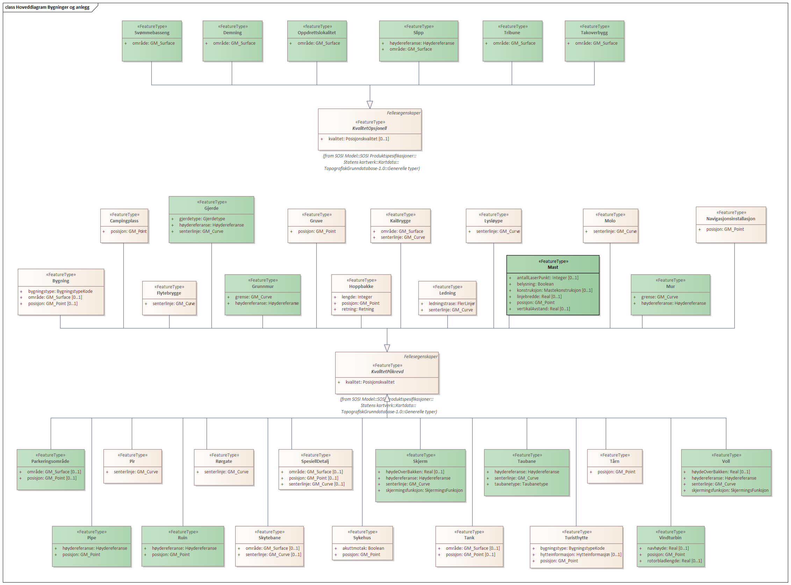
 
'''
 
.Oversiktsdiagram Kodelister og Datatyper 
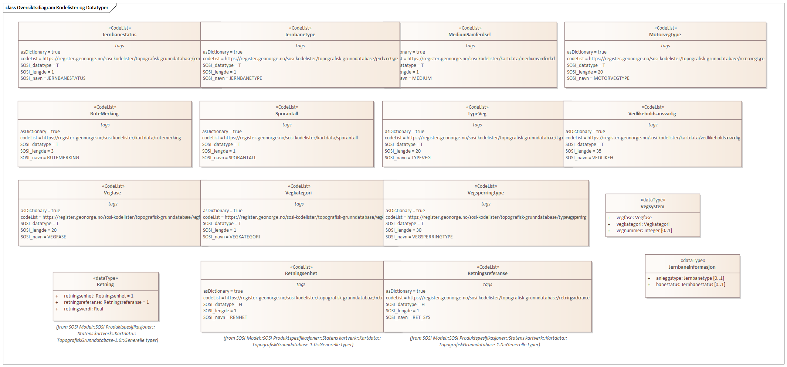
 
'''
 
.Realisering av featuretyper fra generell objektkatalog 

 
'''
 
.Realisering av datatyper fra generell objektkatalog 
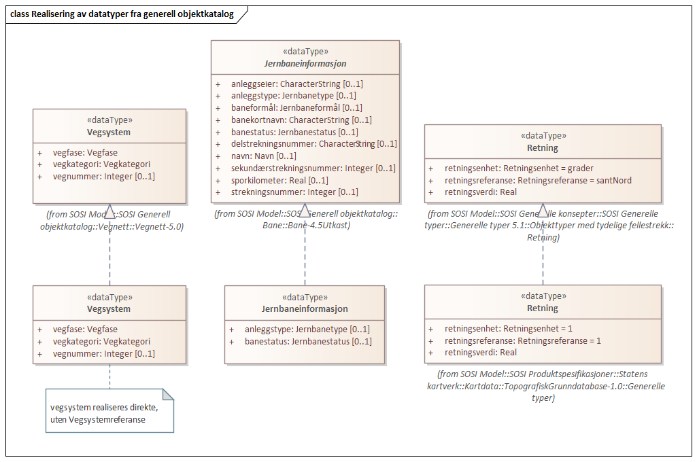
 
'''
 
.Realisering av kodelister fra generell objektkatalog 

 
'''
 
[[turisthytte]]
===== «FeatureType» Turisthytte
*Definisjon:* 
 
[discrete]
====== Egenskaper
[cols="20,80"]
|===
|*Navn:* 
|*posisjon*
 
|Definisjon: 
|sted som objektet eksisterer på
 
|Multiplisitet: 
|[1..1]
 
|Type: 
|http://skjema.geonorge.no/SOSI/basistype/GM_Point[GM_Point]
|Profilparametre i tagged values: 
|
SOSI_melding: Fant ikke denne i SOSI_db + 
SOSI_navn: Punkt + 
|===
[cols="20,80"]
|===
|*Navn:* 
|*bygningstype*
 
|Definisjon: 
|bygningstype sier hva bygningen er brukt til
 
|Multiplisitet: 
|[1..1]
 
|Type: 
|<<bygningstypekode,«CodeList» BygningstypeKode>>
|Profilparametre i tagged values: 
|
SOSI_datatype: H + 
SOSI_lengde: 3 + 
SOSI_lengde: 3 + 
SOSI_navn: BYGGTYP_NBR + 
|===
[cols="20,80"]
|===
|*Navn:* 
|*hytteinformasjon*
 
|Definisjon: 
|informasjon om hytter i form av betjeningsgrad, eier og tilgjengelighet

-- Definition -- 
Information on cabins in the form of identification, services offered and owner
 
|Multiplisitet: 
|[0..1]
 
|Type: 
|<<hytteinformasjon,«dataType» Hytteinformasjon>>
|===
 
[discrete]
====== Arv og realiseringer
[cols="20,80"]
|===
|Supertype: 
|<<kvalitetpåkrevd,«FeatureType» KvalitetPåkrevd>>
 
|===
 
'''
 
[[bygning]]
===== «FeatureType» Bygning
*Definisjon:* bygning som er registrert i Matrikkelen

Representasjonspunkt for bygningen. Punktet angis med geometritypen Punkt definert i SOSI

Skal plasseres innenfor bygningens omriss. 

Punkt registreres også uten at en har omrisset, men da settes ikke kvalitetsmerket for at den er verifisert mot bygningens omriss.
 
[discrete]
====== Profilparametre i tagged values
[cols="20,80"]
|===
|SOSI_geometri
|PUNKT;FLATE;
 
|SOSI-melding
|Finnes i SOSI_db,men ingen ting skal overføres
 
|===
[discrete]
====== Egenskaper
[cols="20,80"]
|===
|*Navn:* 
|*posisjon*
 
|Definisjon: 
|sted som objektet eksisterer på
 
|Multiplisitet: 
|[0..1]
 
|Type: 
|http://skjema.geonorge.no/SOSI/basistype/GM_Point[GM_Point]
|Profilparametre i tagged values: 
|
SOSI_melding: Fant ikke denne i SOSI_db + 
SOSI_navn: Punkt + 
|===
[cols="20,80"]
|===
|*Navn:* 
|*område*
 
|Definisjon: 
|objektets utstrekning
 
|Multiplisitet: 
|[0..1]
 
|Type: 
|http://skjema.geonorge.no/SOSI/basistype/GM_Surface[GM_Surface]
|===
[cols="20,80"]
|===
|*Navn:* 
|*bygningstype*
 
|Definisjon: 
|bygningstype sier hva bygningen er brukt til
 
|Multiplisitet: 
|[1..1]
 
|Type: 
|<<bygningstypekode,«CodeList» BygningstypeKode>>
|Profilparametre i tagged values: 
|
SOSI_datatype: H + 
SOSI_lengde: 3 + 
SOSI_lengde: 3 + 
SOSI_navn: BYGGTYP_NBR + 
|===
 
[discrete]
====== Roller
[cols="20,80"]
|===
|*Rollenavn:* 
|*avgrensesAvTakkant*
 
|Definisjon:
|avgrenser Bygning
 
|Multiplisitet: 
|[0..*]
 
|Til klasse
|<<takkant,«FeatureType» Takkant>>
|===
 
[discrete]
====== Arv og realiseringer
[cols="20,80"]
|===
|Supertype: 
|<<kvalitetpåkrevd,«FeatureType» KvalitetPåkrevd>>
 
|Realisering av: 
|«ApplicationSchema» Bygg-4.5/Bygningspunkt::«featureType» Bygning +
|===
 
'''
 
[[campingplass]]
===== «FeatureType» Campingplass
*Definisjon:* faste anlegg med vaskerom, campinghytter o.l.

-- Definition -- 
permanent  construction with wash rooms, cabins, etc.
 
[discrete]
====== Profilparametre i tagged values
[cols="20,80"]
|===
|SOSI_geometri
|PUNKT;FLATE;
 
|===
[discrete]
====== Egenskaper
[cols="20,80"]
|===
|*Navn:* 
|*posisjon*
 
|Definisjon: 
|sted som objektet eksisterer på
 
|Multiplisitet: 
|[1..1]
 
|Type: 
|http://skjema.geonorge.no/SOSI/basistype/GM_Point[GM_Point]
|Profilparametre i tagged values: 
|
SOSI_datatype: * + 
SOSI_lengde:  + 
SOSI_navn: NØ + 
|===
 
[discrete]
====== Arv og realiseringer
[cols="20,80"]
|===
|Supertype: 
|<<kvalitetpåkrevd,«FeatureType» KvalitetPåkrevd>>
 
|Realisering av: 
|«ApplicationSchema» Areal-4.0/Fritidsområder::«featureType» Campingplass +
|===
 
'''
 
[[demning]]
===== «FeatureType» Demning
*Definisjon:* konstruksjon for å heve vannspeilet og danne et kunstig vannmagasin, samt regulere vannføringen
 
 
'''
.Illustrasjon av objekttype Demning
image::http://skjema.geonorge.no/SOSI/produktspesifikasjon/FKB-BygnAnlegg/5.0/figurer/objtype_demning.png[link=http://skjema.geonorge.no/SOSI/produktspesifikasjon/FKB-BygnAnlegg/5.0/figurer/objtype_demning.png, Alt="Bilde av et eksempel på objekttypen Demning, eventuelt med påtegning av streker som viser hvor geometrien til objektet skal måles fra."]
[discrete]
====== Egenskaper
[cols="20,80"]
|===
|*Navn:* 
|*område*
 
|Definisjon: 
|objektets utstrekning
 
|Multiplisitet: 
|[1..1]
 
|Type: 
|http://skjema.geonorge.no/SOSI/basistype/GM_Surface[GM_Surface]
|===
 
[discrete]
====== Arv og realiseringer
[cols="20,80"]
|===
|Supertype: 
|<<sosi_objekt_kombinasjon_ulike_geometrityper,«FeatureType» SOSI_Objekt_Kombinasjon_Ulike_Geometrityper>>
 
|===
 
'''
 
[[flytebrygge]]
===== «FeatureType» Flytebrygge
*Definisjon:* brygge som er forankret til bunn og hvor plasseringen kan avhenge av vind og strømretning

-- Definition -- 
wharf chained to the bottom and whose location may depend on the direction of the wind and current
 
[discrete]
====== Profilparametre i tagged values
[cols="20,80"]
|===
|SOSI_geometri
|PUNKT;KURVE;FLATE;
 
|===
[discrete]
====== Egenskaper
[cols="20,80"]
|===
|*Navn:* 
|*senterlinje*
 
|Definisjon: 
|forløp som følger objektets sentrale del
 
|Multiplisitet: 
|[1..1]
 
|Type: 
|http://skjema.geonorge.no/SOSI/basistype/GM_Curve[GM_Curve]
|Profilparametre i tagged values: 
|
SOSI_melding: Fant ikke denne i SOSI_db + 
|===
 
[discrete]
====== Arv og realiseringer
[cols="20,80"]
|===
|Supertype: 
|<<kvalitetpåkrevd,«FeatureType» KvalitetPåkrevd>>
 
|Realisering av: 
|«ApplicationSchema» Bygnan-4.0/TekniskeAnleggVannVassdragKyst/Del 1 TekniskeAnleggVannVassdragKyst::«featureType» Flytebrygge +
|===
 
'''
 
[[gjerde]]
===== «FeatureType» Gjerde
*Definisjon:* oppsatt stengsel som hindrer passering. Står ofte i grensa mellom eiendommer
 
 
'''
.Illustrasjon av objekttype Gjerde
image::http://skjema.geonorge.no/SOSI/produktspesifikasjon/FKB-BygnAnlegg/5.0/figurer/objtype_gjerde.png[link=http://skjema.geonorge.no/SOSI/produktspesifikasjon/FKB-BygnAnlegg/5.0/figurer/objtype_gjerde.png, Alt="Bilde av et eksempel på objekttypen Gjerde, eventuelt med påtegning av streker som viser hvor geometrien til objektet skal måles fra."]
[discrete]
====== Egenskaper
[cols="20,80"]
|===
|*Navn:* 
|*senterlinje*
 
|Definisjon: 
|forløp som følger objektets sentrale del
 
|Multiplisitet: 
|[1..1]
 
|Type: 
|http://skjema.geonorge.no/SOSI/basistype/GM_Curve[GM_Curve]
|===
[cols="20,80"]
|===
|*Navn:* 
|*gjerdetype*
 
|Definisjon: 
|Type gjerde
 
|Multiplisitet: 
|[1..1]
 
|Type: 
|<<gjerdetype,«CodeList» Gjerdetype>>
|Profilparametre i tagged values: 
|
defaultCodeSpace: https://register.geonorge.no/sosi-kodelister/topografisk-grunndatabase/gjerdetype + 
SOSI_datatype: T + 
SOSI_lengde: 10 + 
SOSI_navn: GJERDETYPE + 
|===
[cols="20,80"]
|===
|*Navn:* 
|*høydereferanse*
 
|Definisjon: 
|angivelse av om registreringen er utført på topp eller bunn av et element- f.eks. en skråning- mur osv.
 
|Multiplisitet: 
|[1..1]
 
|Type: 
|http://skjema.geonorge.no/SOSI/basistype/Høydereferanse[Høydereferanse]
|Profilparametre i tagged values: 
|
defaultCodeSpace: https://register.geonorge.no/sosi-kodelister/fkb/generell/5.0/hoydereferanse + 
SOSI_datatype: T + 
SOSI_lengde: 6 + 
SOSI_navn: HREF + 
|===
 
[discrete]
====== Arv og realiseringer
[cols="20,80"]
|===
|Supertype: 
|<<kvalitetpåkrevd,«FeatureType» KvalitetPåkrevd>>
 
|===
 
'''
 
[[grunnmur]]
===== «FeatureType» Grunnmur
*Definisjon:* bygningens ytteravgrensning langs grunnmur
Merknad: Høydereferanse  angis med høydereferanse. Grunnrissreferanse er ytterkant av grunnmur.
Merknad: Benyttes hovedsaklig for bygning under oppføring. For bygninger som revet/nedbrent benyttes objekttyper ruin og mur i FKB-BygnAnlegg
 
 
'''
.Illustrasjon av objekttype Grunnmur
image::http://skjema.geonorge.no/SOSI/produktspesifikasjon/FKB-Bygning/5.0/figurer/objtype_grunnmur.png[link=http://skjema.geonorge.no/SOSI/produktspesifikasjon/FKB-Bygning/5.0/figurer/objtype_grunnmur.png, Alt="Bilde av et eksempel på objekttypen Grunnmur, eventuelt med påtegning av streker som viser hvor geometrien til objektet skal måles fra."]
[discrete]
====== Egenskaper
[cols="20,80"]
|===
|*Navn:* 
|*grense*
 
|Definisjon: 
|forløp som følger overgang mellom ulike fenomener
 
|Multiplisitet: 
|[1..1]
 
|Type: 
|http://skjema.geonorge.no/SOSI/basistype/GM_Curve[GM_Curve]
|===
[cols="20,80"]
|===
|*Navn:* 
|*høydereferanse*
 
|Definisjon: 
|koordinatregistering utført på topp eller bunn av et objekt
 
|Multiplisitet: 
|[1..1]
 
|Type: 
|http://skjema.geonorge.no/SOSI/basistype/Høydereferanse[Høydereferanse]
|Profilparametre i tagged values: 
|
defaultCodeSpace: https://register.geonorge.no/sosi-kodelister/fkb/generell/5.0/hoydereferanse + 
SOSI_datatype: T + 
SOSI_lengde: 6 + 
SOSI_navn: HREF + 
|===
 
[discrete]
====== Arv og realiseringer
[cols="20,80"]
|===
|Supertype: 
|<<kvalitetpåkrevd,«FeatureType» KvalitetPåkrevd>>
 
|===
 
'''
 
[[gruve]]
===== «FeatureType» Gruve
*Definisjon:* ikke dagbrudd og skjerp, hvor gruveinngangen er tydelig

-- Definition -- 
not quarry and prospect, where the pit entrance is prominent
 
[discrete]
====== Profilparametre i tagged values
[cols="20,80"]
|===
|SOSI_geometri
|PUNKT;FLATE;
 
|===
[discrete]
====== Egenskaper
[cols="20,80"]
|===
|*Navn:* 
|*posisjon*
 
|Definisjon: 
|sted som objektet eksisterer på
 
|Multiplisitet: 
|[1..1]
 
|Type: 
|http://skjema.geonorge.no/SOSI/basistype/GM_Point[GM_Point]
|Profilparametre i tagged values: 
|
SOSI_datatype: * + 
SOSI_lengde:  + 
SOSI_navn: NØ + 
|===
 
[discrete]
====== Arv og realiseringer
[cols="20,80"]
|===
|Supertype: 
|<<kvalitetpåkrevd,«FeatureType» KvalitetPåkrevd>>
 
|Realisering av: 
|«ApplicationSchema» Areal-4.0/Driftsområder::«featureType» Gruve +
|===
 
'''
 
[[hoppbakke]]
===== «FeatureType» Hoppbakke
*Definisjon:* anlegg for skihopping med kunstig eller naturlig tilløp

-- Definition -- 
facility for ski jumping with artificial or natural approach
 
[discrete]
====== Profilparametre i tagged values
[cols="20,80"]
|===
|SOSI_geometri
|PUNKT;KURVE;
 
|===
[discrete]
====== Egenskaper
[cols="20,80"]
|===
|*Navn:* 
|*posisjon*
 
|Definisjon: 
|sted som objektet eksisterer på
 
|Multiplisitet: 
|[1..1]
 
|Type: 
|http://skjema.geonorge.no/SOSI/basistype/GM_Point[GM_Point]
|Profilparametre i tagged values: 
|
SOSI_datatype: * + 
SOSI_lengde:  + 
SOSI_navn: Punkt + 
SOSI_navn: NØ + 
|===
[cols="20,80"]
|===
|*Navn:* 
|*lengde*
 
|Definisjon: 
|bakkens lengde i meter
 
|Multiplisitet: 
|[1..1]
 
|Type: 
|http://skjema.geonorge.no/SOSI/basistype/Integer[Integer]
|Profilparametre i tagged values: 
|
SOSI_datatype: H + 
SOSI_lengde: 3 + 
SOSI_navn: LENGDE + 
|===
[cols="20,80"]
|===
|*Navn:* 
|*retning*
 
|Definisjon: 
|linjestykke i planet med retning
 
|Multiplisitet: 
|[1..1]
 
|Type: 
|<<retning,«dataType» Retning>>
|Profilparametre i tagged values: 
|
SOSI_navn: RETNING + 
|===
 
[discrete]
====== Arv og realiseringer
[cols="20,80"]
|===
|Supertype: 
|<<kvalitetpåkrevd,«FeatureType» KvalitetPåkrevd>>
 
|Realisering av: 
|«ApplicationSchema» Bygnan-4.0/TekniskeAnlKulturLekMm::«featureType» Hoppbakke +
|===
 
'''
 
[[kaibrygge]]
===== «FeatureType» KaiBrygge
*Definisjon:* angivelse av  innretninger som er satt opp for å betjene båter ved lasting- lossing og landligge
Merknad: Kai er utvidet til også å kunne være bare et fortøyningsanlegg- f.eks. enkeltstående metallring for fastgjøring av skip.

-- Definition -- 
indication of facilities set up to serve boats during loading, unloading and docking
 
[discrete]
====== Profilparametre i tagged values
[cols="20,80"]
|===
|SOSI_geometri
|PUNKT;KURVE;FLATE;
 
|===
[discrete]
====== Egenskaper
[cols="20,80"]
|===
|*Navn:* 
|*område*
 
|Definisjon: 
|objektets utstrekning
 
|Multiplisitet: 
|[1..1]
 
|Type: 
|http://skjema.geonorge.no/SOSI/basistype/GM_Surface[GM_Surface]
|Profilparametre i tagged values: 
|
SOSI_melding: Fant ikke denne i SOSI_db + 
|===
[cols="20,80"]
|===
|*Navn:* 
|*senterlinje*
 
|Definisjon: 
|forløp som følger objektets sentrale del
 
|Multiplisitet: 
|[1..1]
 
|Type: 
|http://skjema.geonorge.no/SOSI/basistype/GM_Curve[GM_Curve]
|Profilparametre i tagged values: 
|
SOSI_melding: Fant ikke denne i SOSI_db + 
SOSI_navn: Kurve + 
|===
 
[discrete]
====== Arv og realiseringer
[cols="20,80"]
|===
|Supertype: 
|<<kvalitetpåkrevd,«FeatureType» KvalitetPåkrevd>>
 
|Realisering av: 
|«ApplicationSchema» Bygnan-4.0/TekniskeAnleggVannVassdragKyst/Del 2 TekniskeAnleggVannVassdragKyst::«featureType» KaiBrygge +
|===
 
'''
 
[[ledning]]
===== «FeatureType» Ledning
*Definisjon:* linje som fører elektrisk kraft over store avstander og der det er usikkert om det er lav- eller høyspentlinje

Merknad:
Kan benyttes dersom ..MEDIUM L og ..LEDNING * 3 8

-- Definition -- 
line conducting electrical power over large distances and where it is uncertain whether there is a low-voltage or high-voltage line. Note: may be used if ..MEDIUM L and ..LINE * 3 8
 
[discrete]
====== Egenskaper
[cols="20,80"]
|===
|*Navn:* 
|*senterlinje*
 
|Definisjon: 
|forløp som følger objektets sentrale del
 
|Multiplisitet: 
|[1..1]
 
|Type: 
|http://skjema.geonorge.no/SOSI/basistype/GM_Curve[GM_Curve]
|===
[cols="20,80"]
|===
|*Navn:* 
|*ledningstrase*
 
|Definisjon: 
|angivelse av antall kraftlinjer
 
|Multiplisitet: 
|[1..1]
 
|Type: 
|<<flerlinjer,«CodeList» FlerLinjer>>
|Profilparametre i tagged values: 
|
SOSI_datatype: H + 
SOSI_lengde: 1 + 
SOSI_navn: FLER_LINJER + 
|===
 
[discrete]
====== Arv og realiseringer
[cols="20,80"]
|===
|Supertype: 
|<<kvalitetpåkrevd,«FeatureType» KvalitetPåkrevd>>
 
|Realisering av: 
|«ApplicationSchema» Ledningsnett-4.0/Superforenklet modell/EL-Traséer::«featureType» LuftledningLH +
|===
 
'''
 
[[lysløype]]
===== «FeatureType» Lysløype
*Definisjon:* løypetrasé som har belysning

-- Definition -- 
trail route with lighting
 
[discrete]
====== Egenskaper
[cols="20,80"]
|===
|*Navn:* 
|*senterlinje*
 
|Definisjon: 
|forløp som følger objektets sentrale del
 
|Multiplisitet: 
|[1..1]
 
|Type: 
|http://skjema.geonorge.no/SOSI/basistype/GM_Curve[GM_Curve]
|===
 
[discrete]
====== Arv og realiseringer
[cols="20,80"]
|===
|Supertype: 
|<<kvalitetpåkrevd,«FeatureType» KvalitetPåkrevd>>
 
|Realisering av: 
|«ApplicationSchema» Samferdsel generell 4.0::«featureType» Lysløype +
|===
 
'''
 
[[mast]]
===== «FeatureType» Mast
*Definisjon:* alle konstruksjoner som primært er laget for å holde ledningsnett/komponent oppe fra bakken

Merknad FKB:
En mast kan bestå av en eller flere stolper og beskriver mastens representasjonspunkt (senterpunkt grunnriss / mastepunkt).
 
 
'''
.Illustrasjon av objekttype Mast
image::http://skjema.geonorge.no/SOSI/produktspesifikasjon/FKB-Ledning/5.0/figurer/Mast.jpg[link=http://skjema.geonorge.no/SOSI/produktspesifikasjon/FKB-Ledning/5.0/figurer/Mast.jpg, Alt="Bilde av et eksempel på objekttypen Mast, eventuelt med påtegning av streker som viser hvor geometrien til objektet skal måles fra."]
[discrete]
====== Egenskaper
[cols="20,80"]
|===
|*Navn:* 
|*posisjon*
 
|Definisjon: 
|sted som objektet eksisterer på
 
|Multiplisitet: 
|[1..1]
 
|Type: 
|http://skjema.geonorge.no/SOSI/basistype/GM_Point[GM_Point]
|===
[cols="20,80"]
|===
|*Navn:* 
|*antallLaserPunkt*
 
|Definisjon: 
|antallet klassifiserte laserpunkt som er med på å bestemme vektorisert objekt

Merknad FKB:
Angis kun dersom mastens geometri har laser som datafangstmetode.
 
|Multiplisitet: 
|[0..1]
 
|Type: 
|http://skjema.geonorge.no/SOSI/basistype/Integer[Integer]
|Profilparametre i tagged values: 
|
SOSI_datatype: H + 
SOSI_lengde: 5 + 
SOSI_navn: ANTALL_LASERPUNKT + 
|===
[cols="20,80"]
|===
|*Navn:* 
|*belysning*
 
|Definisjon: 
|angir om det er montert ett eller flere lysarmaturer i masta
 
|Multiplisitet: 
|[1..1]
 
|Type: 
|http://skjema.geonorge.no/SOSI/basistype/Boolean[Boolean]
|Profilparametre i tagged values: 
|
SOSI_datatype: BOOLSK + 
SOSI_navn: BELYSNING + 
|===
[cols="20,80"]
|===
|*Navn:* 
|*konstruksjon*
 
|Definisjon: 
|hvordan masta er utformet
 
|Multiplisitet: 
|[0..1]
 
|Type: 
|<<mastekonstruksjon,«CodeList» Mastekonstruksjon>>
|Profilparametre i tagged values: 
|
defaultCodeSpace: https://register.geonorge.no/sosi-kodelister/topografisk-grunndatabase/mastekonstruksjon + 
SOSI_datatype: T + 
SOSI_lengde: 20 + 
SOSI_navn: MASTEKONSTRUKSJON + 
|===
[cols="20,80"]
|===
|*Navn:* 
|*linjebredde*
 
|Definisjon: 
|største avstanden mellom ytterfasene (ledningene) i ei mast

Enhet: meter
 
|Multiplisitet: 
|[0..1]
 
|Type: 
|http://skjema.geonorge.no/SOSI/basistype/Real[Real]
|Profilparametre i tagged values: 
|
SOSI_datatype: D + 
SOSI_lengde: 6.2 + 
SOSI_navn: LINJEBREDDE + 
|===
[cols="20,80"]
|===
|*Navn:* 
|*vertikalAvstand*
 
|Definisjon: 
|mastens maksimale vertikale høyde over under-/omkringliggende terreng eller vannoverflate

Enhet: meter
 
|Multiplisitet: 
|[0..1]
 
|Type: 
|http://skjema.geonorge.no/SOSI/basistype/Real[Real]
|Profilparametre i tagged values: 
|
SOSI_datatype: D + 
SOSI_lengde: 6.2 + 
SOSI_navn: VERTIKALAVSTAND + 
|===
 
[discrete]
====== Restriksjoner
[cols="20,80"]
|===
|*Navn:* 
|*driftsmerking på Mast og Masteomriss skal være like*
 
|Beskrivelse: 
|inv: (self.driftsmerking  \ 
--hvis Mast har driftsmerking og har tilhørende Masteomriss  skal driftsmerking på Mast og Masteomriss være like
 
|===
 
[discrete]
====== Arv og realiseringer
[cols="20,80"]
|===
|Supertype: 
|<<kvalitetpåkrevd,«FeatureType» KvalitetPåkrevd>>
 
|===
 
'''
 
[[molo]]
===== «FeatureType» Molo
*Definisjon:* kunstig eller naturlig oppbygning som demper eller tilintetgjør bølgebevegelser i sjøen

-- Definition -- 
artificial or natural structure which reduces or eliminates waves in the sea
 
[discrete]
====== Profilparametre i tagged values
[cols="20,80"]
|===
|SOSI_geometri
|PUNKT;KURVE;FLATE;
 
|===
[discrete]
====== Egenskaper
[cols="20,80"]
|===
|*Navn:* 
|*senterlinje*
 
|Definisjon: 
|forløp som følger objektets sentrale del
 
|Multiplisitet: 
|[1..1]
 
|Type: 
|http://skjema.geonorge.no/SOSI/basistype/GM_Curve[GM_Curve]
|Profilparametre i tagged values: 
|
SOSI_melding: Fant ikke denne i SOSI_db + 
|===
 
[discrete]
====== Arv og realiseringer
[cols="20,80"]
|===
|Supertype: 
|<<kvalitetpåkrevd,«FeatureType» KvalitetPåkrevd>>
 
|Realisering av: 
|«ApplicationSchema» Bygnan-4.0/TekniskeAnleggVannVassdragKyst/Del 2 TekniskeAnleggVannVassdragKyst::«featureType» Molo +
|===
 
'''
 
[[mur]]
===== «FeatureType» Mur
*Definisjon:* mur hvor oppfyllingen på en side utgjør mindre enn halve høyden på den andre siden
 
 
'''
.Illustrasjon av objekttype Mur
image::http://skjema.geonorge.no/SOSI/produktspesifikasjon/FKB-BygnAnlegg/5.0/figurer/objtype_murfrittstaende.png[link=http://skjema.geonorge.no/SOSI/produktspesifikasjon/FKB-BygnAnlegg/5.0/figurer/objtype_murfrittstaende.png, Alt="Bilde av et eksempel på objekttypen Mur, eventuelt med påtegning av streker som viser hvor geometrien til objektet skal måles fra."]
[discrete]
====== Egenskaper
[cols="20,80"]
|===
|*Navn:* 
|*grense*
 
|Definisjon: 
|forløp som følger overgang mellom ulike fenomener
 
|Multiplisitet: 
|[1..1]
 
|Type: 
|http://skjema.geonorge.no/SOSI/basistype/GM_Curve[GM_Curve]
|===
[cols="20,80"]
|===
|*Navn:* 
|*høydereferanse*
 
|Definisjon: 
|angivelse av om registreringen er utført på topp eller bunn av et element- f.eks. en skråning- mur osv.
 
|Multiplisitet: 
|[1..1]
 
|Type: 
|http://skjema.geonorge.no/SOSI/basistype/Høydereferanse[Høydereferanse]
|Profilparametre i tagged values: 
|
defaultCodeSpace: https://register.geonorge.no/sosi-kodelister/fkb/generell/5.0/hoydereferanse + 
SOSI_datatype: T + 
SOSI_lengde: 6 + 
SOSI_navn: HREF + 
|===
 
[discrete]
====== Arv og realiseringer
[cols="20,80"]
|===
|Supertype: 
|<<kvalitetpåkrevd,«FeatureType» KvalitetPåkrevd>>
 
|===
 
'''
 
[[navigasjonsinstallasjon]]
===== «FeatureType» Navigasjonsinstallasjon
*Definisjon:* objekt som hjelper sjøfarende å navigere på sjøen

-- Definition -- 
object which helps mariners to navigate at sea
 
[discrete]
====== Profilparametre i tagged values
[cols="20,80"]
|===
|SOSI_geometri
|PUNKT;
 
|===
[discrete]
====== Egenskaper
[cols="20,80"]
|===
|*Navn:* 
|*posisjon*
 
|Definisjon: 
|sted som objektet eksisterer på
 
|Multiplisitet: 
|[1..1]
 
|Type: 
|http://skjema.geonorge.no/SOSI/basistype/GM_Point[GM_Point]
|Profilparametre i tagged values: 
|
SOSI_datatype: * + 
SOSI_lengde:  + 
SOSI_navn: NØ + 
SOSI_navn: Punkt + 
|===
 
[discrete]
====== Arv og realiseringer
[cols="20,80"]
|===
|Supertype: 
|<<kvalitetpåkrevd,«FeatureType» KvalitetPåkrevd>>
 
|Realisering av: 
|«ApplicationSchema» KystogSjø-4.0/Lykter og merker::«featureType» Navigasjonsinstallasjon +
|===
 
'''
 
[[oppdrettslokalitet]]
===== «featureType» Oppdrettslokalitet
*Definisjon:* fast anlegg for oppdrett av fisk i vann
 
 
'''
.Illustrasjon av objekttype Oppdrettslokalitet
image::http://skjema.geonorge.no/SOSI/produktspesifikasjon/FKB-BygnAnlegg/5.0/figurer/objtype_oppdrettslokalitet.png[link=http://skjema.geonorge.no/SOSI/produktspesifikasjon/FKB-BygnAnlegg/5.0/figurer/objtype_oppdrettslokalitet.png, Alt="Bilde av et eksempel på objekttypen Oppdrettslokalitet, eventuelt med påtegning av streker som viser hvor geometrien til objektet skal måles fra."]
[discrete]
====== Egenskaper
[cols="20,80"]
|===
|*Navn:* 
|*område*
 
|Definisjon: 
|objektets utstrekning
 
|Multiplisitet: 
|[1..1]
 
|Type: 
|http://skjema.geonorge.no/SOSI/basistype/GM_Surface[GM_Surface]
|===
 
[discrete]
====== Arv og realiseringer
[cols="20,80"]
|===
|Supertype: 
|<<sosi_objekt_kombinasjon_ulike_geometrityper,«FeatureType» SOSI_Objekt_Kombinasjon_Ulike_Geometrityper>>
 
|===
 
'''
 
[[parkeringsområde]]
===== «FeatureType» Parkeringsområde
*Definisjon:* Område for parkering av kjøretøy.
 
 
'''
.Illustrasjon av objekttype Parkeringsområde
image::http://skjema.geonorge.no/SOSI/produktspesifikasjon/FKB-Veg/5.0/figurer/objtype_parkeringsomrade.png[link=http://skjema.geonorge.no/SOSI/produktspesifikasjon/FKB-Veg/5.0/figurer/objtype_parkeringsomrade.png, Alt="Bilde av et eksempel på objekttypen Parkeringsområde, eventuelt med påtegning av streker som viser hvor geometrien til objektet skal måles fra."]
[discrete]
====== Egenskaper
[cols="20,80"]
|===
|*Navn:* 
|*område*
 
|Definisjon: 
|objektets utstrekning
 
|Multiplisitet: 
|[0..1]
 
|Type: 
|http://skjema.geonorge.no/SOSI/basistype/GM_Surface[GM_Surface]
|===
[cols="20,80"]
|===
|*Navn:* 
|*posisjon*
 
|Definisjon: 
|sted som objektet eksisterer på
 
|Multiplisitet: 
|[0..1]
 
|Type: 
|http://skjema.geonorge.no/SOSI/basistype/GM_Point[GM_Point]
|===
 
[discrete]
====== Restriksjoner
[cols="20,80"]
|===
|*Navn:* 
|*avgrensningsobjekter i samsvar med områdegeometri*
 
|Beskrivelse: 
|
--ingen OCL  restriksjonen implementeres manuelt

--Område
 
|===
[cols="20,80"]
|===
|*Navn:* 
|*posisjon innenfor område*
 
|Beskrivelse: 
|
--ingen OCL  restriksjonen implementeres manuelt

--Dersom det finnes område
 
|===
 
[discrete]
====== Arv og realiseringer
[cols="20,80"]
|===
|Supertype: 
|<<kvalitetpåkrevd,«FeatureType» KvalitetPåkrevd>>
 
|===
 
'''
 
[[pipe]]
===== «FeatureType» Pipe
*Definisjon:* frittstående rørformete innretninger for transport av avgasser

Merknad: Piper kan forskjellig tverrsnitt (må ikke være sirkulære)
 
 
'''
.Illustrasjon av objekttype Pipe
image::http://skjema.geonorge.no/SOSI/produktspesifikasjon/FKB-BygnAnlegg/5.0/figurer/objtype_pipe.png[link=http://skjema.geonorge.no/SOSI/produktspesifikasjon/FKB-BygnAnlegg/5.0/figurer/objtype_pipe.png, Alt="Bilde av et eksempel på objekttypen Pipe, eventuelt med påtegning av streker som viser hvor geometrien til objektet skal måles fra."]
[discrete]
====== Egenskaper
[cols="20,80"]
|===
|*Navn:* 
|*posisjon*
 
|Definisjon: 
|sted som objektet eksisterer på
 
|Multiplisitet: 
|[1..1]
 
|Type: 
|http://skjema.geonorge.no/SOSI/basistype/GM_Point[GM_Point]
|===
[cols="20,80"]
|===
|*Navn:* 
|*høydereferanse*
 
|Definisjon: 
|koordinatregistering utført på topp eller bunn av et objekt
 
|Multiplisitet: 
|[1..1]
 
|Type: 
|http://skjema.geonorge.no/SOSI/basistype/Høydereferanse[Høydereferanse]
|Profilparametre i tagged values: 
|
defaultCodeSpace: https://register.geonorge.no/sosi-kodelister/fkb/generell/5.0/hoydereferanse + 
SOSI_datatype: T + 
SOSI_lengde: 6 + 
SOSI_navn: HREF + 
|===
 
[discrete]
====== Restriksjoner
[cols="20,80"]
|===
|*Navn:* 
|*Skal ha enten punkt- eller flategeometri*
 
|Beskrivelse: 
|inv: (self.område   
 
|===
 
[discrete]
====== Arv og realiseringer
[cols="20,80"]
|===
|Supertype: 
|<<kvalitetpåkrevd,«FeatureType» KvalitetPåkrevd>>
 
|===
 
'''
 
[[pir]]
===== «FeatureType» Pir
*Definisjon:* markert utstikkende brygge, normalt med vann under, i sjø

-- Definition -- 
marked protruding pier, normally with water underneath, in the sea
 
[discrete]
====== Profilparametre i tagged values
[cols="20,80"]
|===
|SOSI_geometri
|PUNKT;KURVE;FLATE;
 
|===
[discrete]
====== Egenskaper
[cols="20,80"]
|===
|*Navn:* 
|*senterlinje*
 
|Definisjon: 
|forløp som følger objektets sentrale del
 
|Multiplisitet: 
|[1..1]
 
|Type: 
|http://skjema.geonorge.no/SOSI/basistype/GM_Curve[GM_Curve]
|Profilparametre i tagged values: 
|
SOSI_melding: Fant ikke denne i SOSI_db + 
|===
 
[discrete]
====== Arv og realiseringer
[cols="20,80"]
|===
|Supertype: 
|<<kvalitetpåkrevd,«FeatureType» KvalitetPåkrevd>>
 
|Realisering av: 
|«ApplicationSchema» Bygnan-4.0/TekniskeAnleggVannVassdragKyst/Del 2 TekniskeAnleggVannVassdragKyst::«featureType» Pir +
|===
 
'''
 
[[ruin]]
===== «FeatureType» Ruin
*Definisjon:* Synlig mur som er rester etter tidligere byggverk
 
 
'''
.Illustrasjon av objekttype Ruin
image::http://skjema.geonorge.no/SOSI/produktspesifikasjon/FKB-BygnAnlegg/5.0/figurer/objtype_ruin.png[link=http://skjema.geonorge.no/SOSI/produktspesifikasjon/FKB-BygnAnlegg/5.0/figurer/objtype_ruin.png, Alt="Bilde av et eksempel på objekttypen Ruin, eventuelt med påtegning av streker som viser hvor geometrien til objektet skal måles fra."]
[discrete]
====== Egenskaper
[cols="20,80"]
|===
|*Navn:* 
|*grense*
 
|Definisjon: 
|forløp som følger overgang mellom ulike fenomener
 
|Multiplisitet: 
|[1..1]
 
|Type: 
|http://skjema.geonorge.no/SOSI/basistype/GM_Curve[GM_Curve]
|===
[cols="20,80"]
|===
|*Navn:* 
|*høydereferanse*
 
|Definisjon: 
|angivelse av om registreringen er utført på topp eller bunn av et element- f.eks. en skråning- mur osv.
 
|Multiplisitet: 
|[1..1]
 
|Type: 
|http://skjema.geonorge.no/SOSI/basistype/Høydereferanse[Høydereferanse]
|Profilparametre i tagged values: 
|
defaultCodeSpace: https://register.geonorge.no/sosi-kodelister/fkb/generell/5.0/hoydereferanse + 
SOSI_datatype: T + 
SOSI_lengde: 6 + 
SOSI_navn: HREF + 
|===
 
[discrete]
====== Arv og realiseringer
[cols="20,80"]
|===
|Supertype: 
|<<kvalitetpåkrevd,«FeatureType» KvalitetPåkrevd>>
 
|===
 
'''
 
[[rørgate]]
===== «FeatureType» Rørgate
*Definisjon:* rør som leder vann frem til foredlingsanlegg

-- Definition -- 
pipes which lead water into processing facility
 
[discrete]
====== Profilparametre i tagged values
[cols="20,80"]
|===
|SOSI_geometri
|KURVE;
 
|===
[discrete]
====== Egenskaper
[cols="20,80"]
|===
|*Navn:* 
|*senterlinje*
 
|Definisjon: 
|forløp som følger objektets sentrale del
 
|Multiplisitet: 
|[1..1]
 
|Type: 
|http://skjema.geonorge.no/SOSI/basistype/GM_Curve[GM_Curve]
|Profilparametre i tagged values: 
|
SOSI_melding: Fant ikke denne i SOSI_db + 
SOSI_navn: Kurve + 
|===
 
[discrete]
====== Arv og realiseringer
[cols="20,80"]
|===
|Supertype: 
|<<kvalitetpåkrevd,«FeatureType» KvalitetPåkrevd>>
 
|Realisering av: 
|«ApplicationSchema» Bygnan-4.0/TekniskeAnleggVannVassdragKyst/Del 2 TekniskeAnleggVannVassdragKyst::«featureType» Rørgate +
|===
 
'''
 
[[skjerm]]
===== «featureType» Skjerm
*Definisjon:* frittstående konstruksjon laget for å skjerme mot støy eller snø, eller hindre/begrense ras og flom.
 
 
'''
.Illustrasjon av objekttype Skjerm
image::http://skjema.geonorge.no/SOSI/produktspesifikasjon/FKB-BygnAnlegg/5.0/figurer/objtype_skjerm.png[link=http://skjema.geonorge.no/SOSI/produktspesifikasjon/FKB-BygnAnlegg/5.0/figurer/objtype_skjerm.png, Alt="Bilde av et eksempel på objekttypen Skjerm, eventuelt med påtegning av streker som viser hvor geometrien til objektet skal måles fra."]
[discrete]
====== Egenskaper
[cols="20,80"]
|===
|*Navn:* 
|*senterlinje*
 
|Definisjon: 
|forløp som følger objektets sentrale del
 
|Multiplisitet: 
|[1..1]
 
|Type: 
|http://skjema.geonorge.no/SOSI/basistype/GM_Curve[GM_Curve]
|===
[cols="20,80"]
|===
|*Navn:* 
|*skjermingsfunksjon*
 
|Definisjon: 
|hvilken funksjon skjermen har
 
|Multiplisitet: 
|[1..1]
 
|Type: 
|<<skjermingsfunksjon,«CodeList» SkjermingsFunksjon>>
|Profilparametre i tagged values: 
|
defaultCodeSpace: https://register.geonorge.no/sosi-kodelister/topografisk-grunndatabase/skjermingsfunksjon + 
SOSI_datatype: T + 
SOSI_lengde: 20 + 
SOSI_navn: SKJERMINGFUNK + 
|===
[cols="20,80"]
|===
|*Navn:* 
|*høydereferanse*
 
|Definisjon: 
|angivelse av om registreringen er utført på topp eller bunn av et element- f.eks. en skråning- mur osv.
 
|Multiplisitet: 
|[1..1]
 
|Type: 
|http://skjema.geonorge.no/SOSI/basistype/Høydereferanse[Høydereferanse]
|Profilparametre i tagged values: 
|
defaultCodeSpace: https://register.geonorge.no/sosi-kodelister/fkb/generell/5.0/hoydereferanse + 
SOSI_datatype: T + 
SOSI_lengde: 6 + 
SOSI_navn: HREF + 
|===
[cols="20,80"]
|===
|*Navn:* 
|*høydeOverBakken*
 
|Definisjon: 
|høyde over bakken (angitt i meter)
 
|Multiplisitet: 
|[0..1]
 
|Type: 
|http://skjema.geonorge.no/SOSI/basistype/Real[Real]
|Profilparametre i tagged values: 
|
SOSI_datatype: D + 
SOSI_lengde: 10 + 
SOSI_navn: HOB + 
|===
 
[discrete]
====== Arv og realiseringer
[cols="20,80"]
|===
|Supertype: 
|<<kvalitetpåkrevd,«FeatureType» KvalitetPåkrevd>>
 
|===
 
'''
 
[[skytebane]]
===== «FeatureType» Skytebane
*Definisjon:* omriss av tekniske anlegg på skytebane - standplass og skiver som ikke blir registrert som f.eks bygninger og murer

-- Definition -- 
outline of technical facilities at shooting range - stands and targets that are not registered as building or walls
 
[discrete]
====== Profilparametre i tagged values
[cols="20,80"]
|===
|SOSI_geometri
|KURVE;
 
|===
[discrete]
====== Egenskaper
[cols="20,80"]
|===
|*Navn:* 
|*senterlinje*
 
|Definisjon: 
|forløp som følger objektets sentrale del
 
|Multiplisitet: 
|[0..1]
 
|Type: 
|http://skjema.geonorge.no/SOSI/basistype/GM_Curve[GM_Curve]
|Profilparametre i tagged values: 
|
SOSI_melding: Fant ikke denne i SOSI_db + 
SOSI_navn: Kurve + 
|===
[cols="20,80"]
|===
|*Navn:* 
|*område*
 
|Definisjon: 
|objektets utstrekning
 
|Multiplisitet: 
|[0..1]
 
|Type: 
|http://skjema.geonorge.no/SOSI/basistype/GM_Surface[GM_Surface]
|===
 
[discrete]
====== Arv og realiseringer
[cols="20,80"]
|===
|Supertype: 
|<<kvalitetpåkrevd,«FeatureType» KvalitetPåkrevd>>
 
|Realisering av: 
|«ApplicationSchema» Bygnan-4.0/TekniskeAnlKulturLekMm::«featureType» Skytebaneinnretning +
|===
 
'''
 
[[slipp]]
===== «FeatureType» Slipp
*Definisjon:* bane som mindre og middelstore fartøyer kan hales opp ved landsetting, bedding
 
 
'''
.Illustrasjon av objekttype Slipp
image::http://skjema.geonorge.no/SOSI/produktspesifikasjon/FKB-BygnAnlegg/5.0/figurer/objtype_slipp.png[link=http://skjema.geonorge.no/SOSI/produktspesifikasjon/FKB-BygnAnlegg/5.0/figurer/objtype_slipp.png, Alt="Bilde av et eksempel på objekttypen Slipp, eventuelt med påtegning av streker som viser hvor geometrien til objektet skal måles fra."]
[discrete]
====== Egenskaper
[cols="20,80"]
|===
|*Navn:* 
|*område*
 
|Definisjon: 
|objektets utstrekning
 
|Multiplisitet: 
|[1..1]
 
|Type: 
|http://skjema.geonorge.no/SOSI/basistype/GM_Surface[GM_Surface]
|===
[cols="20,80"]
|===
|*Navn:* 
|*høydereferanse*
 
|Definisjon: 
|angivelse av om registreringen er utført på topp eller bunn av et element- f.eks. en skråning- mur osv.
 
|Multiplisitet: 
|[1..1]
 
|Type: 
|http://skjema.geonorge.no/SOSI/basistype/Høydereferanse[Høydereferanse]
|Profilparametre i tagged values: 
|
defaultCodeSpace: https://register.geonorge.no/sosi-kodelister/fkb/generell/5.0/hoydereferanse + 
SOSI_datatype: T + 
SOSI_lengde: 6 + 
SOSI_navn: HREF + 
|===
 
[discrete]
====== Arv og realiseringer
[cols="20,80"]
|===
|Supertype: 
|<<sosi_objekt_kombinasjon_ulike_geometrityper,«FeatureType» SOSI_Objekt_Kombinasjon_Ulike_Geometrityper>>
 
|===
 
'''
 
[[spesielldetalj]]
===== «FeatureType» SpesiellDetalj
*Definisjon:* objekttyper som det er nødvendig å angi av kartografiske hensyn og som ikke fanges opp av definerte objekttyper
 
[discrete]
====== Egenskaper
[cols="20,80"]
|===
|*Navn:* 
|*posisjon*
 
|Definisjon: 
|sted som objektet eksisterer på
 
|Multiplisitet: 
|[0..1]
 
|Type: 
|http://skjema.geonorge.no/SOSI/basistype/GM_Point[GM_Point]
|===
[cols="20,80"]
|===
|*Navn:* 
|*område*
 
|Definisjon: 
|objektets utstrekning
 
|Multiplisitet: 
|[0..1]
 
|Type: 
|http://skjema.geonorge.no/SOSI/basistype/GM_Surface[GM_Surface]
|===
[cols="20,80"]
|===
|*Navn:* 
|*senterlinje*
 
|Definisjon: 
|forløp som følger objektets sentrale del
 
|Multiplisitet: 
|[0..1]
 
|Type: 
|http://skjema.geonorge.no/SOSI/basistype/GM_Curve[GM_Curve]
|===
 
[discrete]
====== Arv og realiseringer
[cols="20,80"]
|===
|Supertype: 
|<<kvalitetpåkrevd,«FeatureType» KvalitetPåkrevd>>
 
|Realisering av: 
|«ApplicationSchema» Generelle typer 4.5/Spesielle linjer og punkter::«featureType» SpesiellDetalj +
|===
 
'''
 
[[svømmebasseng]]
===== «FeatureType» Svømmebasseng
*Definisjon:* basseng for svømming og vannlek
 
 
'''
.Illustrasjon av objekttype Svømmebasseng
image::http://skjema.geonorge.no/SOSI/produktspesifikasjon/FKB-BygnAnlegg/5.0/figurer/objtype_svommebasseng.png[link=http://skjema.geonorge.no/SOSI/produktspesifikasjon/FKB-BygnAnlegg/5.0/figurer/objtype_svommebasseng.png, Alt="Bilde av et eksempel på objekttypen Svømmebasseng, eventuelt med påtegning av streker som viser hvor geometrien til objektet skal måles fra."]
[discrete]
====== Egenskaper
[cols="20,80"]
|===
|*Navn:* 
|*område*
 
|Definisjon: 
|objektets utstrekning
 
|Multiplisitet: 
|[1..1]
 
|Type: 
|http://skjema.geonorge.no/SOSI/basistype/GM_Surface[GM_Surface]
|===
 
[discrete]
====== Arv og realiseringer
[cols="20,80"]
|===
|Supertype: 
|<<sosi_objekt_kombinasjon_ulike_geometrityper,«FeatureType» SOSI_Objekt_Kombinasjon_Ulike_Geometrityper>>
 
|===
 
'''
 
[[tank]]
===== «FeatureType» Tank
*Definisjon:* lukkede kar for oppbevaring av gass eller væsker som ikke er registrert som bygning

-- Definition -- 
closed tank/vessel for storage of gas or fluids which is not registered as building
 
[discrete]
====== Profilparametre i tagged values
[cols="20,80"]
|===
|SOSI_geometri
|PUNKT;FLATE;
 
|===
[discrete]
====== Egenskaper
[cols="20,80"]
|===
|*Navn:* 
|*posisjon*
 
|Definisjon: 
|sted som objektet eksisterer på
 
|Multiplisitet: 
|[0..1]
 
|Type: 
|http://skjema.geonorge.no/SOSI/basistype/GM_Point[GM_Point]
|Profilparametre i tagged values: 
|
SOSI_datatype: * + 
SOSI_lengde:  + 
SOSI_navn: NØ + 
|===
[cols="20,80"]
|===
|*Navn:* 
|*område*
 
|Definisjon: 
|objektets utstrekning
 
|Multiplisitet: 
|[0..1]
 
|Type: 
|http://skjema.geonorge.no/SOSI/basistype/GM_Surface[GM_Surface]
|Profilparametre i tagged values: 
|
SOSI_melding: Fant ikke denne i SOSI_db + 
|===
 
[discrete]
====== Roller
[cols="20,80"]
|===
|*Rollenavn:* 
|*avgrensesAvTankkant*
 
|Definisjon:
|avgrenser Tank
 
|Multiplisitet: 
|[0..*]
 
|Til klasse
|<<tankkant,«FeatureType» Tankkant>>
|===
 
[discrete]
====== Arv og realiseringer
[cols="20,80"]
|===
|Supertype: 
|<<kvalitetpåkrevd,«FeatureType» KvalitetPåkrevd>>
 
|Realisering av: 
|«ApplicationSchema» Bygnan-4.0/BygningsmessigeAnlegg/Pakke2::«featureType» Tank +
|===
 
'''
 
[[takoverbygg]]
===== «FeatureType» Takoverbygg
*Definisjon:* byggverk med ingen eller få vegger, og som ikke er registrert som bygning i matrikkelen
Eksempel:  'carport' eller tak over bensinpumper
 
 
'''
.Illustrasjon av objekttype Takoverbygg
image::http://skjema.geonorge.no/SOSI/produktspesifikasjon/FKB-Bygning/5.0/figurer/objtype_takoverbygg.png[link=http://skjema.geonorge.no/SOSI/produktspesifikasjon/FKB-Bygning/5.0/figurer/objtype_takoverbygg.png, Alt="Bilde av et eksempel på objekttypen Takoverbygg, eventuelt med påtegning av streker som viser hvor geometrien til objektet skal måles fra."]
[discrete]
====== Egenskaper
[cols="20,80"]
|===
|*Navn:* 
|*område*
 
|Definisjon: 
|objektets utstrekning
 
|Multiplisitet: 
|[1..1]
 
|Type: 
|http://skjema.geonorge.no/SOSI/basistype/GM_Surface[GM_Surface]
|===
 
[discrete]
====== Restriksjoner
[cols="20,80"]
|===
|*Navn:* 
|*avgrensningsobjekter i samsvar med områdegeometri*
 
|Beskrivelse: 
|
--ingen OCL  restriksjonen implementeres manuelt

--Område
 
|===
[cols="20,80"]
|===
|*Navn:* 
|*posisjon innenfor område*
 
|Beskrivelse: 
|
--ingen OCL  restriksjonen implementeres manuelt

--Dersom det finnes område
 
|===
 
[discrete]
====== Arv og realiseringer
[cols="20,80"]
|===
|Supertype: 
|<<sosi_objekt_kombinasjon_ulike_geometrityper,«FeatureType» SOSI_Objekt_Kombinasjon_Ulike_Geometrityper>>
 
|===
 
'''
 
[[taubane]]
===== «FeatureType» Taubane
*Definisjon:* innretning hvor tau eller vaiere bærer og eller trekker last over en strekning
 
 
'''
.Illustrasjon av objekttype Taubane
image::http://skjema.geonorge.no/SOSI/produktspesifikasjon/FKB-BygnAnlegg/5.0/figurer/objtype_taubane.png[link=http://skjema.geonorge.no/SOSI/produktspesifikasjon/FKB-BygnAnlegg/5.0/figurer/objtype_taubane.png, Alt="Bilde av et eksempel på objekttypen Taubane, eventuelt med påtegning av streker som viser hvor geometrien til objektet skal måles fra."]
[discrete]
====== Egenskaper
[cols="20,80"]
|===
|*Navn:* 
|*senterlinje*
 
|Definisjon: 
|forløp som følger objektets sentrale del
 
|Multiplisitet: 
|[1..1]
 
|Type: 
|http://skjema.geonorge.no/SOSI/basistype/GM_Curve[GM_Curve]
|===
[cols="20,80"]
|===
|*Navn:* 
|*taubanetype*
 
|Definisjon: 
|hva slags type taubane
 
|Multiplisitet: 
|[1..1]
 
|Type: 
|<<taubanetype,«CodeList» Taubanetype>>
|Profilparametre i tagged values: 
|
defaultCodeSpace: https://register.geonorge.no/sosi-kodelister/topografisk-grunndatabase/taubanetype + 
SOSI_datatype: T + 
SOSI_lengde: 10 + 
SOSI_navn: TAUBANETYPE + 
|===
[cols="20,80"]
|===
|*Navn:* 
|*høydereferanse*
 
|Definisjon: 
|angivelse av om registreringen er utført på topp eller bunn av et element
 
|Multiplisitet: 
|[1..1]
 
|Type: 
|http://skjema.geonorge.no/SOSI/basistype/Høydereferanse[Høydereferanse]
|Profilparametre i tagged values: 
|
defaultCodeSpace: https://register.geonorge.no/sosi-kodelister/fkb/generell/5.0/hoydereferanse + 
SOSI_datatype: T + 
SOSI_lengde: 6 + 
SOSI_navn: HREF + 
|===
 
[discrete]
====== Arv og realiseringer
[cols="20,80"]
|===
|Supertype: 
|<<kvalitetpåkrevd,«FeatureType» KvalitetPåkrevd>>
 
|===
 
'''
 
[[tribune]]
===== «FeatureType» Tribune
*Definisjon:* opparbeidet anlegg av metall- stein- mur eller tre for betjening av publikum på kulturarenaer, særlig idrettsanlegg
Merknad: Tribune som er innredet for bruk, f.eks. som kontor eller butikk, vil være en bygningsenhet.
 
 
'''
.Illustrasjon av objekttype Tribune
image::http://skjema.geonorge.no/SOSI/produktspesifikasjon/FKB-BygnAnlegg/5.0/figurer/objtype_tribune.png[link=http://skjema.geonorge.no/SOSI/produktspesifikasjon/FKB-BygnAnlegg/5.0/figurer/objtype_tribune.png, Alt="Bilde av et eksempel på objekttypen Tribune, eventuelt med påtegning av streker som viser hvor geometrien til objektet skal måles fra."]
[discrete]
====== Egenskaper
[cols="20,80"]
|===
|*Navn:* 
|*område*
 
|Definisjon: 
|objektets utstrekning
 
|Multiplisitet: 
|[1..1]
 
|Type: 
|http://skjema.geonorge.no/SOSI/basistype/GM_Surface[GM_Surface]
|===
 
[discrete]
====== Arv og realiseringer
[cols="20,80"]
|===
|Supertype: 
|<<sosi_objekt_kombinasjon_ulike_geometrityper,«FeatureType» SOSI_Objekt_Kombinasjon_Ulike_Geometrityper>>
 
|===
 
'''
 
[[tårn]]
===== «FeatureType» Tårn
*Definisjon:* høy bygningsmessig konstruksjon hvor høyden er stor i forhold til bygningens areal i grunnplanet
Merknad: Omfatter alle tårn med unntak av de tårn som har en mer spesifisert beskrivelse- som f.eks Silo og tank. 
Eksempel: Måletårn og stupetårn

-- Definition -- 
Tall building structure in which the height is great in relation to the footprint of the building
 
[discrete]
====== Profilparametre i tagged values
[cols="20,80"]
|===
|SOSI_geometri
|PUNKT;FLATE;
 
|===
[discrete]
====== Egenskaper
[cols="20,80"]
|===
|*Navn:* 
|*posisjon*
 
|Definisjon: 
|sted som objektet eksisterer på
 
|Multiplisitet: 
|[1..1]
 
|Type: 
|http://skjema.geonorge.no/SOSI/basistype/GM_Point[GM_Point]
|Profilparametre i tagged values: 
|
SOSI_datatype: * + 
SOSI_lengde:  + 
SOSI_navn: NØ + 
|===
 
[discrete]
====== Arv og realiseringer
[cols="20,80"]
|===
|Supertype: 
|<<kvalitetpåkrevd,«FeatureType» KvalitetPåkrevd>>
 
|Realisering av: 
|«ApplicationSchema» Bygnan-4.0/BygningsmessigeAnlegg/Pakke2::«featureType» Tårn +
|===
 
'''
 
[[vindturbin]]
===== «FeatureType» Vindturbin
*Definisjon:* en kontainer som betegner en hel "vindmølle". En vindturbin har en generator
 
 
'''
.Illustrasjon av objekttype Vindturbin
image::http://skjema.geonorge.no/SOSI/produktspesifikasjon/FKB-Ledning/5.0/figurer/Vindturbin.jpg[link=http://skjema.geonorge.no/SOSI/produktspesifikasjon/FKB-Ledning/5.0/figurer/Vindturbin.jpg, Alt="Bilde av et eksempel på objekttypen Vindturbin, eventuelt med påtegning av streker som viser hvor geometrien til objektet skal måles fra."]
[discrete]
====== Egenskaper
[cols="20,80"]
|===
|*Navn:* 
|*posisjon*
 
|Definisjon: 
|sted som objektet eksisterer på
 
|Multiplisitet: 
|[1..1]
 
|Type: 
|http://skjema.geonorge.no/SOSI/basistype/GM_Point[GM_Point]
|===
[cols="20,80"]
|===
|*Navn:* 
|*rotorbladlengde*
 
|Definisjon: 
|lengde rotorblad

Enhet: meter
 
|Multiplisitet: 
|[0..1]
 
|Type: 
|http://skjema.geonorge.no/SOSI/basistype/Real[Real]
|Profilparametre i tagged values: 
|
SOSI_datatype: D + 
SOSI_lengde: 3.3 + 
SOSI_navn: ROTORBLADLENGDE + 
|===
[cols="20,80"]
|===
|*Navn:* 
|*navhøyde*
 
|Definisjon: 
|vertikal avstand fra omkringliggende terreng eller vann og til topp vindturbintårn

Enhet: meter
 
|Multiplisitet: 
|[0..1]
 
|Type: 
|http://skjema.geonorge.no/SOSI/basistype/Real[Real]
|Profilparametre i tagged values: 
|
SOSI_datatype: D + 
SOSI_lengde: D3.3 + 
SOSI_navn: NAVHØYDE + 
|===
 
[discrete]
====== Restriksjoner
[cols="20,80"]
|===
|*Navn:* 
|*driftsmerking på Vindturbin og Vindturbinomriss skal være like*
 
|Beskrivelse: 
|inv: (self.driftsmerking  
--hvis Vindturbin har driftsmerking og har tilhørende Vindturbinomriss  skal driftsmerking på Vindturbin og Vindturbinomriss være like
 
|===
 
[discrete]
====== Arv og realiseringer
[cols="20,80"]
|===
|Supertype: 
|<<kvalitetpåkrevd,«FeatureType» KvalitetPåkrevd>>
 
|===
 
'''
 
[[voll]]
===== «FeatureType» Voll
*Definisjon:* opphøyd terrengformasjon anlagt for å hindre støy, ukontrollert gjennomstrømming av vann, skade fra  prosjektiler på skytebane o.l.
 
 
'''
.Illustrasjon av objekttype Voll
image::http://skjema.geonorge.no/SOSI/produktspesifikasjon/FKB-BygnAnlegg/5.0/figurer/objtype_voll.png[link=http://skjema.geonorge.no/SOSI/produktspesifikasjon/FKB-BygnAnlegg/5.0/figurer/objtype_voll.png, Alt="Bilde av et eksempel på objekttypen Voll, eventuelt med påtegning av streker som viser hvor geometrien til objektet skal måles fra."]
[discrete]
====== Egenskaper
[cols="20,80"]
|===
|*Navn:* 
|*senterlinje*
 
|Definisjon: 
|forløp som følger objektets sentrale del
 
|Multiplisitet: 
|[1..1]
 
|Type: 
|http://skjema.geonorge.no/SOSI/basistype/GM_Curve[GM_Curve]
|===
[cols="20,80"]
|===
|*Navn:* 
|*skjermingsfunksjon*
 
|Definisjon: 
|hvilken funksjon vollen har
 
|Multiplisitet: 
|[1..1]
 
|Type: 
|<<skjermingsfunksjon,«CodeList» SkjermingsFunksjon>>
|Profilparametre i tagged values: 
|
defaultCodeSpace: https://register.geonorge.no/sosi-kodelister/topografisk-grunndatabase/skjermingsfunksjon + 
SOSI_datatype: T + 
SOSI_lengde: 20 + 
SOSI_navn: SKJERMINGFUNK + 
|===
[cols="20,80"]
|===
|*Navn:* 
|*høydereferanse*
 
|Definisjon: 
|angivelse av om registreringen er utført på topp eller bunn av et element- f.eks. en skråning- mur osv.
 
|Multiplisitet: 
|[1..1]
 
|Type: 
|http://skjema.geonorge.no/SOSI/basistype/Høydereferanse[Høydereferanse]
|Profilparametre i tagged values: 
|
defaultCodeSpace: https://register.geonorge.no/sosi-kodelister/fkb/generell/5.0/hoydereferanse + 
SOSI_datatype: T + 
SOSI_lengde: 6 + 
SOSI_navn: HREF + 
|===
[cols="20,80"]
|===
|*Navn:* 
|*høydeOverBakken*
 
|Definisjon: 
|objekts høyde over bakken
 
|Multiplisitet: 
|[0..1]
 
|Type: 
|http://skjema.geonorge.no/SOSI/basistype/Real[Real]
|Profilparametre i tagged values: 
|
SOSI_datatype: D + 
SOSI_lengde: 10 + 
SOSI_navn: HOB + 
|===
 
[discrete]
====== Arv og realiseringer
[cols="20,80"]
|===
|Supertype: 
|<<kvalitetpåkrevd,«FeatureType» KvalitetPåkrevd>>
 
|===
 
'''
 
[[hytteinformasjon]]
===== «dataType» Hytteinformasjon
*Definisjon:* informasjon om hytter i form av identifikasjon, betjeningsgrad og eier

-- Definition - - 
information about cabins in the form of identification, service level and owner
 
[discrete]
====== Profilparametre i tagged values
[cols="20,80"]
|===
|defaultCodeSpace
|https://register.geonorge.no/sosi-kodelister/topografisk-grunndatabase/tilgjengelighet
 
|SOSI_navn
|HYTTEINFORMASJON
 
|===
[discrete]
====== Egenskaper
[cols="20,80"]
|===
|*Navn:* 
|*betjeningsgrad*
 
|Definisjon: 
|beskrivelse av hvilke servicefunksjoner som er tilgengelige

-- Definition -- 
description of which service functions are available
 
|Multiplisitet: 
|[0..1]
 
|Type: 
|<<betjeningsgrad,«CodeList» Betjeningsgrad>>
|Profilparametre i tagged values: 
|
defaultCodeSpace: https://register.geonorge.no/sosi-kodelister/topografisk-grunndatabase/betjeningsgrad + 
SOSI_datatype: T + 
SOSI_lengde: 1 + 
SOSI_navn: BETJENINGSGRAD + 
|===
[cols="20,80"]
|===
|*Navn:* 
|*hytteeier*
 
|Definisjon: 
|eieren av en hytte

-- Definition -- 
the owner of a cabin
 
|Multiplisitet: 
|[0..1]
 
|Type: 
|<<hytteeier,«CodeList» Hytteeier>>
|Profilparametre i tagged values: 
|
defaultCodeSpace: https://register.geonorge.no/sosi-kodelister/topografisk-grunndatabase/hytteeier + 
SOSI_datatype: H + 
SOSI_lengde: 1 + 
SOSI_navn: HYTTEEIER + 
|===
[cols="20,80"]
|===
|*Navn:* 
|*tilgjengelighet*
 
|Definisjon: 
|beskriver om hytta er låst eller ulåst
 
|Multiplisitet: 
|[0..1]
 
|Type: 
|<<tilgjengelighet,«CodeList» Tilgjengelighet>>
|===
[discrete]
====== Arv og realiseringer
[cols="20,80"]
|===
|Realisering av: 
|«ApplicationSchema» Bygg-4.5/Bygningspunkt::«dataType» Hytteinformasjon +
|===
 
'''
 
[[betjeningsgrad]]
===== «CodeList» Betjeningsgrad
*Definisjon:* beskrivelse av hvilke servicefunksjoner som er tilgengelige

-- Definition - - 
description of which service functions are available
 
[discrete]
====== Profilparametre i tagged values
[cols="20,80"]
|===
|asDictionary
|true
 
|codeList
|https://register.geonorge.no/sosi-kodelister/topografisk-grunndatabase/betjeningsgrad
 
|SOSI_datatype
|T
 
|SOSI_lengde
|20
 
|SOSI_navn
|BETJENINGSGRAD
 
|===
 
'''
 
[[bygningstypekode]]
===== «CodeList» BygningstypeKode
*Definisjon:* bygningstype sier hva bygningen er brukt til
 
[discrete]
====== Profilparametre i tagged values
[cols="20,80"]
|===
|asDictionary
|true
 
|codeList
|https://register.geonorge.no/sosi-kodelister/kartdata/bygningstypekode
 
|SOSI_datatype
|H
 
|SOSI_lengde
|3
 
|SOSI_navn
|BYGGTYP_NBR
 
|===
 
'''
 
[[flerlinjer]]
===== «CodeList» FlerLinjer
*Definisjon:* angivelse av antall kraftlinjer
 
[discrete]
====== Profilparametre i tagged values
[cols="20,80"]
|===
|asDictionary
|true
 
|codeList
|https://register.geonorge.no/sosi-kodelister/kartdata/flerlinjer
 
|SOSI_datatype
|H
 
|SOSI_lengde
|1
 
|SOSI_navn
|FLER_LINJER
 
|===
 
'''
 
[[gjerdetype]]
===== «CodeList» Gjerdetype
*Definisjon:* Type gjerde
 
[discrete]
====== Profilparametre i tagged values
[cols="20,80"]
|===
|asDictionary
|true
 
|codeList
|https://register.geonorge.no/sosi-kodelister/topografisk-grunndatabase/gjerdetype
 
|SOSI_datatype
|T
 
|SOSI_lengde
|10
 
|SOSI_navn
|GJERDETYPE
 
|===
 
'''
 
[[hytteeier]]
===== «CodeList» Hytteeier
*Definisjon:* eieren av en turisthytte

-- Definition - - 
the owner of a cabin
 
[discrete]
====== Profilparametre i tagged values
[cols="20,80"]
|===
|asDictionary
|true
 
|codeList
|https://register.geonorge.no/sosi-kodelister/topografisk-grunndatabase/hytteeier
 
|SOSI_datatype
|H
 
|SOSI_lengde
|1
 
|SOSI_navn
|HYTTEEIER
 
|===
 
'''
 
[[mastekonstruksjon]]
===== «CodeList» Mastekonstruksjon
*Definisjon:* hvordan masta er konstruert

Merknad: Enkelte av kodene er stereotypet for å fortelle hvor konstruksjonstypen er hentet fra.
 
[discrete]
====== Profilparametre i tagged values
[cols="20,80"]
|===
|asDictionary
|true
 
|codeList
|https://register.geonorge.no/sosi-kodelister/topografisk-grunndatabase/mastekonstruksjon
 
|SOSI_datatype
|T
 
|SOSI_lengde
|20
 
|SOSI_navn
|MASTEKONSTRUKSJON
 
|===
 
'''
 
[[skjermingsfunksjon]]
===== «CodeList» SkjermingsFunksjon
*Definisjon:* ulike funksjoner en skjerm kan ha
 
[discrete]
====== Profilparametre i tagged values
[cols="20,80"]
|===
|asDictionary
|true
 
|codeList
|https://register.geonorge.no/sosi-kodelister/topografisk-grunndatabase/skjermingsfunksjon
 
|SOSI_datatype
|T
 
|SOSI_lengde
|20
 
|SOSI_navn
|SKJERMINGFUNK
 
|===
 
'''
 
[[taubanetype]]
===== «CodeList» Taubanetype
*Definisjon:* hva slags type taubane
 
[discrete]
====== Profilparametre i tagged values
[cols="20,80"]
|===
|asDictionary
|true
 
|codeList
|https://register.geonorge.no/sosi-kodelister/topografisk-grunndatabase/taubanetype
 
|SOSI_datatype
|T
 
|SOSI_lengde
|10
 
|SOSI_navn
|TAUBANETYPE
 
|===
 
'''
 
[[tilgjengelighet]]
===== «CodeList» Tilgjengelighet
*Definisjon:* beskriver om hytta er låst eller ulåst.
 
[discrete]
====== Profilparametre i tagged values
[cols="20,80"]
|===
|asDictionary
|true
 
|codeList
|https://register.geonorge.no/sosi-kodelister/topografisk-grunndatabase/tilgjengelighet
 
|SOSI_datatype
|T
 
|SOSI_lengde
|5
 
|SOSI_navn
|TILGJENGELIGHET
 
|===
<<<
'''
=====  Underpakke:IKKE I BRUK
*Definisjon:* 
 
'''
 
[[dam]]
===== IKKE I BRUK::«FeatureType» Dam
*Definisjon:* konstruksjon for å heve vannspeilet og danne et kunstig vannmagasin, samt regulere vannføringen

-- Definition -- 
construction for elevating the water surface and creating an artifical water reservoir as well as regulating the flow of water
 
[discrete]
======= Profilparametre i tagged values
[cols="20,80"]
|===
|SOSI_geometri
|PUNKT;KURVE;FLATE;
 
|===
[discrete]
======= Egenskaper
[cols="20,80"]
|===
|*Navn:* 
|*senterlinje*
 
|Definisjon: 
|forløp som følger objektets sentrale del
 
|Multiplisitet: 
|[1..1]
 
|Type: 
|http://skjema.geonorge.no/SOSI/basistype/GM_Curve[GM_Curve]
|Profilparametre i tagged values: 
|
SOSI_melding: Fant ikke denne i SOSI_db + 
SOSI_navn: Kurve + 
|===
 
[discrete]
======= Arv og realiseringer
[cols="20,80"]
|===
|Supertype: 
|<<sosi_objekt_punkteroglinjer,«FeatureType» SOSI_Objekt_PunkterOgLinjer>>
 
|Realisering av: 
|«ApplicationSchema» Bygnan-4.0/TekniskeAnleggVannVassdragKyst/Del 1 TekniskeAnleggVannVassdragKyst::«featureType» Dam +
|===
 
'''
 
[[ledning]]
===== IKKE I BRUK::«FeatureType» Ledning
*Definisjon:* begrepet ledning er i modellen generalisert til å bety alle typer langsgående fysiske objekter i ledningstraseen

Merknad:
Dette inkluderer også tunnel, kanal, rør og andre objekter som brukes som omsluttende konstruksjon for andre ledninger.

-- Definition -- 
in the model, the term line has been generalised to mean all types of longitudinal physical objects in the route. Note: this also includes tunnels, ducts, pipes and other objects used as encasing?? structures for other lines
 
[discrete]
======= Egenskaper
[cols="20,80"]
|===
|*Navn:* 
|*senterlinje*
 
|Definisjon: 
|forløp som følger objektets sentrale del
 
|Multiplisitet: 
|[1..1]
 
|Type: 
|http://skjema.geonorge.no/SOSI/basistype/GM_Curve[GM_Curve]
|===
 
[discrete]
======= Arv og realiseringer
[cols="20,80"]
|===
|Supertype: 
|<<sosi_objekt_punkteroglinjer,«FeatureType» SOSI_Objekt_PunkterOgLinjer>>
 
|Realisering av: 
|«ApplicationSchema» Ledningsnett-4.0/Full ledningsmodell::«featureType» Ledning +
|===
 
'''
 
[[masttele]]
===== IKKE I BRUK::«FeatureType» MastTele
*Definisjon:* mast med radio- og telekommunikasjonsutstyr for sending/mottak av telesignaler

Merknad: 
Kan benyttes dersom ..KOPLING * 2 * MA

-- Definition -- 
mast with radio and telecommunication equipment for sending /receiving telecommunications signals. Note: may be used if ..KOPLING * 2 * MA  (KOPLING := coupling)
 
[discrete]
======= Egenskaper
[cols="20,80"]
|===
|*Navn:* 
|*posisjon*
 
|Definisjon: 
|sted som objektet eksisterer på
 
|Multiplisitet: 
|[1..1]
 
|Type: 
|http://skjema.geonorge.no/SOSI/basistype/GM_Point[GM_Point]
|===
 
'''
 
[[parkeringsområde]]
===== IKKE I BRUK::«FeatureType» Parkeringsområde
*Definisjon:* område for parkering av kjøretøy
 
[discrete]
======= Profilparametre i tagged values
[cols="20,80"]
|===
|SOSI_geometri
|PUNKT;FLATE;
 
|===
[discrete]
======= Egenskaper
[cols="20,80"]
|===
|*Navn:* 
|*posisjon*
 
|Definisjon: 
|sted som objektet eksisterer på
 
|Multiplisitet: 
|[1..1]
 
|Type: 
|http://skjema.geonorge.no/SOSI/basistype/GM_Point[GM_Point]
|Profilparametre i tagged values: 
|
SOSI_datatype: * + 
SOSI_lengde:  + 
SOSI_navn: NØ + 
SOSI_navn: Punkt + 
|===
 
[discrete]
======= Arv og realiseringer
[cols="20,80"]
|===
|Supertype: 
|<<sosi_objekt_punkteroglinjer,«FeatureType» SOSI_Objekt_PunkterOgLinjer>>
 
|Realisering av: 
|«ApplicationSchema» Vegsituasjon-4.5::«featureType» Parkeringsområde +
|===
 
'''
 
[[reingjerde]]
===== IKKE I BRUK::«FeatureType» Reingjerde
*Definisjon:* gjerde for reindrift

-- Definition -- 
fence for reindeer husbandry
 
[discrete]
======= Profilparametre i tagged values
[cols="20,80"]
|===
|SOSI_geometri
|KURVE;
 
|===
[discrete]
======= Egenskaper
[cols="20,80"]
|===
|*Navn:* 
|*senterlinje*
 
|Definisjon: 
|forløp som følger objektets sentrale del
 
|Multiplisitet: 
|[1..1]
 
|Type: 
|http://skjema.geonorge.no/SOSI/basistype/GM_Curve[GM_Curve]
|Profilparametre i tagged values: 
|
SOSI_melding: Fant ikke denne i SOSI_db + 
|===
 
[discrete]
======= Arv og realiseringer
[cols="20,80"]
|===
|Supertype: 
|<<sosi_objekt_punkteroglinjer,«FeatureType» SOSI_Objekt_PunkterOgLinjer>>
 
|Realisering av: 
|«ApplicationSchema» Bygnan-4.0/MurerOgGjerder::«featureType» Reingjerde +
|===
 
'''
 
[[skitrekk]]
===== IKKE I BRUK::«FeatureType» Skitrekk
*Definisjon:* taubane til å dra skiløper opp bratte bakker
Merknad: Særlig brukt i alpinbakker

-- Definition -- 
cableway for pulling skiers up steep slopes
 
[discrete]
======= Profilparametre i tagged values
[cols="20,80"]
|===
|SOSI_geometri
|KURVE;
 
|===
 
[discrete]
======= Arv og realiseringer
[cols="20,80"]
|===
|Supertype: 
|<<taubane,«FeatureType» Taubane>>
 
|Realisering av: 
|«ApplicationSchema» Bygnan-4.0/TekniskeAnlKulturLekMm::«featureType» Skitrekk +
|===
 
'''
 
[[takkant]]
===== IKKE I BRUK::«FeatureType» Takkant
*Definisjon:* bygningens ytre takflateavgrensing

Merknad: Høydereferansen er de målte punktene på taket. 

Merknad: Dersom deler av takkanten ikke er synlig kodes den synlige delen som takkant- og den ikke synlige som fiktiv bygningsavgrensning.

-- Definition -- 
the external delimitation of the roof surface of the building
 
[discrete]
======= Profilparametre i tagged values
[cols="20,80"]
|===
|SOSI_geometri
|KURVE;
 
|SOSI-melding
|Finnes i SOSI_db,men ingen ting skal overføres
 
|===
[discrete]
======= Egenskaper
[cols="20,80"]
|===
|*Navn:* 
|*grense*
 
|Definisjon: 
|forløp som følger overgang mellom ulike fenomener

 
|Multiplisitet: 
|[1..1]
 
|Type: 
|http://skjema.geonorge.no/SOSI/basistype/GM_Curve[GM_Curve]
|===
 
[discrete]
======= Arv og realiseringer
[cols="20,80"]
|===
|Supertype: 
|<<sosi_objekt_punkteroglinjer,«FeatureType» SOSI_Objekt_PunkterOgLinjer>>
 
|Realisering av: 
|«ApplicationSchema» Bygg-4.5/Bygningsavgrensning::«featureType» Takkant +
|===
 
'''
 
[[tankkant]]
===== IKKE I BRUK::«FeatureType» Tankkant
*Definisjon:* avgrensning av tank

-- Definition -- 
delimitation of tank/vessel
 
[discrete]
======= Profilparametre i tagged values
[cols="20,80"]
|===
|SOSI_geometri
|KURVE;
 
|===
[discrete]
======= Egenskaper
[cols="20,80"]
|===
|*Navn:* 
|*grense*
 
|Definisjon: 
|forløp som følger overgang mellom ulike fenomener
 
|Multiplisitet: 
|[1..1]
 
|Type: 
|http://skjema.geonorge.no/SOSI/basistype/GM_Curve[GM_Curve]
|Profilparametre i tagged values: 
|
SOSI_melding: Fant ikke denne i SOSI_db + 
SOSI_navn: Kurve + 
|===
 
[discrete]
======= Arv og realiseringer
[cols="20,80"]
|===
|Supertype: 
|<<sosi_objekt_punkteroglinjer,«FeatureType» SOSI_Objekt_PunkterOgLinjer>>
 
|Realisering av: 
|«ApplicationSchema» Bygnan-4.0/BygningsmessigeAnlegg/Pakke2::«featureType» Tankkant +
|===
 
'''
 
[[taubane]]
===== IKKE I BRUK::«FeatureType» Taubane
*Definisjon:* innretning hvor tau eller vaiere bærer og eller trekker last over en strekning

-- Definition -- 
facility where ropes or cables carry and/or pull cargo over some distance
 
[discrete]
======= Profilparametre i tagged values
[cols="20,80"]
|===
|SOSI_geometri
|KURVE;
 
|===
[discrete]
======= Egenskaper
[cols="20,80"]
|===
|*Navn:* 
|*senterlinje*
 
|Definisjon: 
|forløp som følger objektets sentrale del
 
|Multiplisitet: 
|[1..1]
 
|Type: 
|http://skjema.geonorge.no/SOSI/basistype/GM_Curve[GM_Curve]
|Profilparametre i tagged values: 
|
SOSI_melding: Fant ikke denne i SOSI_db + 
|===
 
[discrete]
======= Arv og realiseringer
[cols="20,80"]
|===
|Supertype: 
|<<sosi_objekt_punkteroglinjer,«FeatureType» SOSI_Objekt_PunkterOgLinjer>>
 
|Subtyper:
|<<skitrekk,«FeatureType» Skitrekk>> +
|Realisering av: 
|«ApplicationSchema» Bygnan-4.0/TekniskeAnlKulturLekMm::«featureType» Taubane +
|===
 
'''
 
[[vindkraftverk]]
===== IKKE I BRUK::«FeatureType» Vindkraftverk
*Definisjon:* kraftverk som nytter vindens energi til å produsere elkraft

Merknad:
Kan benyttes dersom ..KOPLING * 3 * VKST

-- Definition -- 
power plant which utilises the wind's energy to produce electric power. Note: may be used if ..KOPLING * 3 * VKST   (KOPLING := coupling)
 
[discrete]
======= Egenskaper
[cols="20,80"]
|===
|*Navn:* 
|*posisjon*
 
|Definisjon: 
|sted som objektet eksisterer på
 
|Multiplisitet: 
|[1..1]
 
|Type: 
|http://skjema.geonorge.no/SOSI/basistype/GM_Point[GM_Point]
|===
 
[discrete]
======= Arv og realiseringer
[cols="20,80"]
|===
|Supertype: 
|<<sosi_objekt_punkteroglinjer,«FeatureType» SOSI_Objekt_PunkterOgLinjer>>
 
|Realisering av: 
|«ApplicationSchema» Ledningsnett-4.0/Superforenklet modell/EL-Koplingsobjekter::«featureType» Vindkraftverk +
|===
<<<
'''
==== Pakke: Høyde
*Definisjon:* Høyde inneholder høydekurver og terrengpunkter som er nødvendig for å beskrive terrengets form over havflaten, samt trigonometriske punkter. Generelt brukes 20 meter ekvidistanse,mellomkurver med 10 meter ekvidistanse kan forekomme.
 
'''
 
.Pakkerealisering Høyde 
image::diagrammer/Pakkerealisering Høyde.png[link=diagrammer/Pakkerealisering Høyde.png, Alt="Diagram med navn Pakkerealisering Høyde som viser UML-klasser beskrevet i teksten nedenfor."]
 
'''
 
.Realisering av featuretyper fra generell objektkatalog 

 
'''
 
.Realisering av kodelister fra generell objektkatalog 

 
'''
 
.Hoveddiagram Høyde 
image::diagrammer/Hoveddiagram Høyde.png[link=diagrammer/Hoveddiagram Høyde.png, Alt="Diagram med navn Hoveddiagram Høyde som viser UML-klasser beskrevet i teksten nedenfor."]
 
'''
 
[[høydekurve]]
===== «FeatureType» Høydekurve
*Definisjon:* linje i terrenget med fast høydeverdi (z-verdi) over referansehøyden

Merknad: Høydekurver skal ikke krysse hverandre, bortsett fra der dette er tilfelle (overheng).

-- Definition -- 
line in the terrain with a fixed height value (z value) above the reference height
 
[discrete]
====== Profilparametre i tagged values
[cols="20,80"]
|===
|SOSI_geometri
|KURVE;
 
|===
[discrete]
====== Egenskaper
[cols="20,80"]
|===
|*Navn:* 
|*senterlinje*
 
|Definisjon: 
|forløp som følger objektets sentrale del
 
|Multiplisitet: 
|[1..1]
 
|Type: 
|http://skjema.geonorge.no/SOSI/basistype/GM_Curve[GM_Curve]
|Profilparametre i tagged values: 
|
SOSI_melding: Fant ikke denne i SOSI_db + 
SOSI_navn: Kurve + 
|===
[cols="20,80"]
|===
|*Navn:* 
|*høydekurvetype*
 
|Definisjon: 
|
 
|Multiplisitet: 
|[1..1]
 
|Type: 
|http://skjema.geonorge.no/SOSI/basistype/CharacterString[CharacterString]
|Profilparametre i tagged values: 
|
isMetadata: false + 
sequenceNumber:  + 
SOSI_lengde:  + 
SOSI_navn: HØYDEKURVETYPE + 
|===
[cols="20,80"]
|===
|*Navn:* 
|*høyde*
 
|Definisjon: 
|angivelse av høydekurvens høyde over høydereferansen i meter

-- Definition -- 
indication of the depression curve's height above the height reference in metres - to be given with decimals if necessary
 
|Multiplisitet: 
|[1..1]
 
|Type: 
|http://skjema.geonorge.no/SOSI/basistype/Integer[Integer]
|Profilparametre i tagged values: 
|
SOSI_datatype: H + 
SOSI_lengde: 4 + 
SOSI_navn: HØYDE + 
SOSI_navn: HØYDE + 
|===
 
[discrete]
====== Arv og realiseringer
[cols="20,80"]
|===
|Supertype: 
|<<kvalitetpåkrevd,«FeatureType» KvalitetPåkrevd>>
 
|Realisering av: 
|«ApplicationSchema» Terreng 4.0::«featureType» Høydekurve +
|===
 
'''
 
[[terrengpunkt]]
===== «FeatureType» Terrengpunkt
*Definisjon:* punkt i terrenget med målt høydeverdi som brukes for å angi høyde på markerte flater i terrenget som for eksempel sadler og store flater, i veg- og gatekryss og andre kryss mellom samferdselslinjer, på gårdsplasser utenfor hovedinnganger og på parkeringsplasser

-- Definition -- 
point in the terrain with a measured height value used to indicate the height on pronounced surfaces in the terrain, such as saddles and large surfaces, in road and street intersections and other intersections between transportation lines, in courtyards outside main entrances and in car parks
 
[discrete]
====== Profilparametre i tagged values
[cols="20,80"]
|===
|SOSI_geometri
|PUNKT;
 
|===
[discrete]
====== Egenskaper
[cols="20,80"]
|===
|*Navn:* 
|*posisjon*
 
|Definisjon: 
|sted som objektet eksisterer på
 
|Multiplisitet: 
|[1..1]
 
|Type: 
|http://skjema.geonorge.no/SOSI/basistype/GM_Point[GM_Point]
|Profilparametre i tagged values: 
|
SOSI_datatype: * + 
SOSI_lengde:  + 
SOSI_navn: Punkt + 
SOSI_navn: NØ + 
|===
[cols="20,80"]
|===
|*Navn:* 
|*høydepunkttype*
 
|Definisjon: 
|
 
|Multiplisitet: 
|[1..1]
 
|Type: 
|http://skjema.geonorge.no/SOSI/basistype/CharacterString[CharacterString]
|Profilparametre i tagged values: 
|
isMetadata: false + 
sequenceNumber:  + 
SOSI_lengde:  + 
SOSI_navn: HØYDEPUNKTTYPE + 
|===
[cols="20,80"]
|===
|*Navn:* 
|*høyde*
 
|Definisjon: 
|angivelse av punktets høyde, og oppgis i meter

-- Definition -- 
indication of the height of the point, to be given with decimals if necessary
 
|Multiplisitet: 
|[1..1]
 
|Type: 
|http://skjema.geonorge.no/SOSI/basistype/Integer[Integer]
|Profilparametre i tagged values: 
|
SOSI_datatype: H + 
SOSI_lengde: 4 + 
SOSI_navn: HØYDE + 
|===
 
[discrete]
====== Arv og realiseringer
[cols="20,80"]
|===
|Supertype: 
|<<kvalitetpåkrevd,«FeatureType» KvalitetPåkrevd>>
 
|Realisering av: 
|«ApplicationSchema» Terreng 4.0::«featureType» Terrengpunkt +
|===
 
'''
 
[[mediumhøyde]]
===== «CodeList» MediumHøyde
*Definisjon:* objektets beliggenhet i forhold til jordoverflaten

Eksempel:
Veg på bro, i tunnel, inne i et bygningsmessig anlegg, etc.
 
[discrete]
====== Profilparametre i tagged values
[cols="20,80"]
|===
|asDictionary
|true
 
|codeList
|https://register.geonorge.no/sosi-kodelister/kartdata/mediumh%C3%B8yde
 
|SOSI_datatype
|T
 
|SOSI_lengde
|1
 
|SOSI_navn
|MEDIUM
 
|===
<<<
'''
=====  Underpakke:IKKE I BRUK
*Definisjon:* 
 
'''
 
[[forsenkningskurve]]
===== IKKE I BRUK::«FeatureType» Forsenkningskurve
*Definisjon:* linje i terrenget med fast høydeverdi (z-verdi) som beskriver en forsenkning i terrenget

Merknad: Alle kurver som beskriver en forsenkning skal kodes som forsenkningskurver- ikke bare den nederste kurven.

-- Definition -- 
line in the terrain with a fixed height value (z value) which describes a depression in the terrain
 
[discrete]
======= Profilparametre i tagged values
[cols="20,80"]
|===
|SOSI_geometri
|KURVE;
 
|===
[discrete]
======= Egenskaper
[cols="20,80"]
|===
|*Navn:* 
|*senterlinje*
 
|Definisjon: 
|forløp som følger objektets sentrale del
 
|Multiplisitet: 
|[1..1]
 
|Type: 
|http://skjema.geonorge.no/SOSI/basistype/GM_Curve[GM_Curve]
|Profilparametre i tagged values: 
|
SOSI_melding: Fant ikke denne i SOSI_db + 
SOSI_navn: Kurve + 
|===
[cols="20,80"]
|===
|*Navn:* 
|*høyde*
 
|Definisjon: 
|angir forsenkningskurvens  høyde over høydereferansen i meter

-- Definition -- 
indicates the depression curve's height above the height reference in metres - to given with decimals if necessary
 
|Multiplisitet: 
|[1..1]
 
|Type: 
|http://skjema.geonorge.no/SOSI/basistype/Integer[Integer]
|Profilparametre i tagged values: 
|
SOSI_datatype: H + 
SOSI_datatype: H + 
SOSI_lengde: 4 + 
SOSI_navn: HØYDE + 
SOSI_navn: H + 
|===
 
[discrete]
======= Arv og realiseringer
[cols="20,80"]
|===
|Supertype: 
|<<sosi_objekt_punkteroglinjer_høyde,«FeatureType» SOSI_Objekt_PunkterOgLinjer_Høyde>>
 
|Realisering av: 
|«ApplicationSchema» Terreng 4.0::«featureType» Forsenkningskurve +
|===
 
'''
 
[[hjelpekurve]]
===== IKKE I BRUK::«FeatureType» Hjelpekurve
*Definisjon:* linje som følger terrenget med fast høydeverdi (z-verdi) og som brukes for bedre å beskrive terrenget mellom de vanlige høydekurvene

Merknad: Tidligere kalt mellomkurve

-- Definition -- 
line which follows the terrain with a fixed height value (z value), and which is used to provide a better description of the terrain between the ordinary ??(contour lines / height contours)
 
[discrete]
======= Profilparametre i tagged values
[cols="20,80"]
|===
|SOSI_geometri
|KURVE;
 
|===
[discrete]
======= Egenskaper
[cols="20,80"]
|===
|*Navn:* 
|*senterlinje*
 
|Definisjon: 
|forløp som følger objektets sentrale del
 
|Multiplisitet: 
|[1..1]
 
|Type: 
|http://skjema.geonorge.no/SOSI/basistype/GM_Curve[GM_Curve]
|Profilparametre i tagged values: 
|
SOSI_melding: Fant ikke denne i SOSI_db + 
SOSI_navn: Kurve + 
|===
[cols="20,80"]
|===
|*Navn:* 
|*høyde*
 
|Definisjon: 
|angivelse av hjelpekurvens høyde over høydereferansen i meter

-- Definition -- 
indication of the auxiliary curve's height above the height reference in metres - to be given with decimals if necessary
 
|Multiplisitet: 
|[1..1]
 
|Type: 
|http://skjema.geonorge.no/SOSI/basistype/Integer[Integer]
|Profilparametre i tagged values: 
|
SOSI_datatype: H + 
SOSI_lengde: 4 + 
SOSI_navn: HØYDE + 
SOSI_navn: H + 
|===
 
[discrete]
======= Arv og realiseringer
[cols="20,80"]
|===
|Supertype: 
|<<sosi_objekt_punkteroglinjer_høyde,«FeatureType» SOSI_Objekt_PunkterOgLinjer_Høyde>>
 
|Realisering av: 
|«ApplicationSchema» Terreng 4.0::«featureType» Hjelpekurve +
|===
 
'''
 
[[trigonometriskpunkt]]
===== IKKE I BRUK::«FeatureType» TrigonometriskPunkt
*Definisjon:* varig merket punkt, markert med bolt eller annet merke, der plane koordinater og høyde er bestemt i et trigonometrisk nett, i et geodetisk system

-- Definition -- 
permanently marked point, marked with a bolt or other mark in which the plane coordinates and/or height are determined in a Trigonometrical network in a geodetic system
 
[discrete]
======= Profilparametre i tagged values
[cols="20,80"]
|===
|SOSI_geometri
|PUNKT;
 
|===
[discrete]
======= Egenskaper
[cols="20,80"]
|===
|*Navn:* 
|*posisjon*
 
|Definisjon: 
|sted som objektet eksisterer på
 
|Multiplisitet: 
|[1..1]
 
|Type: 
|http://skjema.geonorge.no/SOSI/basistype/GM_Point[GM_Point]
|Profilparametre i tagged values: 
|
SOSI_datatype: * + 
SOSI_lengde:  + 
SOSI_navn: Punkt + 
SOSI_navn: NØ + 
|===
[cols="20,80"]
|===
|*Navn:* 
|*høyde*
 
|Definisjon: 
|angivelse av punktets høyde, og oppgis i meter

-- Definition -- 
indication of the height of the point, to be given with decimals if necessary
 
|Multiplisitet: 
|[1..1]
 
|Type: 
|http://skjema.geonorge.no/SOSI/basistype/Integer[Integer]
|Profilparametre i tagged values: 
|
SOSI_datatype: H + 
SOSI_lengde: 4 + 
SOSI_navn: HØYDE + 
|===
 
[discrete]
======= Arv og realiseringer
[cols="20,80"]
|===
|Supertype: 
|<<sosi_objekt_punkteroglinjer_høyde,«FeatureType» SOSI_Objekt_PunkterOgLinjer_Høyde>>
 
|Realisering av: 
|«ApplicationSchema» Fastmerker-4.0::«featureType» TrigonometriskPunkt +
|===
<<<
'''
==== Pakke: Restriksjonsområder
*Definisjon:* Restriksjonsområder inneholder:
- Forekomster og grenser vernet etter Lov om naturvern
- Grenser som ikke er tilknyttet de administrative områdene (skytefeltgrenser og statsallmenningsgrenser)
 
'''
 
.Pakkerealisering Restriksjonsområder 
image::diagrammer/Pakkerealisering Restriksjonsområder.png[link=diagrammer/Pakkerealisering Restriksjonsområder.png, Alt="Diagram med navn Pakkerealisering Restriksjonsområder som viser UML-klasser beskrevet i teksten nedenfor."]
 
'''
 
.Hoveddiagram Restriksjonsområder 
image::diagrammer/Hoveddiagram Restriksjonsområder.png[link=diagrammer/Hoveddiagram Restriksjonsområder.png, Alt="Diagram med navn Hoveddiagram Restriksjonsområder som viser UML-klasser beskrevet i teksten nedenfor."]
 
'''
 
.Realisering av featuretyper fra generell objektkatalog og generelle typer 
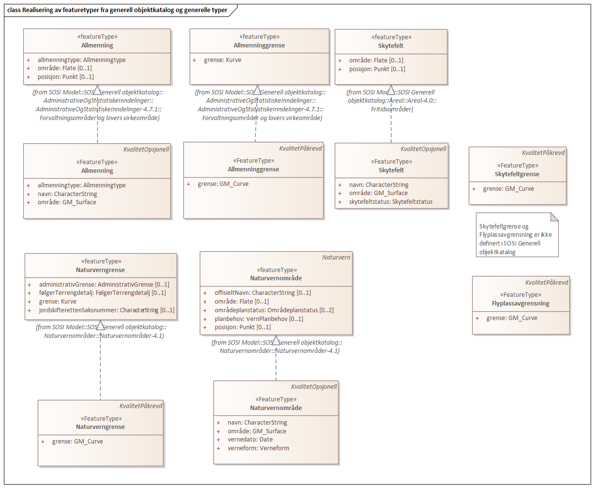
 
'''
 
.Realisering av kodelister fra generell objektkatalog 

 
'''
 
[[allmenning]]
===== «FeatureType» Allmenning
*Definisjon:*  område som alle, eller en bestemt gruppe har bruksrett til 
 
  Merknad: Det er ofte vilkår om at den bruksberettigede må ha en eiendom av en viss størrelse. Eksempel på rettigheter er beiterett, hogstrett, fiskerett. 
 
[discrete]
====== Egenskaper
[cols="20,80"]
|===
|*Navn:* 
|*område*
 
|Definisjon: 
|objektets utstrekning

 
|Multiplisitet: 
|[1..1]
 
|Type: 
|http://skjema.geonorge.no/SOSI/basistype/GM_Surface[GM_Surface]
|===
[cols="20,80"]
|===
|*Navn:* 
|*allmenningtype*
 
|Definisjon: 
|nærmere inndeling av allmenninger
 
|Multiplisitet: 
|[1..1]
 
|Type: 
|<<allmenningtype,«CodeList» Allmenningtype>>
|Profilparametre i tagged values: 
|
defaultCodeSpace: https://register.geonorge.no/sosi-kodelister/topografisk-grunndatabase/allmenningtype + 
SOSI_datatype: T + 
SOSI_lengde: 1 + 
|===
[cols="20,80"]
|===
|*Navn:* 
|*navn*
 
|Definisjon: 
|navn på området
 
|Multiplisitet: 
|[1..1]
 
|Type: 
|http://skjema.geonorge.no/SOSI/basistype/CharacterString[CharacterString]
|Profilparametre i tagged values: 
|
SOSI_datatype: T + 
SOSI_lengde: 60 + 
SOSI_navn: NAVN + 
|===
 
[discrete]
====== Roller
[cols="20,80"]
|===
|*Rollenavn:* 
|*avgrensesAvAllmenninggrense*
 
|Definisjon:
|avgrense allmenning
 
|Multiplisitet: 
|[0..*]
 
|Til klasse
|<<allmenninggrense,«FeatureType» Allmenninggrense>>
|===
 
[discrete]
====== Arv og realiseringer
[cols="20,80"]
|===
|Supertype: 
|<<kvalitetopsjonell,«FeatureType» KvalitetOpsjonell>>
 
|Realisering av: 
|«ApplicationSchema» AdministrativeOgStatistiskeInndelinger-4.7.1/Forvaltningsområder og lovers virkeområde::«featureType» Allmenning +
|===
 
'''
 
[[allmenninggrense]]
===== «FeatureType» Allmenninggrense
*Definisjon:* avgrensning av allmenning
 
[discrete]
====== Egenskaper
[cols="20,80"]
|===
|*Navn:* 
|*grense*
 
|Definisjon: 
|forløp som følger overgang mellom ulike fenomener
 
|Multiplisitet: 
|[1..1]
 
|Type: 
|http://skjema.geonorge.no/SOSI/basistype/GM_Curve[GM_Curve]
|===
 
[discrete]
====== Arv og realiseringer
[cols="20,80"]
|===
|Supertype: 
|<<kvalitetpåkrevd,«FeatureType» KvalitetPåkrevd>>
 
|Realisering av: 
|«ApplicationSchema» AdministrativeOgStatistiskeInndelinger-4.7.1/Forvaltningsområder og lovers virkeområde::«featureType» Allmenninggrense +
|===
 
'''
 
[[flyplassavgrensning]]
===== «FeatureType» Flyplassavgrensning
*Definisjon:* 
 
[discrete]
====== Egenskaper
[cols="20,80"]
|===
|*Navn:* 
|*grense*
 
|Definisjon: 
|forløp som følger overgang mellom ulike fenomener
 
|Multiplisitet: 
|[1..1]
 
|Type: 
|http://skjema.geonorge.no/SOSI/basistype/GM_Curve[GM_Curve]
|===
 
[discrete]
====== Arv og realiseringer
[cols="20,80"]
|===
|Supertype: 
|<<kvalitetpåkrevd,«FeatureType» KvalitetPåkrevd>>
 
|===
 
'''
 
[[naturverngrense]]
===== «FeatureType» Naturverngrense
*Definisjon:* avgrenser et naturvernområde
 
[discrete]
====== Profilparametre i tagged values
[cols="20,80"]
|===
|SOSI_geometri
|KURVE;
 
|===
[discrete]
====== Egenskaper
[cols="20,80"]
|===
|*Navn:* 
|*grense*
 
|Definisjon: 
|forløp som følger overgang mellom ulike fenomener
 
|Multiplisitet: 
|[1..1]
 
|Type: 
|http://skjema.geonorge.no/SOSI/basistype/GM_Curve[GM_Curve]
|Profilparametre i tagged values: 
|
SOSI_melding: Fant ikke denne i SOSI_db + 
SOSI_navn: Kurve + 
|===
 
[discrete]
====== Arv og realiseringer
[cols="20,80"]
|===
|Supertype: 
|<<kvalitetpåkrevd,«FeatureType» KvalitetPåkrevd>>
 
|Realisering av: 
|«ApplicationSchema» Naturvernområder-4.1::«featureType» Naturverngrense +
|===
 
'''
 
[[naturvernområde]]
===== «FeatureType» Naturvernområde
*Definisjon:* naturvernområde
 
[discrete]
====== Profilparametre i tagged values
[cols="20,80"]
|===
|SOSI_geometri
|PUNKT;FLATE;
 
|SOSI_navn
|verneform
 
|===
[discrete]
====== Egenskaper
[cols="20,80"]
|===
|*Navn:* 
|*område*
 
|Definisjon: 
|objektets utstrekning
 
|Multiplisitet: 
|[1..1]
 
|Type: 
|http://skjema.geonorge.no/SOSI/basistype/GM_Surface[GM_Surface]
|Profilparametre i tagged values: 
|
SOSI_melding: Fant ikke denne i SOSI_db + 
SOSI_navn: Flate + 
|===
[cols="20,80"]
|===
|*Navn:* 
|*vernedato*
 
|Definisjon: 
|dato for vern av området
 
|Multiplisitet: 
|[1..1]
 
|Type: 
|http://skjema.geonorge.no/SOSI/basistype/Date[Date]
|Profilparametre i tagged values: 
|
SOSI_datatype: DATO + 
SOSI_navn: VERNEDATO + 
|===
[cols="20,80"]
|===
|*Navn:* 
|*verneform*
 
|Definisjon: 
|ulike type vern sortert under forskjellige lovverk og med tilhørende restriksjoner
 
|Multiplisitet: 
|[1..1]
 
|Type: 
|<<verneform,«CodeList» Verneform>>
|Profilparametre i tagged values: 
|
defaultCodeSpace: https://register.geonorge.no/sosi-kodelister/topografisk-grunndatabase/verneform + 
|===
[cols="20,80"]
|===
|*Navn:* 
|*navn*
 
|Definisjon: 
|navn på naturvernområdet
 
|Multiplisitet: 
|[1..1]
 
|Type: 
|http://skjema.geonorge.no/SOSI/basistype/CharacterString[CharacterString]
|Profilparametre i tagged values: 
|
SOSI_datatype: T + 
SOSI_lengde: 60 + 
SOSI_navn: NAVN + 
|===
 
[discrete]
====== Roller
[cols="20,80"]
|===
|*Rollenavn:* 
|*avgrensesAvNaturverngrense*
 
|Definisjon:
|avgrenser naturvernområde
 
|Multiplisitet: 
|[0..*]
 
|Til klasse
|<<naturverngrense,«FeatureType» Naturverngrense>>
|===
 
[discrete]
====== Arv og realiseringer
[cols="20,80"]
|===
|Supertype: 
|<<kvalitetopsjonell,«FeatureType» KvalitetOpsjonell>>
 
|Realisering av: 
|«ApplicationSchema» Naturvernområder-4.1::«featureType» Naturvernområde +
|===
 
'''
 
[[skytefelt]]
===== «FeatureType» Skytefelt
*Definisjon:* område for militære avdelingers skarpskyteøvelse til lands og/eller til vanns

Merknad: Gjelder også testfelt knyttet til våpen- spregningsindustri

-- Definition -- 
area where divisions from the armed forces undertake live firing practice on land and/or at sea. Note: Also applies to proving grounds related to the explosive armaments industry
 
[discrete]
====== Profilparametre i tagged values
[cols="20,80"]
|===
|SOSI_geometri
|PUNKT;FLATE;
 
|===
[discrete]
====== Egenskaper
[cols="20,80"]
|===
|*Navn:* 
|*område*
 
|Definisjon: 
|objektets utstrekning
 
|Multiplisitet: 
|[1..1]
 
|Type: 
|http://skjema.geonorge.no/SOSI/basistype/GM_Surface[GM_Surface]
|Profilparametre i tagged values: 
|
SOSI_melding: Fant ikke denne i SOSI_db + 
|===
[cols="20,80"]
|===
|*Navn:* 
|*navn*
 
|Definisjon: 
|navn på området
 
|Multiplisitet: 
|[1..1]
 
|Type: 
|http://skjema.geonorge.no/SOSI/basistype/CharacterString[CharacterString]
|Profilparametre i tagged values: 
|
SOSI_datatype: T + 
SOSI_lengde: 60 + 
SOSI_navn: NAVN + 
|===
[cols="20,80"]
|===
|*Navn:* 
|*skytefeltstatus*
 
|Definisjon: 
|angir skytefeltstatus
 
|Multiplisitet: 
|[1..1]
 
|Type: 
|<<skytefeltstatus,«CodeList» Skytefeltstatus>>
|Profilparametre i tagged values: 
|
defaultCodeSpace: https://register.geonorge.no/sosi-kodelister/topografisk-grunndatabase/skytefeltstatus + 
|===
 
[discrete]
====== Roller
[cols="20,80"]
|===
|*Rollenavn:* 
|*avgrensesAvSkytefeltgrense*
 
|Definisjon:
|avgrenser skytefelt
 
|Multiplisitet: 
|[0..*]
 
|Til klasse
|<<skytefeltgrense,«FeatureType» Skytefeltgrense>>
|===
 
[discrete]
====== Arv og realiseringer
[cols="20,80"]
|===
|Supertype: 
|<<kvalitetopsjonell,«FeatureType» KvalitetOpsjonell>>
 
|Realisering av: 
|«ApplicationSchema» Areal-4.0/Fritidsområder::«featureType» Skytefelt +
|===
 
'''
 
[[skytefeltgrense]]
===== «FeatureType» Skytefeltgrense
*Definisjon:* avgrenser skytefelt
 
[discrete]
====== Egenskaper
[cols="20,80"]
|===
|*Navn:* 
|*grense*
 
|Definisjon: 
|forløp som følger overgang mellom ulike fenomener
 
|Multiplisitet: 
|[1..1]
 
|Type: 
|http://skjema.geonorge.no/SOSI/basistype/GM_Curve[GM_Curve]
|===
 
[discrete]
====== Arv og realiseringer
[cols="20,80"]
|===
|Supertype: 
|<<kvalitetpåkrevd,«FeatureType» KvalitetPåkrevd>>
 
|===
 
'''
 
[[allmenningtype]]
===== «CodeList» Allmenningtype
*Definisjon:* nærmere inndeling av allmenninger
 
[discrete]
====== Profilparametre i tagged values
[cols="20,80"]
|===
|asDictionary
|true
 
|codeList
|https://register.geonorge.no/sosi-kodelister/topografisk-grunndatabase/allmenningtype
 
|SOSI_datatype
|T
 
|SOSI_lengde
|20
 
|SOSI_navn
|ALLMENNINGTYPE
 
|===
 
'''
 
[[skytefeltstatus]]
===== «CodeList» Skytefeltstatus
*Definisjon:* angir skytefeltstatus
 
[discrete]
====== Profilparametre i tagged values
[cols="20,80"]
|===
|asDictionary
|true
 
|codeList
|https://register.geonorge.no/sosi-kodelister/topografisk-grunndatabase/skytefeltstatus
 
|SOSI_datatype
|T
 
|SOSI_lengde
|7
 
|SOSI_navn
|SKYTEFELTSTATUS
 
|===
 
'''
 
[[verneform]]
===== «CodeList» Verneform
*Definisjon:* verneformer som sorterer under forskjellig lovverk og restriksjoner
 
[discrete]
====== Profilparametre i tagged values
[cols="20,80"]
|===
|asDictionary
|true
 
|codeList
|https://register.geonorge.no/sosi-kodelister/topografisk-grunndatabase/verneform
 
|SOSI_datatype
|T
 
|SOSI_lengde
|5
 
|SOSI_navn
|VERNEFORM
 
|===
<<<
'''
=====  Underpakke:IKKE I BRUK
*Definisjon:* 
 
'''
 
[[naturvernpunkt]]
===== IKKE I BRUK::«FeatureType» Naturvernpunkt
*Definisjon:* vernet enkeltobjekt etter gammelt lovverk. Vil ikke bli etablert nye. Trær, stein osv.
 
[discrete]
======= Profilparametre i tagged values
[cols="20,80"]
|===
|SOSI_geometri
|PUNKT;
 
|===
[discrete]
======= Egenskaper
[cols="20,80"]
|===
|*Navn:* 
|*posisjon*
 
|Definisjon: 
|sted som objektet eksisterer på
 
|Multiplisitet: 
|[1..1]
 
|Type: 
|http://skjema.geonorge.no/SOSI/basistype/GM_Point[GM_Point]
|Profilparametre i tagged values: 
|
SOSI_datatype: * + 
SOSI_lengde:  + 
SOSI_navn: Punkt + 
SOSI_navn: NØ + 
|===
[cols="20,80"]
|===
|*Navn:* 
|*vernedato*
 
|Definisjon: 
|dato for vern av området
 
|Multiplisitet: 
|[1..1]
 
|Type: 
|http://skjema.geonorge.no/SOSI/basistype/Date[Date]
|Profilparametre i tagged values: 
|
SOSI_datatype: DATO + 
SOSI_navn: VERNEDATO + 
|===
[cols="20,80"]
|===
|*Navn:* 
|*verneform*
 
|Definisjon: 
|ulike typer vern sortert under forskjellige lovverk og med tilhørende restriksjoner
 
|Multiplisitet: 
|[1..1]
 
|Type: 
|<<verneform,«CodeList» Verneform>>
|===
[cols="20,80"]
|===
|*Navn:* 
|*navn*
 
|Definisjon: 
|navn på naturvernområdet
 
|Multiplisitet: 
|[1..1]
 
|Type: 
|http://skjema.geonorge.no/SOSI/basistype/CharacterString[CharacterString]
|Profilparametre i tagged values: 
|
SOSI_datatype: T + 
SOSI_lengde: 60 + 
SOSI_navn: NAVN + 
|===
 
[discrete]
======= Arv og realiseringer
[cols="20,80"]
|===
|Supertype: 
|<<sosi_objekt_punkteroglinjer,«FeatureType» SOSI_Objekt_PunkterOgLinjer>>
 
|Realisering av: 
|«ApplicationSchema» Naturvernområder-4.1::«featureType» Naturvernpunkt +
|===
<<<
'''
==== Pakke: Samferdsel
*Definisjon:* Samferdsel inneholder menneskeskapte kommunikasjonslinjer, samt jernbanestasjoner og vegsperringer
 
'''
 
.Pakkerealisering Samferdsel 
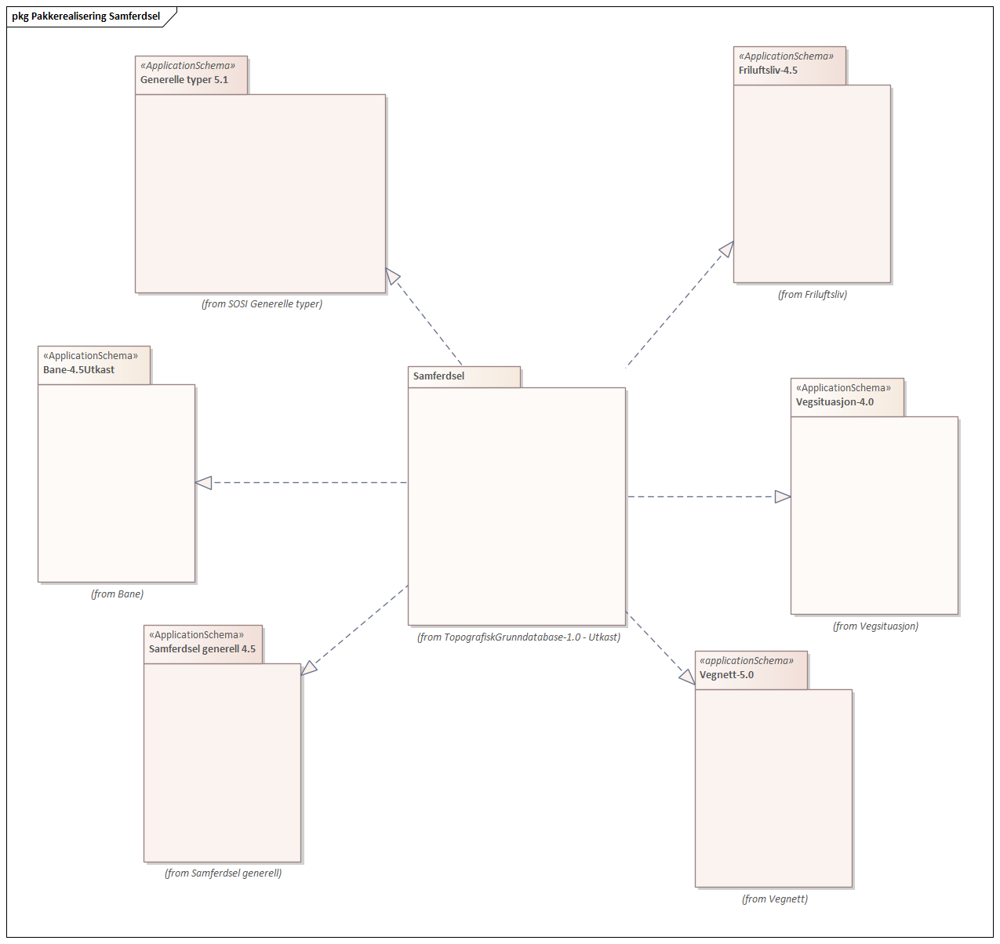
 
'''
 
.Oversiktsdiagram Samferdsel - FeatureTyper 
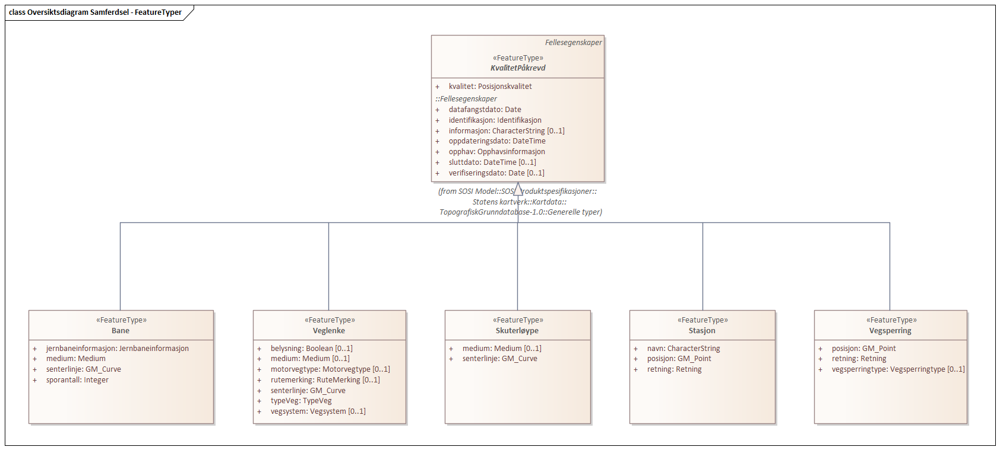
 
'''
 
.Oversiktsdiagram Kodelister og Datatyper 

 
'''
 
.Realisering av featuretyper fra generell objektkatalog 

 
'''
 
.Realisering av datatyper fra generell objektkatalog 

 
'''
 
.Realisering av kodelister fra generell objektkatalog 

 
'''
 
[[skuterløype]]
===== «FeatureType» Skuterløype
*Definisjon:* 
 
[discrete]
====== Egenskaper
[cols="20,80"]
|===
|*Navn:* 
|*senterlinje*
 
|Definisjon: 
|forløp som følger objektets sentrale del
 
|Multiplisitet: 
|[1..1]
 
|Type: 
|http://skjema.geonorge.no/SOSI/basistype/GM_Curve[GM_Curve]
|===
[cols="20,80"]
|===
|*Navn:* 
|*medium*
 
|Definisjon: 
|objektets beliggenhet i forhold til jordoverflaten

Eksempel:
På bro, i tunnel, inne i et bygningsmessig anlegg, etc.
 
|Multiplisitet: 
|[0..1]
 
|Type: 
|http://skjema.geonorge.no/SOSI/basistype/Medium[Medium]
|Profilparametre i tagged values: 
|
SOSI_navn: MEDIUM + 
|===
 
[discrete]
====== Arv og realiseringer
[cols="20,80"]
|===
|Supertype: 
|<<kvalitetpåkrevd,«FeatureType» KvalitetPåkrevd>>
 
|===
 
'''
 
[[bane]]
===== «FeatureType» Bane
*Definisjon:* teoretisk linje som representerer ett enkelt eller flere parallelle spor som del av en banestrekning

-- Definition -- 
theoretical line which represents a single or several parallel tracks as part of a railway line

 -- INSPIRE -- 
 Maps to RailwayLink 
 
[discrete]
====== Profilparametre i tagged values
[cols="20,80"]
|===
|SOSI_navn
|BANE
 
|===
[discrete]
====== Egenskaper
[cols="20,80"]
|===
|*Navn:* 
|*senterlinje*
 
|Definisjon: 
|forløp som følger objektets sentrale del
 
|Multiplisitet: 
|[1..1]
 
|Type: 
|http://skjema.geonorge.no/SOSI/basistype/GM_Curve[GM_Curve]
|===
[cols="20,80"]
|===
|*Navn:* 
|*jernbaneinformasjon*
 
|Definisjon: 
|beskrivelse av jernbanen.
 
|Multiplisitet: 
|[1..1]
 
|Type: 
|<<jernbaneinformasjon,«dataType» Jernbaneinformasjon>>
|===
[cols="20,80"]
|===
|*Navn:* 
|*sporantall*
 
|Definisjon: 
|definerer antall spor på en banestrekning

-- Definition -- 
defines the number of tracks on a railway line
 
|Multiplisitet: 
|[1..1]
 
|Type: 
|<<integer,«dataType» Integer>>
|Profilparametre i tagged values: 
|
SOSI_datatype: H + 
SOSI_lengde: 1 + 
SOSI_navn: SPORANTALL + 
|===
[cols="20,80"]
|===
|*Navn:* 
|*medium*
 
|Definisjon: 
|objektets beliggenhet i forhold til jordoverflaten

Eksempel:
På bro, i tunnel, inne i et bygningsmessig anlegg, etc.
 
|Multiplisitet: 
|[0..1]
 
|Type: 
|http://skjema.geonorge.no/SOSI/basistype/Medium[Medium]
|Profilparametre i tagged values: 
|
SOSI_navn: MEDIUM + 
|===
 
[discrete]
====== Arv og realiseringer
[cols="20,80"]
|===
|Supertype: 
|<<kvalitetpåkrevd,«FeatureType» KvalitetPåkrevd>>
 
|Realisering av: 
|«ApplicationSchema» Bane-4.5Utkast::«featureType» Bane +
|===
 
'''
 
[[stasjon]]
===== «FeatureType» Stasjon
*Definisjon:* representasjonspunkt for stasjon, holdeplass eller godsterminal

-- Definition -- 
representation point for station, stopping place or freight terminal
 
[discrete]
====== Egenskaper
[cols="20,80"]
|===
|*Navn:* 
|*posisjon*
 
|Definisjon: 
|sted som objektet eksisterer på
 
|Multiplisitet: 
|[1..1]
 
|Type: 
|http://skjema.geonorge.no/SOSI/basistype/GM_Point[GM_Point]
|===
[cols="20,80"]
|===
|*Navn:* 
|*navn*
 
|Definisjon: 
|navn på stasjon

-- Definition -- 
name of a station
 
|Multiplisitet: 
|[1..1]
 
|Type: 
|http://skjema.geonorge.no/SOSI/basistype/CharacterString[CharacterString]
|Profilparametre i tagged values: 
|
SOSI_datatype: T + 
SOSI_lengde: 30 + 
SOSI_navn: NAVN + 
|===
[cols="20,80"]
|===
|*Navn:* 
|*retning*
 
|Definisjon: 
|linjestykke i planet med retning 

-- Definition - - 
directed line segment in the plane
 
|Multiplisitet: 
|[1..1]
 
|Type: 
|<<retning,«dataType» Retning>>
|===
 
[discrete]
====== Arv og realiseringer
[cols="20,80"]
|===
|Supertype: 
|<<kvalitetpåkrevd,«FeatureType» KvalitetPåkrevd>>
 
|Realisering av: 
|«ApplicationSchema» Bane-4.5Utkast::«featureType» Stasjon +
|===
 
'''
 
[[veglenke]]
===== «FeatureType» Veglenke
*Definisjon:* Objekttype som representerer lenker i vegnettet
Eksempel: NVDB Referanselenkedeler
 
[discrete]
====== Egenskaper
[cols="20,80"]
|===
|*Navn:* 
|*senterlinje*
 
|Definisjon: 
|forløp som følger objektets sentrale del
 
|Multiplisitet: 
|[1..1]
 
|Type: 
|http://skjema.geonorge.no/SOSI/basistype/GM_Curve[GM_Curve]
|===
[cols="20,80"]
|===
|*Navn:* 
|*typeVeg*
 
|Definisjon: 
|type veg (FormOfWay).
 
|Multiplisitet: 
|[1..1]
 
|Type: 
|<<typeveg,«CodeList» TypeVeg>>
|Profilparametre i tagged values: 
|
SOSI_navn: TYPEVEG + 
|===
[cols="20,80"]
|===
|*Navn:* 
|*vegsystem*
 
|Definisjon: 
|definerer hvilke deler av vegnettet som forvaltningsmessig hører sammen
 
|Multiplisitet: 
|[0..1]
 
|Type: 
|<<vegsystem,«dataType» Vegsystem>>
|===
[cols="20,80"]
|===
|*Navn:* 
|*motorvegtype*
 
|Definisjon: 
|klassifisering av veger etter grad av vilkår med hensyn til f.eks. fart, avkjøringer/kryss og antall kjørefelt
 
|Multiplisitet: 
|[0..1]
 
|Type: 
|<<motorvegtype,«CodeList» Motorvegtype>>
|===
[cols="20,80"]
|===
|*Navn:* 
|*rutemerking*
 
|Definisjon: 
|forteller om det er merking  langs en sti, løype, veg, sykkelvei mv
 
|Multiplisitet: 
|[0..1]
 
|Type: 
|http://skjema.geonorge.no/SOSI/basistype/RuteMerking[RuteMerking]
|===
[cols="20,80"]
|===
|*Navn:* 
|*belysning*
 
|Definisjon: 
|
 
|Multiplisitet: 
|[0..1]
 
|Type: 
|http://skjema.geonorge.no/SOSI/basistype/Boolsk[Boolsk]
|Profilparametre i tagged values: 
|
isMetadata: false + 
sequenceNumber:  + 
SOSI_lengde:  + 
SOSI_navn: BELYSNING + 
|===
[cols="20,80"]
|===
|*Navn:* 
|*medium*
 
|Definisjon: 
|objektets beliggenhet i forhold til jordoverflaten

Eksempel:
På bro, i tunnel, inne i et bygningsmessig anlegg, etc.
 
|Multiplisitet: 
|[0..1]
 
|Type: 
|http://skjema.geonorge.no/SOSI/basistype/Medium[Medium]
|Profilparametre i tagged values: 
|
SOSI_navn: MEDIUM + 
|===
 
[discrete]
====== Arv og realiseringer
[cols="20,80"]
|===
|Supertype: 
|<<kvalitetpåkrevd,«FeatureType» KvalitetPåkrevd>>
 
|Realisering av: 
|«ApplicationSchema» Vegnett-5.0::«featureType» Veglenke +
|===
 
'''
 
[[vegsperring]]
===== «FeatureType» Vegsperring
*Definisjon:* fysisk sperring av vegen

-- Definition -- 
physical blockage of the road
 
[discrete]
====== Egenskaper
[cols="20,80"]
|===
|*Navn:* 
|*posisjon*
 
|Definisjon: 
|sted som objektet eksisterer på
 
|Multiplisitet: 
|[1..1]
 
|Type: 
|<<gm_point,GM_Point>>
|===
[cols="20,80"]
|===
|*Navn:* 
|*vegsperringtype*
 
|Definisjon: 
|angir type vegsperring

-- Definition -- 
indicates type of roadblock
 
|Multiplisitet: 
|[0..1]
 
|Type: 
|<<vegsperringtype,«CodeList» Vegsperringtype>>
|===
[cols="20,80"]
|===
|*Navn:* 
|*retning*
 
|Definisjon: 
|linjestykke i planet med retning 

-- Definition - - 
directed line segment in the plane
 
|Multiplisitet: 
|[1..1]
 
|Type: 
|<<retning,«dataType» Retning>>
|===
 
[discrete]
====== Arv og realiseringer
[cols="20,80"]
|===
|Supertype: 
|<<kvalitetpåkrevd,«FeatureType» KvalitetPåkrevd>>
 
|Realisering av: 
|«ApplicationSchema» Vegsituasjon-4.0::«featureType» Vegsperring +
|===
 
'''
 
[[jernbaneinformasjon]]
===== «dataType» Jernbaneinformasjon
*Definisjon:* beskrivelse av jernbanen.
 
[discrete]
====== Profilparametre i tagged values
[cols="20,80"]
|===
|SOSI_navn
|JERNBANEINFORMASJON
 
|===
[discrete]
====== Egenskaper
[cols="20,80"]
|===
|*Navn:* 
|*anleggstype*
 
|Definisjon: 
|angir type jernbaneanlegg
 
|Multiplisitet: 
|[0..1]
 
|Type: 
|<<jernbanetype,«CodeList» Jernbanetype>>
|===
[cols="20,80"]
|===
|*Navn:* 
|*banestatus*
 
|Definisjon: 
|definerer status for drift på en banestrekning. I denne sammenhengen betyr Midlertidig ute av drift at anlegget finnes, men at det ikke er trafikk. Det kan kreves vedlikeholdsarbeid for å sett i drift. Nedlagt betyr at strekningen er nedlagt ved Stortingsvedtak, men at strekningen fortsatt finnes fysisk i terrenget. Nedlagte strekninger kan kreve nytt vedtak for å sette i drift.
 
|Multiplisitet: 
|[0..1]
 
|Type: 
|<<jernbanestatus,«CodeList» Jernbanestatus>>
|===
[discrete]
====== Arv og realiseringer
[cols="20,80"]
|===
|Realisering av: 
|«ApplicationSchema» Bane-4.5Utkast::«dataType» Jernbaneinformasjon +
|===
 
'''
 
[[vegsystem]]
===== «dataType» Vegsystem
*Definisjon:* Definerer hvilke deler av vegnettet som forvaltningsmessig hører sammen.
 
[discrete]
====== Profilparametre i tagged values
[cols="20,80"]
|===
|catalogue-entry
|NVDB Datakatalogen
 
|NVDB_ID
|915
 
|NVDB_navn
|Vegsystem
 
|SOSI_navn
|VEGSYSTEM
 
|===
[discrete]
====== Egenskaper
[cols="20,80"]
|===
|*Navn:* 
|*vegkategori*
 
|Definisjon: 
|kategorisering som angir på hvilket nivå vegmyndigheten for strekningen ligger
 
|Multiplisitet: 
|[1..1]
 
|Type: 
|<<vegkategori,«CodeList» Vegkategori>>
|Profilparametre i tagged values: 
|
NVDB_ID: 11276 + 
NVDB_navn: Vegkategori + 
SOSI_datatype: T + 
SOSI_lengde: 50 + 
SOSI_navn: VEGKATEGORI + 
|===
[cols="20,80"]
|===
|*Navn:* 
|*vegfase*
 
|Definisjon: 
|angir vegens fase i livet
 
|Multiplisitet: 
|[1..1]
 
|Type: 
|<<vegfase,«CodeList» Vegfase>>
|Profilparametre i tagged values: 
|
NVDB_ID: 11278 + 
NVDB_navn: Fase + 
SOSI_datatype: T + 
SOSI_lengde: 20 + 
SOSI_navn: VEGFASE + 
|===
[cols="20,80"]
|===
|*Navn:* 
|*vegnummer*
 
|Definisjon: 
|angir hvilke deler av vegnettet som rutemessig hører sammen
 
|Multiplisitet: 
|[0..1]
 
|Type: 
|<<integer,«dataType» Integer>>
|Profilparametre i tagged values: 
|
NVDB_ID: 11277 + 
NVDB_navn: Vegnummer + 
SOSI_datatype: H + 
SOSI_lengde: 5 + 
SOSI_navn: VEGNUMMER + 
|===
[discrete]
====== Arv og realiseringer
[cols="20,80"]
|===
|Realisering av: 
|«ApplicationSchema» Vegnett-5.0::«dataType» Vegsystem +
|===
 
'''
 
[[jernbanestatus]]
===== «CodeList» Jernbanestatus
*Definisjon:* definerer status for drift på en banestrekning
 
[discrete]
====== Profilparametre i tagged values
[cols="20,80"]
|===
|asDictionary
|true
 
|codeList
|https://register.geonorge.no/sosi-kodelister/topografisk-grunndatabase/jernbanestatus
 
|SOSI_datatype
|T
 
|SOSI_lengde
|1
 
|SOSI_navn
|JERNBANESTATUS
 
|===
 
'''
 
[[jernbanetype]]
===== «CodeList» Jernbanetype
*Definisjon:* klassifisering av jernbaneanlegg i hht. konstruksjon/dimensjonering
 
[discrete]
====== Profilparametre i tagged values
[cols="20,80"]
|===
|asDictionary
|true
 
|codeList
|https://register.geonorge.no/sosi-kodelister/topografisk-grunndatabase/jernbanetype
 
|SOSI_datatype
|T
 
|SOSI_lengde
|1
 
|SOSI_navn
|JERNBANETYPE
 
|===
 
'''
 
[[mediumsamferdsel]]
===== «CodeList» MediumSamferdsel
*Definisjon:* objektets beliggenhet i forhold til jordoverflaten

Eksempel:
Veg på bro, i tunnel, inne i et bygningsmessig anlegg, etc.
 
[discrete]
====== Profilparametre i tagged values
[cols="20,80"]
|===
|asDictionary
|true
 
|codeList
|https://register.geonorge.no/sosi-kodelister/kartdata/mediumsamferdsel
 
|SOSI_datatype
|T
 
|SOSI_lengde
|1
 
|SOSI_navn
|MEDIUM
 
|===
 
'''
 
[[motorvegtype]]
===== «CodeList» Motorvegtype
*Definisjon:* klassifisering av veger etter grad av vilkår med hensyn til f.eks. fart, avkjøringer/kryss og antall kjørefelt
 
[discrete]
====== Profilparametre i tagged values
[cols="20,80"]
|===
|asDictionary
|true
 
|codeList
|https://register.geonorge.no/sosi-kodelister/topografisk-grunndatabase/motorvegtype
 
|SOSI_datatype
|T
 
|SOSI_lengde
|20
 
|SOSI_navn
|MOTORVEGTYPE
 
|===
 
'''
 
[[rutemerking]]
===== «CodeList» RuteMerking
*Definisjon:* forteller om det er merking  langs en sti, løype, veg, sykkelvei mv
 
[discrete]
====== Profilparametre i tagged values
[cols="20,80"]
|===
|asDictionary
|true
 
|codeList
|https://register.geonorge.no/sosi-kodelister/kartdata/rutemerking
 
|SOSI_datatype
|T
 
|SOSI_lengde
|3
 
|SOSI_navn
|RUTEMERKING
 
|===
 
'''
 
[[sporantall]]
===== «CodeList» Sporantall
*Definisjon:* antall jernbanespor
 
[discrete]
====== Profilparametre i tagged values
[cols="20,80"]
|===
|asDictionary
|true
 
|codeList
|https://register.geonorge.no/sosi-kodelister/kartdata/sporantall
 
|SOSI_datatype
|T
 
|SOSI_lengde
|1
 
|SOSI_navn
|SPORANTALL
 
|===
 
'''
 
[[typeveg]]
===== «CodeList» TypeVeg
*Definisjon:* type veg (FormOfWay).
 
[discrete]
====== Profilparametre i tagged values
[cols="20,80"]
|===
|asDictionary
|true
 
|codeList
|https://register.geonorge.no/sosi-kodelister/topografisk-grunndatabase/typeveg
 
|SOSI_datatype
|T
 
|SOSI_lengde
|20
 
|SOSI_navn
|TYPEVEG
 
|===
 
'''
 
[[vedlikeholdsansvarlig]]
===== «CodeList» Vedlikeholdsansvarlig
*Definisjon:* institusjon eller andre som har ansvar for vedlikehold av rute
 
[discrete]
====== Profilparametre i tagged values
[cols="20,80"]
|===
|asDictionary
|true
 
|codeList
|https://register.geonorge.no/sosi-kodelister/kartdata/vedlikeholdsansvarlig
 
|SOSI_datatype
|T
 
|SOSI_lengde
|35
 
|SOSI_navn
|VEDLIKEH
 
|===
 
'''
 
[[vegfase]]
===== «CodeList» Vegfase
*Definisjon:* angir vegens fase i livet
 
[discrete]
====== Profilparametre i tagged values
[cols="20,80"]
|===
|asDictionary
|true
 
|codeList
|https://register.geonorge.no/sosi-kodelister/topografisk-grunndatabase/vegfase
 
|SOSI_datatype
|T
 
|SOSI_lengde
|20
 
|SOSI_navn
|VEGFASE
 
|===
 
'''
 
[[vegkategori]]
===== «CodeList» Vegkategori
*Definisjon:* kategorisering som angir på hvilket nivå vegmyndigheten for strekningen ligger
 
[discrete]
====== Profilparametre i tagged values
[cols="20,80"]
|===
|asDictionary
|true
 
|codeList
|https://register.geonorge.no/sosi-kodelister/topografisk-grunndatabase/vegkategori
 
|SOSI_datatype
|T
 
|SOSI_lengde
|1
 
|SOSI_navn
|VEGKATEGORI
 
|===
 
'''
 
[[vegsperringtype]]
===== «CodeList» Vegsperringtype
*Definisjon:* angir type vegsperring

-- Definition - - 
indicates type of roadblock
 
[discrete]
====== Profilparametre i tagged values
[cols="20,80"]
|===
|asDictionary
|true
 
|codeList
|https://register.geonorge.no/sosi-kodelister/topografisk-grunndatabase/typevegsperring
 
|SOSI_datatype
|T
 
|SOSI_lengde
|30
 
|SOSI_navn
|VEGSPERRINGTYPE
 
|===
<<<
'''
==== Pakke: Stedsnavn
*Definisjon:* Stedsnavn inneholder stedsnavn beregnet på presentasjon sammen med øvrig informasjon i kartet.
 
'''
 
.Pakkerealisering 
image::diagrammer/Pakkerealisering.png[link=diagrammer/Pakkerealisering.png, Alt="Diagram med navn Pakkerealisering som viser UML-klasser beskrevet i teksten nedenfor."]
 
'''
 
.Hoveddiagram Stedsnavn 
image::diagrammer/Hoveddiagram Stedsnavn.png[link=diagrammer/Hoveddiagram Stedsnavn.png, Alt="Diagram med navn Hoveddiagram Stedsnavn som viser UML-klasser beskrevet i teksten nedenfor."]
 
'''
 
.Realisering av featuretyper fra generell objektkatalog 

 
'''
 
.Realisering av datatyper og kodelister fra generell objektkatalog 

 
'''
 
[[fellestekst]]
===== «FeatureType» FellesTekst (abstrakt)
*Definisjon:* abstrakt objekt som bærer en felles egenskaper som brukes på tekstobjektene
 
[discrete]
====== Egenskaper
[cols="20,80"]
|===
|*Navn:* 
|*geometri*
 
|Definisjon: 
|kurve-geometri på tekstobjekter brukes slik: Punkt nr. 1 på kurva er objektets referansekoordinat. Punkt nr. 2 er tekstens plasseringskoordinat. Punkt nr. 3 angir retning på teksten. Dersom kurva inneholder flere koordinater angir disse forløp på teksten. 
 
|Multiplisitet: 
|[1..1]
 
|Type: 
|http://skjema.geonorge.no/SOSI/basistype/GM_Curve[GM_Curve]
|===
[cols="20,80"]
|===
|*Navn:* 
|*streng*
 
|Definisjon: 
|teksten som skal presenteres på kartet
 
|Multiplisitet: 
|[1..1]
 
|Type: 
|http://skjema.geonorge.no/SOSI/basistype/CharacterString[CharacterString]
|Profilparametre i tagged values: 
|
SOSI_datatype: T + 
SOSI_lengde: 70 + 
SOSI_navn: STRENG + 
|===
[cols="20,80"]
|===
|*Navn:* 
|*oppdateringsdato*
 
|Definisjon: 
|dato for siste endring på objektetdataene 

-Definition-
Date and time at which this version of the spatial object was inserted or changed in the spatial data set.
 
|Multiplisitet: 
|[0..1]
 
|Type: 
|http://skjema.geonorge.no/SOSI/basistype/Date[Date]
|Profilparametre i tagged values: 
|
SOSI_datatype: DATO + 
SOSI_navn: OPPDATERINGSDATO + 
|===
[cols="20,80"]
|===
|*Navn:* 
|*datafangstdato*
 
|Definisjon: 
|dato når objektet siste gang ble registrert/observert/målt i terrenget

Merknad: I mange tilfeller er denne forskjellig fra Oppdateringsdato, da registrerte endringer kan bufres i en kortere eller lengre periode før disse legges inn i databasen.
Ved førstegangsregistrering settes Datafangstdato lik førsteDatafangstdato.
 
|Multiplisitet: 
|[0..1]
 
|Type: 
|http://skjema.geonorge.no/SOSI/basistype/Date[Date]
|Profilparametre i tagged values: 
|
SOSI_datatype: DATO + 
SOSI_navn: DATAFANGSTDATO + 
|===
[cols="20,80"]
|===
|*Navn:* 
|*tekstformatering*
 
|Definisjon: 
|ulike egenskaper til brukt for å presentere teksten på mediumet
 
|Multiplisitet: 
|[1..1]
 
|Type: 
|<<tekstformatering,«dataType» Tekstformatering>>
|===
[cols="20,80"]
|===
|*Navn:* 
|*fulltekst*
 
|Definisjon: 
|navnet i SSR som skal vises på kartet. Vil i de fleste tilfeller være likt Streng, men kan avvike dersom det av kartografiske hensyn bare vises deler av navnet e.l.
 
|Multiplisitet: 
|[1..1]
 
|Type: 
|http://skjema.geonorge.no/SOSI/basistype/CharacterString[CharacterString]
|Profilparametre i tagged values: 
|
SOSI_datatype: T + 
SOSI_lengde: 100 + 
SOSI_navn: FULLTEKST + 
|===
 
[discrete]
====== Arv og realiseringer
[cols="20,80"]
|===
|Subtyper:
|<<stedsnavntekst,«FeatureType» StedsnavnTekst>> +
<<presentasjontekst,«FeatureType» PresentasjonTekst>> +
|===
 
'''
 
[[presentasjontekst]]
===== «FeatureType» PresentasjonTekst
*Definisjon:* PresentasjonTekst benyttes for høydetall som skal presenteres på kartet. Kodelista teksttype angir hva slags type objekt høydetall står til.
 
[discrete]
====== Egenskaper
[cols="20,80"]
|===
|*Navn:* 
|*teksttype*
 
|Definisjon: 
|kodeliste som angir hva slags type objekt teksten beskriver.
 
|Multiplisitet: 
|[1..1]
 
|Type: 
|<<teksttype,«CodeList» Teksttype>>
|Profilparametre i tagged values: 
|
SOSI_navn: TEKSTTYPE + 
|===
 
[discrete]
====== Arv og realiseringer
[cols="20,80"]
|===
|Supertype: 
|<<fellestekst,«FeatureType» FellesTekst>>
 
|===
 
'''
 
[[stedsnavntekst]]
===== «FeatureType» StedsnavnTekst
*Definisjon:* StedsnavnTekst er stedsnavn fra SSR tilpasset visning på kart
 
[discrete]
====== Egenskaper
[cols="20,80"]
|===
|*Navn:* 
|*navneobjekthovedgruppe*
 
|Definisjon: 
|hovedgruppene følger i hovedsak Inspire "NamedPlaceTypeValue", men populatedPlace og building er samlet under bebyggelse og hydrography er delt mellom sjø og ferskvann.
 
|Multiplisitet: 
|[1..1]
 
|Type: 
|<<navneobjekthovedgruppe,«CodeList» Navneobjekthovedgruppe>>
|Profilparametre i tagged values: 
|
asDictionary: false + 
|===
[cols="20,80"]
|===
|*Navn:* 
|*navneobjektgruppe*
 
|Definisjon: 
|inndeling i kategorier under hver hovedgruppe.
 
|Multiplisitet: 
|[1..1]
 
|Type: 
|<<navneobjektgruppe,«CodeList» Navneobjektgruppe>>
|Profilparametre i tagged values: 
|
asDictionary: false + 
|===
[cols="20,80"]
|===
|*Navn:* 
|*navneobjekttype*
 
|Definisjon: 
|stedets navneobjekttype er en underinndeling av navneobjektgruppene som igjen er inndeling av navneobjekthovedgruppene.
 
|Multiplisitet: 
|[1..1]
 
|Type: 
|<<navneobjekttype,«CodeList» Navneobjekttype>>
|Profilparametre i tagged values: 
|
asDictionary: false + 
|===
[cols="20,80"]
|===
|*Navn:* 
|*språk*
 
|Definisjon: 
|angir hvilket språk teksten hører til, norsk, kvensk, nordsamisk, lulesamisk, sørsamisk osv.
 
|Multiplisitet: 
|[0..1]
 
|Type: 
|<<språkkode,«CodeList» SpråkKode>>
|Profilparametre i tagged values: 
|
SOSI_datatype: T + 
SOSI_lengde: 3 + 
SOSI_navn: SPRÅK + 
|===
[cols="20,80"]
|===
|*Navn:* 
|*stedsnavnnummer*
 
|Definisjon: 
|stedsnummer, stedsnavnnummer og skrivemåtenummer skal sammen utgjøre en såkalt tematisk id som brukes av registerførere som opplslagsnummer. identifikatoren ligner litt på Gnr/Bnr/Fnr. 

 Stedsnavnnummer  er et løpende nummer (starter på 1) systemet gir stedsnavnet som en identifikator. stedsnavnnummeret er kun unikt under et stedsnummer og kan ikke brukes om igjen for dette stedsnavnet.
 
|Multiplisitet: 
|[0..1]
 
|Type: 
|http://skjema.geonorge.no/SOSI/basistype/Integer[Integer]
|Profilparametre i tagged values: 
|
SOSI_datatype: H + 
SOSI_lengde: 10 + 
SOSI_navn: STEDSNAVNNUMMER + 
|===
[cols="20,80"]
|===
|*Navn:* 
|*språkprioritering*
 
|Definisjon: 
|stedsnavnet sin prioritering i forhold til de ulike språkgruppene
 
|Multiplisitet: 
|[0..1]
 
|Type: 
|<<språkprioriteringkode,«CodeList» SpråkprioriteringKode>>
|Profilparametre i tagged values: 
|
SOSI_datatype: T + 
SOSI_lengde: 256 + 
SOSI_navn: SPRÅKPRIORITERING + 
|===
[cols="20,80"]
|===
|*Navn:* 
|*stedsnummer*
 
|Definisjon: 
|stedsnummer, stedsnavnsnummer og skrivemåtenummer skal sammen utgjøre en såkalt tematisk id som brukes av registerførere som opplslagsnummer. Identifikatoren ligner litt på Gnr/Bnr/Fnr. 

 Stedsnummeret  er et løpende nummer systemet gir stedet som en identifikator. Stedsnummeret er unikt og kan ikke brukes om igjen.
 
|Multiplisitet: 
|[0..1]
 
|Type: 
|http://skjema.geonorge.no/SOSI/basistype/Integer[Integer]
|Profilparametre i tagged values: 
|
SOSI_datatype: H + 
SOSI_lengde: 10 + 
SOSI_navn: STEDSNUMMER + 
|===
[cols="20,80"]
|===
|*Navn:* 
|*skrivemåtenummer*
 
|Definisjon: 
|stedsnummer, stedsnavnsnummer og skrivemåtenummer skal sammen utgjøre en såkalt tematisk id som brukes av registerførere som opplslagsnummer. Identifikatoren ligner litt på Gnr/Bnr/Fnr.

 Skrivemåtenummer  er et løpende nummer systemet gir skrivemåten som en identifikator. skrivemåtenummeret er kun unikt under et stedsnavnsnummer og kan ikke brukes om igjen for dette stedsnavnet.
 
|Multiplisitet: 
|[0..1]
 
|Type: 
|http://skjema.geonorge.no/SOSI/basistype/Integer[Integer]
|Profilparametre i tagged values: 
|
SOSI_datatype: H + 
SOSI_lengde: 10 + 
SOSI_navn: SKRIVEMÅTENUMMER + 
|===
 
[discrete]
====== Arv og realiseringer
[cols="20,80"]
|===
|Supertype: 
|<<fellestekst,«FeatureType» FellesTekst>>
 
|Realisering av: 
|«ApplicationSchema» Stedsnavn-5.0-Utkast2020-02-14::«FeatureType» Sted +
|===
 
'''
 
[[tekstformatering]]
===== «dataType» Tekstformatering
*Definisjon:* presentasjonsegenskaper knytta til tekst
 
[discrete]
====== Profilparametre i tagged values
[cols="20,80"]
|===
|SOSI_navn
|TEKSTFORMATERING
 
|===
[discrete]
====== Egenskaper
[cols="20,80"]
|===
|*Navn:* 
|*tekstReferansepunkt*
 
|Definisjon: 
|tekstens referansepunkt er det stedet på teksten som en tekstplassering refererer seg til.
 
|Multiplisitet: 
|[0..1]
 
|Type: 
|<<tekstreferansepunkt,«dataType» TekstReferansePunkt>>
|Profilparametre i tagged values: 
|
SOSI_lengde:  + 
SOSI_navn: TREF + 
|===
[cols="20,80"]
|===
|*Navn:* 
|*tegnavstand*
 
|Definisjon: 
|avstanden mellom bokstavene i teksten, enhet er prosent
 
|Multiplisitet: 
|[0..1]
 
|Type: 
|http://skjema.geonorge.no/SOSI/basistype/Integer[Integer]
|Profilparametre i tagged values: 
|
SOSI_datatype: H + 
SOSI_lengde: 8 + 
SOSI_navn: TEGNAVSTAND + 
|===
[cols="20,80"]
|===
|*Navn:* 
|*skriftkode*
 
|Definisjon: 
|produktavhengig koplingsnøkkel mot presentasjonsinformasjon
 
|Multiplisitet: 
|[0..1]
 
|Type: 
|<<skriftkode,«CodeList» Skriftkode>>
|Profilparametre i tagged values: 
|
SOSI_datatype: H + 
SOSI_lengde: 3 + 
SOSI_navn: SKRIFTKODE + 
|===
[cols="20,80"]
|===
|*Navn:* 
|*skrifttype*
 
|Definisjon: 
|angivelse av den skrifttype eller font som skal benyttes. Default skrifttype er ARIAL
 
|Multiplisitet: 
|[0..1]
 
|Type: 
|http://skjema.geonorge.no/SOSI/basistype/CharacterString[CharacterString]
|Profilparametre i tagged values: 
|
SOSI_datatype: T + 
SOSI_lengde: 50 + 
SOSI_navn: SKRIFTTYPE + 
|===
[cols="20,80"]
|===
|*Navn:* 
|*referansemålestokk*
 
|Definisjon: 
|egenskap som beskriver hvilken målestokk (oppgitt som målestokkstall) denne teksten er redigert for, både størrelse og
plassering. Kan benyttes for å velge hvilke tekster som skal tegnes ut i ulike målestokker.
 
|Multiplisitet: 
|[0..1]
 
|Initialverdi: 
|50000
 
|Type: 
|http://skjema.geonorge.no/SOSI/basistype/Integer[Integer]
|Profilparametre i tagged values: 
|
SOSI_datatype: H + 
SOSI_lengde: 9 + 
SOSI_navn: REFMSTK + 
|===
[discrete]
====== Arv og realiseringer
[cols="20,80"]
|===
|Realisering av: 
|«ApplicationSchema» Generelle typer 5.0/TekstOgSymbol::«dataType» Tekstformatering +
|===
 
'''
 
[[tekstreferansepunkt]]
===== «dataType» TekstReferansePunkt
*Definisjon:* tekstens referansepunkt er det stedet på teksten  som en tekstplassering refererer seg til. Hvis teksten består av flere linjer er det fremdeles referert ut fra første del av strengen (dvs i første linje).
Merknad: Hvis ikke andre verdier er oppgitt, er default plassering av TREF som følger:
TRNORD = 1, TRØST = 0, dvs nedre venstre punkt til første bokstav.
 
[discrete]
====== Profilparametre i tagged values
[cols="20,80"]
|===
|SOSI_navn
|TREF
 
|===
[discrete]
====== Egenskaper
[cols="20,80"]
|===
|*Navn:* 
|*tekstReferansePunktNord*
 
|Definisjon: 
|vertikal plassering av teksten. 
Merknad: N50 Kartdata plasseres alltid teksten langs bunnlinja, dvs. TRNORD = 0
 
|Multiplisitet: 
|[1..1]
 
|Type: 
|<<tekstreferansepunktnord,«CodeList» TekstReferansePunktNord>>
|===
[cols="20,80"]
|===
|*Navn:* 
|*tekstReferansePunktØst*
 
|Definisjon: 
|horisontal plassering av teksten
 
|Multiplisitet: 
|[1..1]
 
|Type: 
|<<tekstreferansepunktøst,«CodeList» TekstReferansePunktØst>>
|Profilparametre i tagged values: 
|
SOSI_navn: TRØST + 
|===
 
'''
 
[[navneobjekthovedgruppe]]
===== «CodeList» Navneobjekthovedgruppe
*Definisjon:* hovedgruppene følger i hovedsak Inspire "NamedPlaceTypeValue", men populatedPlace og building er samlet under bebyggelse og hydrography er delt mellom sjø og ferskvann.
 
[discrete]
====== Profilparametre i tagged values
[cols="20,80"]
|===
|asDictionary
|true
 
|codeList
|https://register.geonorge.no/sosi-kodelister/stedsnavn/navneobjekthovedgruppe
 
|SOSI_datatype
|T
 
|SOSI_lengde
|60
 
|SOSI_navn
|NAVNEOBJEKTHOVEDGRUPPE
 
|===
 
'''
 
[[navneobjektgruppe]]
===== «CodeList» Navneobjektgruppe
*Definisjon:* inndeling i kategorier under hver hovedgruppe.
 
[discrete]
====== Profilparametre i tagged values
[cols="20,80"]
|===
|asDictionary
|true
 
|codeList
|https://register.geonorge.no/sosi-kodelister/stedsnavn/navneobjektgruppe
 
|SOSI_datatype
|T
 
|SOSI_lengde
|60
 
|SOSI_navn
|NAVNEOBJEKTGRUPPE
 
|===
 
'''
 
[[navneobjekttype]]
===== «CodeList» Navneobjekttype
*Definisjon:* stedets navneobjekttype er en underinndeling av navneobjektgruppene som igjen er inndeling av navneobjekthovedgruppene.
 
[discrete]
====== Profilparametre i tagged values
[cols="20,80"]
|===
|asDictionary
|true
 
|codeList
|https://register.geonorge.no/sosi-kodelister/stedsnavn/navneobjekttype
 
|SOSI_datatype
|T
 
|SOSI_lengde
|60
 
|SOSI_navn
|NAVNEOBJEKTTYPE
 
|===
 
'''
 
[[skriftkode]]
===== «CodeList» Skriftkode
*Definisjon:* koblingsnøkkel mot presentasjonsinformasjon. Forslag til presentasjon av stedsnavn og høydetall basert på skriftkoder. Presentasjonskoden er basert på hovedkartserien 1:50 000/M711 produsert av Kartverket. Kartverket har egne fonter, men oversatt til TimesNewRoman slik at enhver kan presentere dataene tilnærmet presentasjonen til Kartverket. Ved bruk av ESRI FGDB filformat ligger fontinformasjon allerede inne i egenskapstabellen.
 
[discrete]
====== Profilparametre i tagged values
[cols="20,80"]
|===
|asDictionary
|true
 
|codeList
|https://register.geonorge.no/sosi-kodelister/kartdata/skriftkode
 
|SOSI_datatype
|H
 
|SOSI_lengde
|4
 
|SOSI_navn
|SKRIFTKODE
 
|===
 
'''
 
[[språkkode]]
===== «CodeList» SpråkKode
*Definisjon:* subsett av ISO 639-3 som inneholder trebokstavs-koder de språkene som trengs for å konvertere innholdet fra SSR. Kodelisten kan utvides ved behov etter produksjonssetting.
 
[discrete]
====== Profilparametre i tagged values
[cols="20,80"]
|===
|asDictionary
|true
 
|codeList
|https://register.geonorge.no/sosi-kodelister/stedsnavn/spr%C3%A5kkode
 
|SOSI_datatype
|T
 
|SOSI_lengde
|25
 
|SOSI_navn
|SPRÅK
 
|===
 
'''
 
[[språkprioriteringkode]]
===== «CodeList» SpråkprioriteringKode
*Definisjon:* kodeliste som angir visningsrekkefølgen til stedsnavn på forskjellig språk. 

Det er de første fem verdiene i kodene (de norske språkene) som varierer mellom kodene, ellers er det lik (alfabetisk i forhold til ISO-kodeverdien) rekkefølge på språkene som ikke er aktuelle for behandling etter lov om stadnamn.
 
[discrete]
====== Profilparametre i tagged values
[cols="20,80"]
|===
|asDictionary
|true
 
|codeList
|https://register.geonorge.no/sosi-kodelister/stedsnavn/spr%C3%A5kprioriteringkode
 
|SOSI_datatype
|T
 
|SOSI_lengde
|100
 
|SOSI_navn
|SPRÅKPRIORITERING
 
|===
 
'''
 
[[tekstreferansepunktnord]]
===== «CodeList» TekstReferansePunktNord
*Definisjon:* vertikal plassering av teksten
 
[discrete]
====== Profilparametre i tagged values
[cols="20,80"]
|===
|asDictionary
|true
 
|codeList
|https://register.geonorge.no/sosi-kodelister/kartdata/tekstreferansepunktnord
 
|SOSI_datatype
|H
 
|SOSI_lengde
|1
 
|SOSI_navn
|TRNORD
 
|===
 
'''
 
[[tekstreferansepunktøst]]
===== «CodeList» TekstReferansePunktØst
*Definisjon:* horisontal plassering av teksten
 
[discrete]
====== Profilparametre i tagged values
[cols="20,80"]
|===
|asDictionary
|true
 
|codeList
|https://register.geonorge.no/sosi-kodelister/kartdata/tekstreferansepunkt%C3%B8st
 
|SOSI_datatype
|H
 
|SOSI_lengde
|1
 
|SOSI_navn
|TRØST
 
|===
 
'''
 
[[teksttype]]
===== «CodeList» Teksttype
*Definisjon:* beskriver hva teksten står til.
 
[discrete]
====== Profilparametre i tagged values
[cols="20,80"]
|===
|asDictionary
|true
 
|codeList
|https://register.geonorge.no/sosi-kodelister/kartdata/teksttype
 
|SOSI_datatype
|T
 
|SOSI_lengde
|32
 
|SOSI_navn
|TEKSTTYPE
 
|===
// End of UML-model
